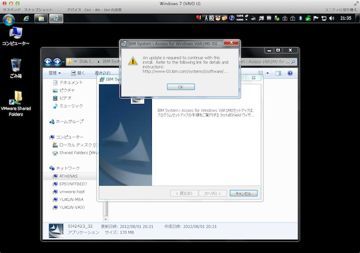

IBM System i Access for Windows のv6.1, v7.1をインストールする際に下記のエラーが発生しインストールが中断する。

### エラーダイアログ・メッセージ

```
An update is required to continue with this install.
Refer to the following link for data files and
instructions:http://www-03.ibm.com/system/i/software

```

[](./ibm_system_i_access_error_ms_patch.png) 対処法としては、下記のMSパッチを適用しWindowsを再起動。

- 対象パッチ情報：[Microsoft Security Bulletin MS11-025 - Important : Vulnerability in Microsoft Foundation Class (MFC) Library Could Allow Remote Code Execution (2500212)](http://technet.microsoft.com/en-us/security/Bulletin/MS11-025)
- ダウンロードサイト：[Download Microsoft Visual C++ 2005 Service Pack 1 Redistributable Package MFC Security Update from Official Microsoft Download Center](http://www.microsoft.com/en-us/download/details.aspx?id=26347)
