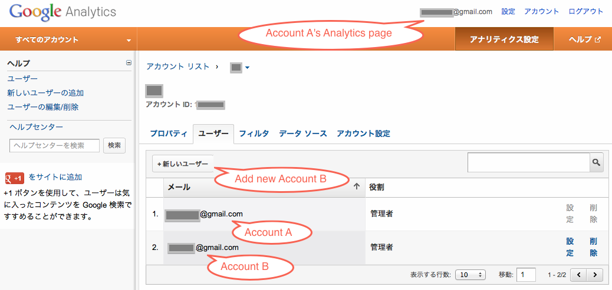
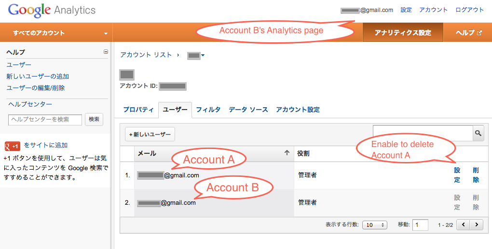

先日Google Analyticsプロファイルを別のGoogle\[Gmail/Analytics\]アカウントに移行(データの共有設定)したのでその手順を下記にまとめておく。 
<!-- truncate -->

### 移行手順

引用サイト：[複数の Google アカウントを 1 つにまとめる - AdWords ヘルプ](https://support.google.com/adwords/answer/44500?hl=ja)

> Google Analytics アカウントを別の Google サービスのアカウントとして使用するように変更するには、その Google アカウントを Analytics アカウントの 2 番目の管理者にします。
> 
> 1. Google Analytics アカウントにログインします。
> 2. \[ユーザー マネージャ\] をクリックします。
> 3. \[既存のアクセス権\] 表で \[ユーザーを追加\] をクリックします。
> 4. 管理者にする Google アカウントのメール アドレスを入力します。
> 5. \[アクセス タイプ\] で \[アカウント管理者\] を選択します。
> 6. \[変更を保存\] をクリックします。
> 
> これで、Analytics アカウントに新しい管理者としてログインできるようになります。元のアカウント管理者は、必要に応じて削除できます。

設定時のスクリーンショットは下記の通り。画像中の表記では移行元のアカウントをAccount A、移行先をAccount Bとしている。

### 移行元設定

### 移行先設定

### 参考サイト

- [サービス データの移行 - Google アカウント ヘルプ](https://support.google.com/accounts/answer/58582?hl=ja)
- [the Data Liberation Front](http://www.dataliberation.org/)
