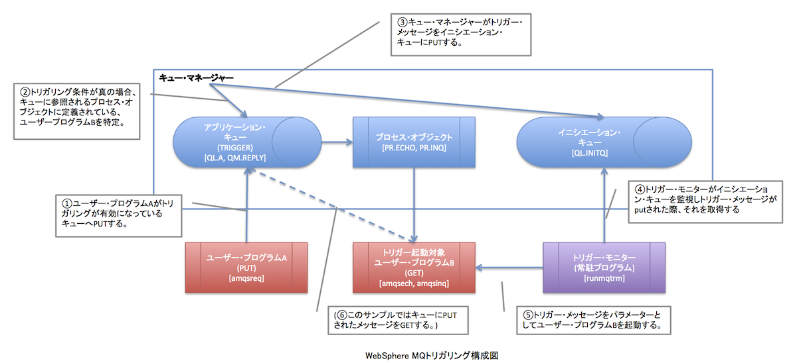

WebShpere MQのトリガリング機能の動作確認。前回までの記事は[こちら](/blog/websphere-mq-delete-queue "WebSphere MQ: キューの削除 – DELETE purge")。参考サイト・ドキュメントは記事の末尾をご参照。 
<!-- truncate -->


### トリガリングとは

下記のドキュメントが簡単に纏まっていたので引用させて頂く。 引用元：WebSphere MQ System Administration Guide Version 7.0

> WebSphere MQ enables you to start an application automatically when certain conditions on a queue are met. For example, you might want to start an application when the number of messages on a queue reaches a specified number. This facility is called triggering and is described in detail in the WebSphere MQ Application Programming Guide.

簡単に言えばイベント(メッセージ)ドリブンな処理を実現できる機能。

### トリガリングの構成コンポーネント

下記画像はクリックすると拡大します。 [](./websphere_mq_trigger.png) 上図の()括弧は補足説明。\[\]括弧は今記事でサンプルとして定義する名称。6つのコンポーネントに追加で一時動的Reply-toキューをモデル・キューとして定義しトリガリングの動作を確認する。

### 検証プログラム

使用サンプルプログラムは下記の2つ。

#### amqsreq - /opt/mqm/samp/amqsreq0.c

ソースの冒頭のコメントを参照。簡単に言うと、標準入力から入力されたメッセージ行を対象キューにMQPUTし、空行が入力されると、Reply-toキューからメッセージをMQGETし標準出力する。上図のユーザー・プログラムAの役割。Reply-toキューを図に記載しなかったのはトリガー構成から趣旨がずれてしまう為。 書式：amqsreq ＜対象キュー＞ ＜キュー・マネージャー＞ ＜Reply-toキュー＞ 

```c
 /* Program logic: */ /* MQOPEN server queue for output */ /* MQOPEN the reply queue for exclusive input */ /* for each line in the input file, */ /* . MQPUT request message containing text to server queue */ /* while no MQI failures, */ /* . MQGET message from reply queue */ /* . display its content */ /* MQCLOSE both queues */ /* */ /********************************************************************/ /* */ /* AMQSREQ0 has 3 parameters */ /* - the name of the target queue (required) */ /* - queue manager name (optional) */ /* - the name of the ReplyToQ (optional) */ 
```


#### amqsech - /opt/mqm/samp/amqsecha.c

プロンプトから起動するのではなく、トリガー・モニターよりトリガー・メッセージ(構造体)をパラメーターとして起動。構造体内で指定されているキューからメッセージをMQGETし、そのメッセージ記述子に指定されたReply-toキューにそのメッセージのコピーをMQPUTする。これを対象のキューに残っているメッセージそれぞれに対して処理し、キューが空になったら、MQCLOSEする。上図のユーザー・プログラムBの役割。 詳細はソースに記載のコメントを参照。 

```c
 /* Program logic: */ /* MQCONNect to message queue manager */ /* MQOPEN message queue for shared input */ /* while no MQI failures, */ /* . MQGET next message from input queue */ /* . Prepare reply message if MQGET was successful */ /* . Prepare a report message if MQGET failed */ /* . MQPUT1, send reply or report to named reply queue */ /* MQCLOSE queue A */ /* MQDISConnect from queue manager */ /* */ /* */ /********************************************************************/ /* */ /* AMQSECHA has 1 parameter - a string (MQTMC2) based on the */ /* initiation trigger message; only the QName and queue */ /* manager name fields are used in this example */ 
```


### トリガリング用のキュー・マネージャー構成

検証用のオブジェクトの作成スクリプトは下記のようになる。

```
$ vi exe2.txt
def ql(QL.INITQ) replace
def ql(QL.A) replace +
trigger trigtype(first) +
process(PR.ECHO) +
initq(QL.INITQ)
def process(PR.ECHO) replace +
applicid('/opt/mqm/samp/bin/amqsech')
def qmodel(QM.REPLY) replace
$ runmqsc qmgr1  report2.txt

```

簡単に上図との対応を記載すると、

- イニシエーション・キュー：QL.INITQ (下記QL.AのINITQパラメーターで指定、参照される。)
- アプリケーション・キュー：QL.A (TRIGGERを指定する事でトリガリング機能を有効にする。またTRIGTYPE(FIRST)はキューが空の状態からメッセージが1つPUTされた時にトリガー・イベントが発生する。)
- プロセス・オブジェクト：トリガー起動対象プログラムはamqsech。QL.Aに指定、参照される。
- Reply-toキュー：図には無いがamqsreq, amqsechが使用するキュー。モデル・キューとして定義。アプリケーションよりMQOPENされるとキュー・マネージャーによって動的にキューが作成される。

#### runmqscの実行結果

```
Starting MQSC for queue manager qmgr1.
     1 : def ql(QL.INITQ) replace
AMQ8006: WebSphere MQ queue created.
     2 : def ql(QL.A) replace +
       : trigger trigtype(first) +
       : process(PR.ECHO) +
       : initq(QL.INITQ)
AMQ8006: WebSphere MQ queue created.
     3 : def process(PR.ECHO) replace +
       : applicid('/opt/mqm/samp/bin/amqsech')
AMQ8010: WebSphere MQ process created.
     4 : def qmodel(QM.REPLY) replace
AMQ8006: WebSphere MQ queue created.
       :
4 MQSC commands read.
No commands have a syntax error.
All valid MQSC commands were processed.

```

### トリガー・モニターの起動 - runmqtrm

WebSphere MQ (Windows, UNIX)に提供されているトリガー・モニターの内、runmqtrmを用いる。 書式：runmqtrm -m QMgrName -q InitiationQName 仮にイニシエーション・キューを指定しなかった場合はSYSTEM.DEFAULT.INITIATION.QUEUEが使用される。

```
$ runmqtrm -q QL.INITQ -m qmgr1
01/06/13  16:25:08 : WebSphere MQ trigger monitor started.
__________________________________________________
01/06/13  16:25:08 : Waiting for a trigger message

```

### トリガリングのテスト

#### メッセージのPUT


```bash
 $ amqsreq QL.A qmgr1 QM.REPLY Sample AMQSREQ0 start server queue is QL.A replies to AMQ.50E9AFED20001E02 Hello MQ world! Hello Hello response response response no more replies Sample AMQSREQ0 end $ 
```

 "Hello MQ world!"、"Hello"、"Hello"メッセージがQL.AにMQPUTされ、空行の後にQM.REPLYキューよりamqsechがMQPUTしたメッセージをMQGETできている。その時のトリガー・モニターの状況は下記の通り。

#### トリガー・モニター

スペースが多いのはメッセージ構造体に指定されていないパラメータが多い為。

```
__________________________________________________
01/06/13  16:25:08 : Waiting for a trigger message
/opt/mqm/samp/bin/amqsech 'TMC    2QL.A                                            PR.ECHO                                                                                                             /opt/mqm/samp/bin/amqsech                                                                                                                                                                                                                                                                                                                                                                                                                                                                                                       qmgr1                                           '
Sample AMQSECHA start
Hello MQ world!
MQGET ended with reason code 2033
Sample AMQSECHA end
01/06/13  16:27:21 : End of application trigger.
__________________________________________________
01/06/13  16:27:21 : Waiting for a trigger message
/opt/mqm/samp/bin/amqsech 'TMC    2QL.A                                            PR.ECHO                                                                                                             /opt/mqm/samp/bin/amqsech                                                                                                                                                                                                                                                                                                                                                                                                                                                                                                       qmgr1                                           '
Sample AMQSECHA start
Hello
Hello
MQGET ended with reason code 2033
Sample AMQSECHA end
01/06/13  16:27:40 : End of application trigger.
__________________________________________________
01/06/13  16:27:40 : Waiting for a trigger message

```

トリガー・メッセージが2つに区切られているのは、1件目のMQGET後、5秒間(WaitIntervalで指定された時間)後、何もメッセーがPUT為れなかった為、MQGETがrc 2033(MQRC\_NO\_MSG\_AVAILABLE)を返して終了したが、2, 3件目の間は5秒以内だった為、続けて"Hello", "Hello"とMQGETした。このWaitIntervalの設定はソース中のGetMsgOpts構造体で設定している。 3件目のputの際は、直前にamqsechがgetしているので再度トリガーイベントが発生しamqsechが2重起動しそうな気がしたが、まだ、amqsechがMQOPEN中でWaitしている状態の為、イベントが発生しなかったのかな。 

```c
 ＜前略＞ /******************************************************************/ /* */ /* Get messages from the message queue */ /* Loop until there is a warning or failure */ /* */ /******************************************************************/ buflen = sizeof(buffer) - 1; gmo.Version = MQGMO_VERSION_2; /* Avoid need to reset Message */ gmo.MatchOptions = MQMO_NONE; /* ID and Correlation ID after */ /* every MQGET */ gmo.Options = MQGMO_ACCEPT_TRUNCATED_MSG | MQGMO_CONVERT /* receive converted messages */ | MQGMO_WAIT; /* wait for new messages */ gmo.WaitInterval = 5000; /* 5 second limit for waiting */ while (CompCode == MQCC_OK) { /****************************************************************/ /* */ /* MQGET sets Encoding and CodedCharSetId to the values in */ /* the message returned, so these fields should be reset to */ /* the default values before every call, as MQGMO_CONVERT is */ /* specified. */ /* */ /****************************************************************/ md.Encoding = MQENC_NATIVE; md.CodedCharSetId = MQCCSI_Q_MGR; MQGET(Hcon, /* connection handle */ Hobj, /* object handle */ &md, /* message descriptor */ &gmo, /* GET options */ buflen, /* buffer length */ buffer, /* message buffer */ &messlen, /* message length */ &CompCode, /* completion code */ &Reason); /* reason code */ /* report reason if any (loop ends if it failed) */ if (Reason != MQRC_NONE) { printf("MQGET ended with reason code %d\n", Reason); } ＜後略＞ 
```

 尚、トリガー機能を停止したい場合はキューに対してNOTRIGGERパラメーターを設定する。

```
alter ql(QL.A) notrigger
     1 : alter ql(QL.A) notrigger
AMQ8008: WebSphere MQ queue changed.

```

### 参考ドキュメント

- WebSphere MQ Application Programming Guide Version 7.0
- WebSphere MQ System Administration Guide Version 7.0

ちなみに、runmqtrmはiSeries(IBM i)版には無いらしい。。。
