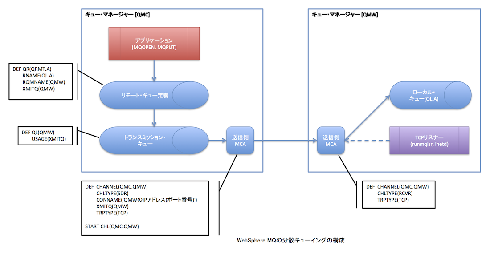

WebSphere MQにおける異なるシステム間でのメッセージの送受信機能について確認する。前回までの記事は[こちら](/blog/websphere-mq-recovery "WebSphere MQ: メッセージの完全性 (2) メディア・リカバリー")。参考ドキュメントは記事の末尾をご参照。 
<!-- truncate -->


### 分散キューイングの構成

※画像はクリックすると拡大します。 [](./websphere_mq_remote.png) 上図はキュー・マネージャーQMC→QMWへのメッセージ送信時の各オブジェクトの定義例と必要要素を図示したもの。上図のメッセージ・フローは一方通行だが、下記のサンプルはQMC, QMWにSender, Receiverの双方を作成して、両キュー・マネージャー間のメッセージ通信機能を確認する。

### 接続オブジェクトの定義 - QMC側

本来であれば、QMC, QMWはそれぞれ別のシステム上に設置されて通信させるものだが、今回は検証環境の都合上、同システム上に2つのキュー・マネージャーを定義して通信をさせる。先ずはQMCというキュー・マネージャーを定義しSTARTさせる。その後、サンプル・プログラムを使用するための初期設定スクリプトを実行する。

```
$ crtmqm QMC
$ strmqm QMC
$ runmqsc QMC < /opt/mqm/samp/amqscos0.tst

```

続けて、送信・受信チャネル、トランスミッション・キュー、リモート・キュー定義、及びDead-Letterキューを作成する。

```
$ vi exe3.txt
DEF CHL(QMC.QMW) CHLTYPE(SDR) REPLACE +
TRPTYPE(TCP) +
CONNAME('127.0.0.1(1414)') +
XMITQ(QMW) PROPCTL(NONE)
DEF CHL(QMW.QMC) CHLTYPE(RCVR) REPLACE TRPTYPE(TCP)
DEF QL(QMW) REPLACE USAGE(XMITQ)
DEF QL(DLQ) REPLACE
ALTER QMGR DEADQ(DLQ)
DEF QL(QL.A) REPLACE
DEF QR(QRMT.A) REPLACE +
RNAME(QL.A) RQMNAME(QMW) +
XMITQ(QMW)
$ runmqsc QMC < exe3.txt

```

### 接続オブジェクトの定義 - QMW側

QMC側と同様にキュー・マネージャーと接続オブジェクトを定義する。

```
$ crtmqm QMW
$ strmqm QMW
$ runmqsc QMW < /opt/mqm/samp/amqscos0.tst
$ vi exe3w.txt
DEF CHL(QMW.QMC) CHLTYPE(SDR) REPLACE +
TRPTYPE(TCP) +
CONNAME('127.0.0.1(4141)') +
XMITQ(QMC) PROPCTL(NONE)
DEF CHL(QMC.QMW) CHLTYPE(RCVR) REPLACE TRPTYPE(TCP)
DEF QL(QMC) REPLACE USAGE(XMITQ)
DEF QL(DLQ) REPLACE
ALTER QMGR DEADQ(DLQ)
DEF QL(QL.A) REPLACE
DEF QR(QRMT.A) REPLACE +
RNAME(QL.A) RQMNAME(QMC) +
XMITQ(QMC)
$ runmqsc QMW < exe3w.txt

```

### 接続テスト

双方のコマンドプロンプトで所定のポートをlistenするリスナーを起動する。

#### QMC側

```
runmqlsr -t TCP -p 4141 -m QMC

```

#### QMW側

```
runmqlsr -t TCP -p 1414 -m QMW

```

双方からrunmqscコマンド・インターフェイス上のMQ PINGを実施しチャネル定義を確認する。

#### QMC側

```
ping chl(QMC.QMW)
     1 : ping chl(QMC.QMW)
AMQ8020: Ping WebSphere MQ channel complete.
start chl(QMC.QMW)
     2 : start chl(QMC.QMW)
AMQ8018: Start WebSphere MQ channel accepted.

```

#### QMW側

```
ping chl(QMW.QMC)
     1 : ping chl(QMW.QMC)
AMQ8020: Ping WebSphere MQ channel complete.
start chl(QMW.QMC)
     2 : start chl(QMW.QMC)
AMQ8018: Start WebSphere MQ channel accepted.

```

### メッセージのput

試しにQMC→QMWへのメッセージのputをする。

```
$ amqsput QRMT.A QMC
Sample AMQSPUT0 start
target queue is QRMT.A
I send a message from QMC.
Sample AMQSPUT0 end
$ amqsbcg QL.A QMW
AMQSBCG0 - starts here
**********************
 MQOPEN - 'QL.A'
 MQGET of message number 1
****Message descriptor****
  StrucId  : 'MD  '  Version : 2
  Report   : 0  MsgType : 8
  Expiry   : -1  Feedback : 0
  Encoding : 546  CodedCharSetId : 819
  Format : 'MQSTR   '
  Priority : 0  Persistence : 0
  MsgId : X'414D5120514D432020202020202020209093F25002350020'
  CorrelId : X'000000000000000000000000000000000000000000000000'
  BackoutCount : 0
  ReplyToQ       : '                                                '
  ReplyToQMgr    : 'QMC                                             '
  ** Identity Context
  UserIdentifier : 'mqm         '
  AccountingToken :
   X'0334393600000000000000000000000000000000000000000000000000000006'
  ApplIdentityData : '                                '
  ** Origin Context
  PutApplType    : '6'
  PutApplName    : 'amqsput                     '
  PutDate  : '20130113'    PutTime  : '11370619'
  ApplOriginData : '    '
  GroupId : X'000000000000000000000000000000000000000000000000'
  MsgSeqNumber   : '1'
  Offset         : '0'
  MsgFlags       : '0'
  OriginalLength : '-1'
****   Message      ****
 length - 26 bytes
00000000:  4920 7365 6E64 2061 206D 6573 7361 6765 'I send a message'
00000010:  2066 726F 6D20 514D 432E                ' from QMC.      '
 No more messages
 MQCLOSE
 MQDISC
$

```

正常にメッセージが送信されていることを確認できた。続いてQMW→QMCへのメッセージの送信確認をする。

```
$ amqsget QL.A QMW
Sample AMQSGET0 start
message 
no more messages
Sample AMQSGET0 end
$
$ amqsput QRMT.A QMW
Sample AMQSPUT0 start
target queue is QRMT.A
I send a message from QMW
Sample AMQSPUT0 end
$ amqsget QL.A QMC
Sample AMQSGET0 start
message 
no more messages
Sample AMQSGET0 end
$

```

__確かに送信できていることを確認できた。

### 参考文献

- WebSphere MQ System Administration Guide Version 7.0
- [WebSphere MQ 入門書](https://www.ibm.com/developerworks/jp/websphere/library/wmq/mq_intro/)

__
