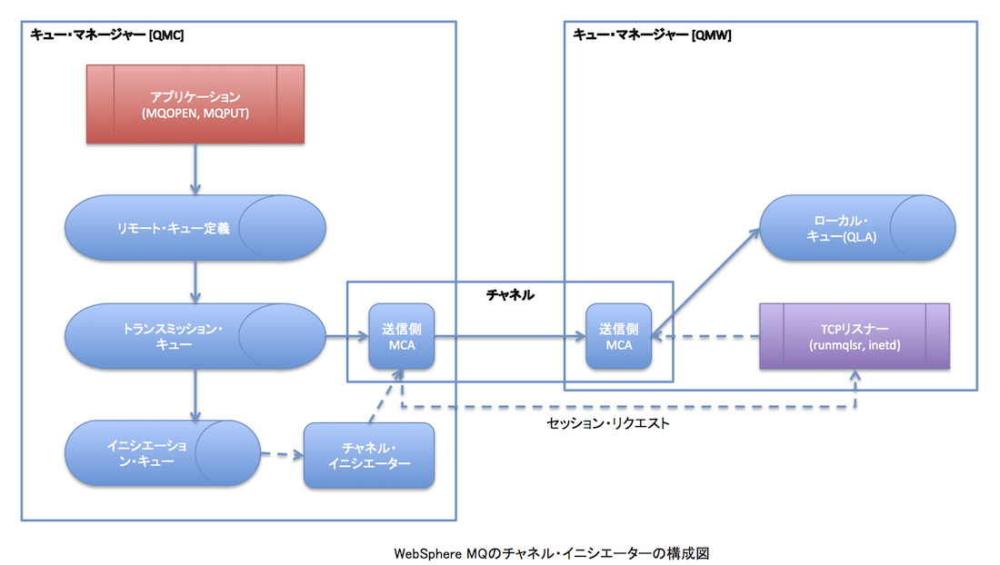

[前回までの分散キューイング記事](/blog/websphere-mq-sender-receiver "WebSphere MQ: 分散キューイング (1) Sender, Receiver")の続き。WebSphere MQのチャネル・イニシエーターの機能の確認をする。参考文献は記事末尾をご参照。 
<!-- truncate -->
 [前回のリモート・トリガリング](/blog/websphere-mq-remote-trigger "WebSphere MQ: 分散キューイング (2) リモート・トリガリング")がメッセージの受信側のキューのトリガー・モニター設定なら、チャネル・イニシエーターは送信側チャネルのトリガー・モニターとしての機能を提供する。これは、トランスミッション・キューをトリガー付きキューとして設定することで、トリガリング条件を満たすメッセージがputされると、トリガー・メッセージがイニシエーション・キューに送付され、対応する送信側チャネルをSTARTさせる為にチャネル・イニシエーターが起動させる。

### チャネル・イニシエーターのトリガリング構成図

※画像はクリックすると拡大します。 [](./websphere_mq_channel_init.png)

### チャネル・イニシエーターの構成定義

トランスミッション・キューのトリガリングを有効化しチャネルの切断間隔を30秒に設定する。その後送信側のチャネルを再起動し30秒で切れることを確認する。

#### QMC側

```
$ runmqsc QMC < exe4.txt
Starting MQSC for queue manager QMC.
     1 : alter ql(QMW) trigger +
       : trigtype(FIRST) +
       : trigdata(QMC.QMW) +
       : initq(SYSTEM.CHANNEL.INITQ)
AMQ8008: WebSphere MQ queue changed.
     2 : alter channel(QMC.QMW) chltype(SDR) +
       : discint(30)
AMQ8016: WebSphere MQ channel changed.
       :
2 MQSC commands read.
No commands have a syntax error.
All valid MQSC commands were processed.

```

```
STOP CHL(QMC.QMW)
    15 : STOP CHL(QMC.QMW)
AMQ9533: Channel 'QMC.QMW' is not currently active.
START CHL(QMC.QMW)
    16 : START CHL(QMC.QMW)
AMQ8018: Start WebSphere MQ channel accepted.
DIS CHSTATUS(QMC.QMW)
    17 : DIS CHSTATUS(QMC.QMW)
AMQ8417: Display Channel Status details.
   CHANNEL(QMC.QMW)                        CHLTYPE(SDR)
   CONNAME(127.0.0.1(1414))                CURRENT
   RQMNAME(QMW)                            STATUS(RUNNING)
   SUBSTATE(MQGET)                         XMITQ(QMW)
＜STARTから30秒後に再度ステータス確認＞
DIS CHSTATUS(QMC.QMW)
    18 : DIS CHSTATUS(QMC.QMW)
AMQ8420: Channel Status not found.

```

#### QMW側

```
$ runmqsc QMW < exe4w.txt
Starting MQSC for queue manager QMW.
     1 : alter ql(QMC) trigger +
       : trigtype(FIRST) +
       : trigdata(QMW.QMC) +
       : initq(SYSTEM.CHANNEL.INITQ)
AMQ8008: WebSphere MQ queue changed.
     2 : alter channel(QMW.QMC) chltype(SDR) +
       : discint(30)
AMQ8016: WebSphere MQ channel changed.
       :
2 MQSC commands read.
No commands have a syntax error.
All valid MQSC commands were processed.

```

```
STOP CHL(QMW.QMC)
     5 : STOP CHL(QMW.QMC)
AMQ9533: Channel 'QMW.QMC' is not currently active.
START CHL(QMW.QMC)
     6 : START CHL(QMW.QMC)
AMQ8018: Start WebSphere MQ channel accepted.
DIS CHSTATUS(QMW.QMC)
     8 : DIS CHSTATUS(QMW.QMC)
AMQ8417: Display Channel Status details.
   CHANNEL(QMW.QMC)                        CHLTYPE(SDR)
   CONNAME(127.0.0.1(4141))                CURRENT
   RQMNAME(QMC)                            STATUS(RUNNING)
   SUBSTATE(MQGET)                         XMITQ(QMC)
＜STARTから30秒後に再度ステータス確認＞
DIS CHSTATUS(QMW.QMC)
     9 : DIS CHSTATUS(QMW.QMC)
AMQ8420: Channel Status not found.

```

### チャネル・イニシエーターの動作確認

amqsputを用いてリモート・キューQRMT.Aにメッセージをputする。ただし、事前に双方のローカル・キューQL.Aのトリガリング機能は無効にしておく(このトリガリングはamqsreq用の為)。

```
ALTER QL(QL.A) NOTRIGGER
    19 : ALTER QL(QL.A) NOTRIGGER
AMQ8008: WebSphere MQ queue changed.

```

ここでは例としてQMC→QMWへのPUTを確認する。

```
$ amqsput QRMT.A QMC
Sample AMQSPUT0 start
target queue is QRMT.A
I send a message from QMC manager.
Sample AMQSPUT0 end
$ amqsget QL.A QMW
Sample AMQSGET0 start
message 
no more messages
Sample AMQSGET0 end
$

```

_確かにチャネルが自動起動してメッセージが送信されたことを確認できた。続けてamqsreqで検証するべくQL.Aのトリガーを有効化する。

```
alter ql(QL.A) trigger
    11 : alter ql(QL.A) trigger
AMQ8008: WebSphere MQ queue changed.

```

次にQMW上でトリガー・モニターを起動する。

```
$ runmqtrm -q QL.INITQ -m QMW
01/14/13  00:02:31 : WebSphere MQ trigger monitor started.
＜後述のamqsreqを実行すると下記のメッセージが出力される＞
__________________________________________________
01/14/13  00:02:36 : Waiting for a trigger message
/opt/mqm/samp/bin/amqsech 'TMC    2QL.A                                            PR.ECHO                                                                                                             /opt/mqm/samp/bin/amqsech                                                                                                                                                                                                                                                                                                                                                                                                                                                                                                       QMW                                             '
Sample AMQSECHA start
I send a message from QMC with amqsreq.
MQGET ended with reason code 2033
Sample AMQSECHA end
01/14/13  00:03:50 : End of application trigger.
__________________________________________________
01/14/13  00:03:50 : Waiting for a trigger message

```

そして、QMC上でamqsreqを実行する。

```
$ amqsreq QRMT.A QMC QM.REPLY
Sample AMQSREQ0 start
server queue is QRMT.A
replies to AMQ.50F2939020004E02
I send a message from QMC with amqsreq.
response 
no more replies
Sample AMQSREQ0 end
$

```

_以上より、QMC, QMW上の両チャネルが自動的に起動しメッセージを送受できることを確認できた。 最後にローカル・キューQL.Aのトリガー機能をオフにする。

```
ALTER QL(QL.A) NOTRIGGER

```

### 参考文献

- WebSphere MQ System Administration Guide Version 7.0
- [WebSphere MQ 入門書](https://www.ibm.com/developerworks/jp/websphere/library/wmq/mq_intro/)
- [MQ設計虎の巻: 第2回「WebSphere MQの特長と主な機能（後編）」](http://www.ibm.com/developerworks/jp/websphere/library/wmq/toranomaki/2.html)

__
