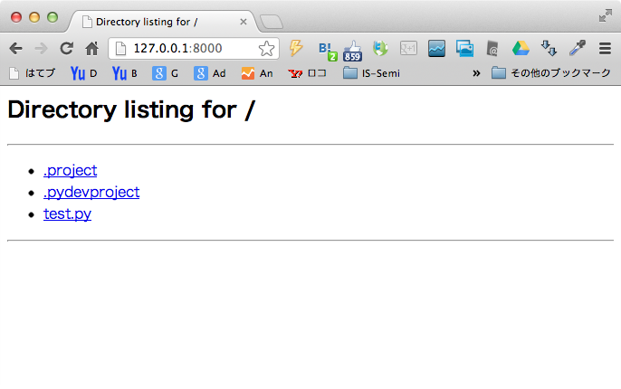
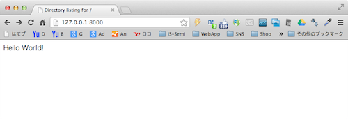

Python のみでWebサーバを提供できるのでその動作確認。今回は下記SimpleHTTPServerモジュールを使用する。 

```python
 import SimpleHTTPServer SimpleHTTPServer.test() 
```

 上記コードを実行すると下記のようにWebサーバをポート8000番（デフォルト）で提供する。 
<!-- truncate -->


```
pydev debugger: starting
Serving HTTP on 0.0.0.0 port 8000 ...

```

この状態でループバックアドレス(localhost)にアクセスすると下記のように、稼働しているスクリプトがドキュメントルートとして設定されていることが分かる。（今回はEclipse+pydevのworkspaceから実行したのでそれ関連のファイルやフォルダが並んでいる。） [](./SimpleHTTPServer_test.png) その際、SimpleHTTPServerの実行コンソールはアクセス時のログを出力する。favicon.icoが無いとの404メッセージが出力されているが、当然favicon.icoは設定してないので当該メッセージは静観する。

```
pydev debugger: starting
Serving HTTP on 0.0.0.0 port 8000 ...
1.0.0.127.in-addr.arpa - - [09/Feb/2013 19:18:27] "GET / HTTP/1.1" 200 -
1.0.0.127.in-addr.arpa - - [09/Feb/2013 19:18:27] code 404, message File not found
1.0.0.127.in-addr.arpa - - [09/Feb/2013 19:18:27] "GET /favicon.ico HTTP/1.1" 404 -

```

続いてスクリプトと同階層フォルダにindex.htmlのファイル名で下記のHTMLを設置する。 

```html
 Hello World! 
```

 再度、localhostにアクセスすると下記のようにindex.htmlの内容が表示される。(SimpleHTTPServerのDirectoryIndexにindex.htmlが設定されているため。) [](./Python_SimpleHTTPServer_test_html.png)

### 参考サイト

- [20.19. SimpleHTTPServer — Simple HTTP request handler — Python v2.7.3 documentation](http://docs.python.org/2/library/simplehttpserver.html)
