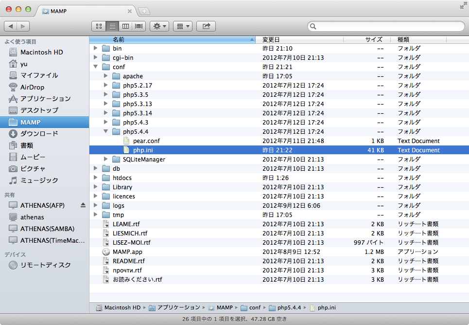
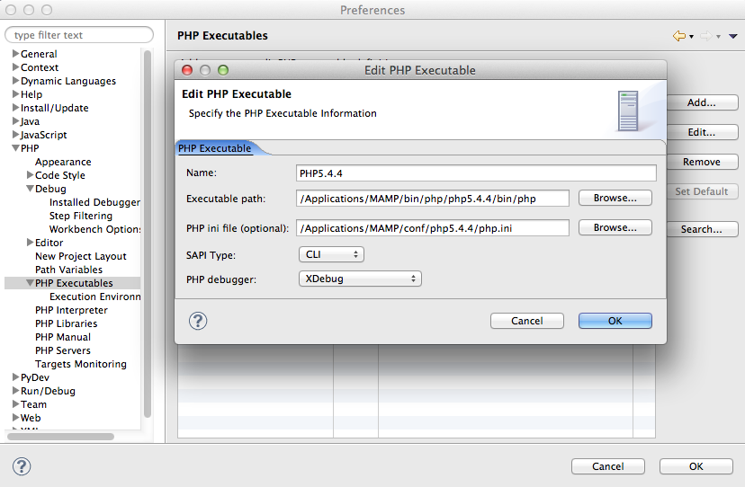
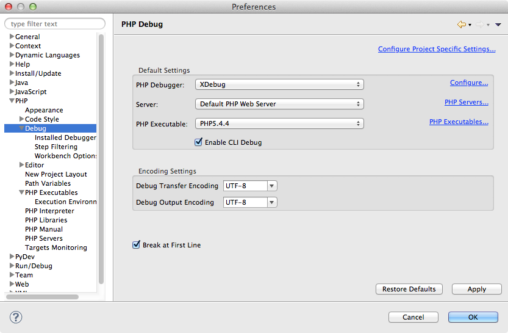
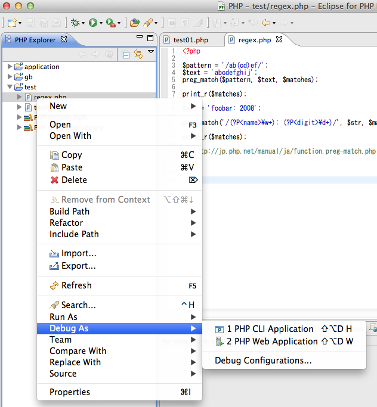
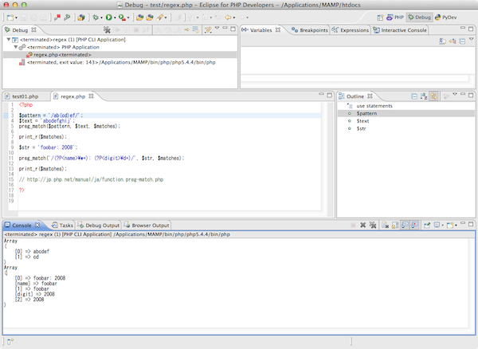

Mac上でのPHP開発環境のセットアップとCLIデバッグ環境の構築で幾つか躓いたところがあったので、備忘録もかねて下記にまとめておく。

### MAMP+Eclipse PDTの入手

以下のサイトよりそれぞれダウンロードしインストールする。

- [PHP Development Tools (PDT) - Downloads](https://www.eclipse.org/pdt/)
- [MAMP: Mac, Apache, MySQL, PHP](http://www.mamp.info/en/index.html)


<!-- truncate -->


### php.iniの設定

[](./mamp_conf_file_path.png) Xdebugを使用するための設定。MAMP上のphp.iniに以下の内容を追記。zend\_extensionの項目はコメント;を外すだけで良い。（パス自体はバージョン依存なので。）

```
[xdebug]
zend_extension="/Applications/MAMP/bin/php/php5.4.4/lib/php/extensions/no-debug-non-zts-20100525/xdebug.so"
xdebug.remote_enable = On
xdebug.remote_handler = dbgp
xdebug.remote_mode = req
xdebug.remote_host = localhost
xdebug.remote_port = 9000
xdebug.idekey =
xdebug.profiler_enable = On
xdebug.profiler_output_dir = “/Applications/MAMP/tmp/xdebug/”

```

### Eclipseの設定

先ずはEdit PHP Executabl画面でPHPの実行ファイルとphp.iniファイル、及びPHP debuggerタイプを指定する。 [](./eclipse_edit_php_executable.png) 続いてPHP Debug画面でPHP Debugger、PHP Executable、CLI Debugチェックボックス等の設定を下図の様に設定する。 [](./eclipse_php_debug.png)

### 設定確認テスト

後は適当なPHPコードを書いた後に以下のようにDebugを実行する。 [](./php_debug.png) デバッグ用のパースペクティブに遷移して下記のように表示される。（ブレークポイントを設定していればそこでステップイン等の操作が可能） [](./php_debug_result.png)
