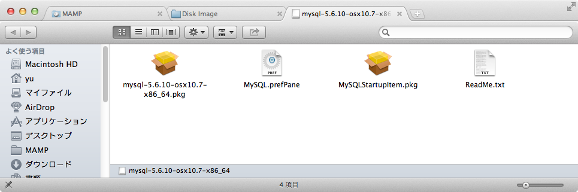
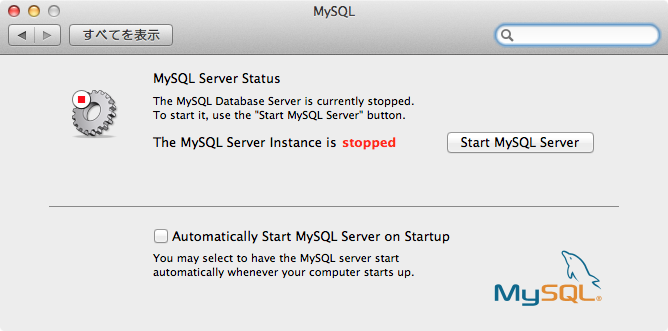

MAMP付属のMySQLではなくMac OSに直にMySQLをインストールする場合の手順を以下にまとめておく。

### ダウンロードするもの

以下のサイトよりMySQLをダウンロードする。ダウンロード時にはアカウントの登録を求められるが特に費用は掛からない。 [MySQL :: Download MySQL Community Server](http://dev.mysql.com/downloads/mysql/) 私の環境はMBA 64bitである為、＜Mac OS X ver. XX.X (x86, 64-bit), DMG Archive＞ファイルをダウンロードした。 
<!-- truncate -->


### インストールするもの

[](./mac_mysql_dmg.png) ダウンロードしたファイル(mysql-X.X.XX-osxXX.X-x86\_64.dmg)をマウントした後、下記の順番でパッケージとパネルをインストールする。

1. mysql-X.X.XX-osxXX.X-x86\_64.pkg
2. MySQLStartupItem.pkg
3. MySQL.prefPane

MySQLのファイルは/usr/local/mysql-X.X.XX-osxXX.X-x86\_64に保管され、そこへのシンボリックリンクが/usr/local/mysqlに保管される。

```
$ ls -l /usr/local/
＜中略＞
lrwxr-xr-x   1 root  wheel    27  3  2 01:35 mysql -> mysql-5.6.10-osx10.7-x86_64
drwxr-xr-x  17 root  wheel   578  3  2 01:35 mysql-5.6.10-osx10.7-x86_64

```

### MySQLサービスの起動

[](./mac_mysql_setting_panel.png) 環境設定→MySQLパネルよりサービスの起動を行う。

### PATHの設定

ターミナルからコマンド起動する為にPATH設定を行う。今回は使用ユーザーのbash設定ファイル~/.bash\_profileに下記の内容を追記する。

```
# MySQL Path Setting
export PATH=$PATH:/usr/local/mysql/bin

```

設定後、.bash\_profileを読み込ませる為にターミナルを再起動すれば以降、そのユーザーターミナルでmysqlコマンド、mysqladminコマンドが使用可能となる。

### 動作確認など

#### rootパスワードの設定

```
mysqladmin -u root password 'パスワード文字列'

```

#### rootでMySQLへログイン

```
mysql -u root -p

```

最近はMAMPで開発環境を構築するのが多いので余り使わない手順。因みに主題からはずれるが仮にIDE等でMAMP付属のPHP等を使用すると、php.ini側で設定してあるmysqlのパスがMAMP側のmysqlの為、幾つか設定修正が必要である。尚、MAMPのmysql, mysqladminコマンドパスは/Applications/MAMP/Library/bin以下になる。また、rootパスワードはrootとなる。（このパスワードはスタートページや各種設定ファイルにハードコードされているので弄った場合の修正範囲が大きい）
