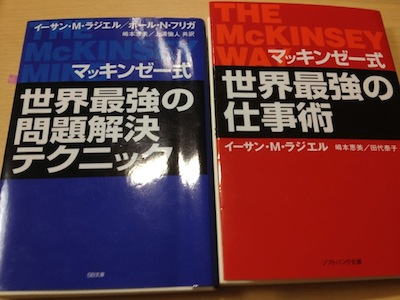

 先日会社の方に上記の本を勧められて読了。記録と復習も兼ねてMind Mapを作成したので本記事の末尾で紹介。

1. [マッキンゼー式 世界最強の仕事術](http://www.amazon.co.jp/gp/product/4797337389/ref=as_li_ss_tl?ie=UTF8&camp=247&creative=7399&creativeASIN=4797337389&linkCode=as2&tag=bitsmining-22)
2. [マッキンゼー式 世界最強の問題解決テクニック](http://www.amazon.co.jp/gp/product/4797337397/ref=as_li_ss_tl?ie=UTF8&camp=247&creative=7399&creativeASIN=4797337397&linkCode=as2&tag=bitsmining-22)

原書のタイトルはそれぞれ The McKinsey Way, The McKinsey Mindで1999年に刊行されたもの。WayのほうがMcKinseyでの仕事の進めたかを主に説明していて、MindではそのHow toが書かれている。二冊読む場合はWay→Mindの順に読むと良いが、重複部分がそれなりにある。事前に目次を見て差分が気になるようであれば、両方読んでも良いかも。時間が無ければMindの方をお勧めする。 印象に残ったフレーズは、「MECEは全て」、「問題の分析は仮説を証明・反証していく方がはるかに効率的」、「その問題は本当に解決すべき問題なのか」「イシュー・ツリーによる仮説のクイックテスト」、「エレベーター・テスト」、「毎日1つチャートを作る」あたり。 この本で問題解決のプロセスと着眼点について理解できたので、今後はより具体的なHow toを他の本で補強しつつ業務で活用していくととする。これ系の本は読み終わった後が重要で、考え方を実行できるまでに実践が必要。チャートの作成方法については別途「[Say it with Charts](http://www.amazon.co.jp/gp/product/4492555226/ref=as_li_ss_tl?ie=UTF8&camp=247&creative=7399&creativeASIN=4492555226&linkCode=as2&tag=bitsmining-22)」、「[Say it with Charts Workbook](http://www.amazon.co.jp/gp/product/4492555439/ref=as_li_ss_tl?ie=UTF8&camp=247&creative=7399&creativeASIN=4492555439&linkCode=as2&tag=bitsmining-22)」等を参照しながら実践していく。イシュー・ツリーやロジック・ツリーについては、「[30代までに身につけておきたい「課題解決」の技術](/blog/mind-map-business-solution-technique "Mind Map: 30代までに身につけておきたい「課題解決」の技術")」がよさそう。

### マインドマップ：マッキンゼー式 世界最強の仕事術

- [画像版(PNG)](./mckinsey_way.png)
- [HTML版(Webページ)](pathname:///files/mckinsey_way.html)
- Flash版

### マインドマップ：マッキンゼー式 世界最強の問題解決テクニック

- [画像版(PNG)](./mckinsey_mind.png)
- [HTML版(Webページ)](pathname:///files/mckinsey_mind.html)
- Flash版
