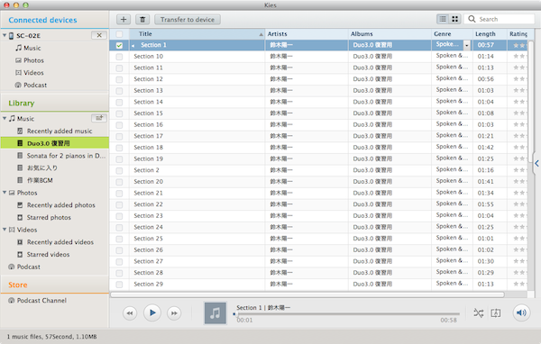
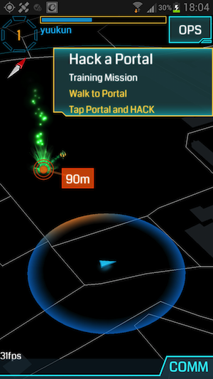

 昨日Softbank iPhone4sからDocomo Galaxy Note IIにMNPで機種変した。期末と言うこともあり、キャンペーンで安く買えたのは良かった。iTunesのような便利なAndroid用同期ソフトがMacにあるかと探してみると、Note II用の公式ソフトKiesがあったのでインストールを試みたが、10.8以降は対応していないらしい。 ただ、下記のサイトの手順を参考に強制的にインストール可能。上図の通り音楽等のデータを同期できた。

- [Kies for Mac and Mountain Lion not working? Here's a solution \[From the Forums\] | Android Central](http://www.androidcentral.com/kies-mac-and-mountain-lion-not-working-heres-solution-forums)

追記(2014-01-24)：現在公式で10.8以降のMac版のKiesも配布されているようだ。 [Samsung Kiss](https://www.samsung.com/us/support/owners/app/kies) 
<!-- truncate -->
 一日触ってみたが、4sより画面が大きく、バッテリーのもちもいいので、今のところかなり使いやすい。 あとARゲームのIngressも中々良い。早速近所のポータルをhackしてみた。他ユーザーとのインタラクション方法が増えればより中毒性が上がるかもしれないが、現実の地図上を舞台としたゲームの特性上、地理的制約がユーザーとの連携を妨げるかもしれない。 
