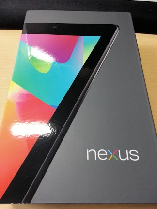
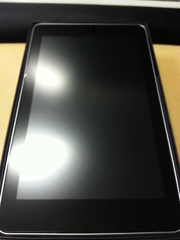

 先日Retina iPadを妹に譲って自分はNexus7を購入し、root化をしてみたので、その際の作業手順を簡単に記録しておく。 
<!-- truncate -->

### ダウンロードするもの

- [Android SDK | Android Developers](http://developer.android.com/sdk/index.html)
- Nexus Root Toolkit v1.6.3 | WugFresh (ダウンロード時点ではv1.63だった)

### root化の手順

1. Android SDK内のSDK Manager.exeを起動し、Google USB Driverをインストール
2. 端末のモデル番号を7回クリックして開発者メニューを表示
3. 端末の開発者メニューからUSBデバックオプションをONに設定
4. 端末を接続しデバイスマネージャーからドライバの更新する(パス→C:\\adt\\**sdk\\extras\\google\\usb\_driver**)
5. Nexus Root Toolkitをインストール、初回起動する。ポップアップ画面に沿ってroot化対象のモデルを選択し必要なイメージをダウンロードしていく(プルダウンメニューとOKボタンを連打するのみ)
6. Nexus Root Toolkitのメイン画面からUnlockボタンを押下して端末のUnlock
7. Unlockが完了したら、再度開発者メニューのUSBデバックオプションをON
8. Nexus Root Toolkitのメイン画面からRootボタンを押下して端末をroot化

本来これ系の記事は色々スクリーンショットを添付してStep by Stepで説明するのが常であるが、今回は割愛する(何か質問等あればコメントにてお知らせください。)。一番参考になったのは、本家のyoutube動画であるが、使用バージョン等が若干違っているので今回の手順とは所々違う部分があるものの、要領はつかめたので問題なかった。

<iframe width="560" height="315" src="https://www.youtube.com/embed/Lg_QU9w5xCU" frameborder="0" allow="accelerometer; autoplay; encrypted-media; gyroscope; picture-in-picture" allowfullscreen></iframe>

Nexus7を2日ほど使用しての雑感としては、以下の通り。

1. 片手である程度持っていても疲れない大きさとして7インチは最適。持ち運びも楽でドキュメントを読むのに便利。
2. root化が簡単で/system/app内にシステム権限で実行できるアプリを配置できて、色々(ry　

下記の写真は開封時のモノ。今回はビッククロで購入し同時に1,000円払ってクリアフィルムも貼って頂いた。（自分で貼ると埃とか気泡が入ることがあるので。。。） 
