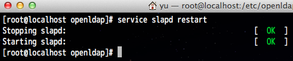

[](./openldap_restart_slapd.png) LPIC Level3の学習の一環で仮想CentOS v6.4にOpenLDAP 2.4系をインストールした際の手順を簡単に纏めておく。2.2系とは手順が少し異なったので、その点戸惑った。参考サイトは記事末尾に紹介。 
<!-- truncate -->


### インストール

事前に対象のOS環境に既にpkgが導入されているかどうかを確認する。 

```bash
 # yum list installed '*ldap*' Loaded plugins: fastestmirror, refresh-packagekit, security Loading mirror speeds from cached hostfile * base: centos.ustc.edu.cn * extras: mirror.neu.edu.cn * updates: centos.ustc.edu.cn Installed Packages apr-util-ldap.x86_64 1.3.9-3.el6_0.1 @anaconda-CentOS-201207061011.x86_64/6.3 openldap.x86_64 2.4.23-32.el6_4.1 @updates 
```

 OSの初期インストール時に幾つか入っていたようだが、肝心のservers, clientsが入っていないので下記コマンドでインストールする。 

```bash
 # yum install openldap-servers # yum install openldap-clients 
```


### 初期設定 - slapd.conf

LDAP機能の提供サーバである、slapdの設定ファイルのひな形をコピーし、それを編集する。

```
# cp /usr/share/openldap-servers/slapd.conf.obsolete /etc/openldap/slapd.conf

```

ここで編集するのは下記の３要素。

1. suffix ：　ディレクトリサービスの基点となるディレクトリ
2. rootdn　：　LDAPディレクトリ管理者(ルートDN)
3. rootpw　：　ルートDNのパスワード

尚、ルートDNのパスワードの設定はslappasswdコマンドを用いて暗号化したものを設定ファイルに入力する。 

```bash
 # slappasswd New password: Re-enter new password: {SSHA}57xj01XKSrzMVdDC6tqyCe86itiSQosQ 
```

 また、設定の動的な更新を可能にするために、databaseディレクティブに対してconfigのモノも作成する。結果として修正後の設定ファイル(抜粋)は下記の通り。 

```bash
 database config rootdn "cn=admin,cn=config" rootpw {SSHA}57xj01XKSrzMVdDC6tqyCe86itiSQosQ database bdb suffix "dc=yukun,dc=info" rootdn "cn=Manager,dc=yukun,dc=info" rootpw {SSHA}57xj01XKSrzMVdDC6tqyCe86itiSQosQ directory /var/lib/ldap 
```

 ここでは、configとbdbのパスワードは一先ず同じモノとしている。 続いて、下記のコマンドで設定をテスト・反映する。 

```bash
 # rm -rf slapd.d # mkdir slapd.d # slaptest -f slapd.conf -F slapd.d bdb_db_open: warning - no DB_CONFIG file found in directory /var/lib/ldap: (2). Expect poor performance for suffix "dc=yukun,dc=info". config file testing succeeded 
```

 データベースの管理パラメータの設定ひな形が管理ディレクトリに存在していなかったので、下記のコマンドでコピーする。

```
# cp /usr/share/openldap-servers/DB_CONFIG.example /var/lib/ldap/DB_CONFIG

```

再度チェック。 

```bash
 # slaptest -f slapd.conf -F slapd.d config file testing succeeded 
```


### slapdの起動

yumからインストールした場合、serviceコマンドからslapdを起動できる。 

```bash
 # service slapd start Checking configuration files for slapd: [FAILED] ldif_read_file: Permission denied for "/etc/openldap/slapd.d/cn=config.ldif" slaptest: bad configuration file! 
```

 Permissionがrootになっているので、ldapに直す。 

```bash
 # chown -R ldap: /etc/openldap/slapd.d/ [root@localhost openldap]# service slapd start Starting slapd: [ OK ] 
```

 あわせてサーバ起動時の自動起動設定も実施する。 

```bash
 chkconfig slapd on 
```

 後はldapadd, ldapsearchコマンド等が正常に使えればは問題なし。それについては後日纏めておく。

### 参考サイト

- [OpenLDAP, Documentation](http://www.openldap.org/doc/)
- [Formation OpenLDAP - PedroWiki](http://wiki.pedrono.fr/index.php/Formation_OpenLDAP)
- openLDAP 構築(38) - エラーメッセージ集 | arinux
- [DebianでLDAPサーバ - Humanity](http://d.hatena.ne.jp/tyru/20110725/ldap)
- [Cannot setup LDAP via server guide - hangs when issuing "ldapmodify" command \[Archive\] - Ubuntu Forums](http://ubuntuforums.org/archive/index.php/t-1588149.html)
- [Multiple issues with OpenLDAP slapd \[Archive\] - Ubuntu Forums](http://ubuntuforums.org/archive/index.php/t-1601873.html)
