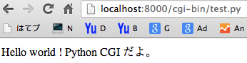
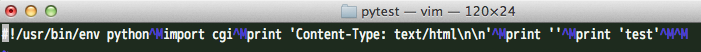
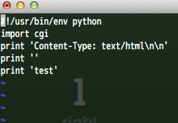
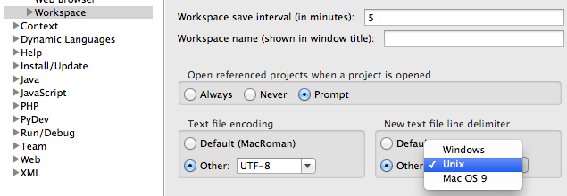

PythonのみでCGIを処理できるサーバを立てられるので、その動作確認。今回は下記CGIHTTPServerモジュールを使用する。尚、実行環境はMac OSX。 
<!-- truncate -->


### ソースコード


```python
 import CGIHTTPServer CGIHTTPServer.test() 
```

 上記スクリプトを実行後、そのスクリプトのカレントディレクトリの直下にcgi-binフォルダを作成し、そこに今回処理させるCGIスクリプトを配置する。 

```python
 #!/usr/bin/env python # -*- coding: utf-8 -*- print """Content-Type: text/html Hello world ! Python CGI だよ。 """ 
```


### 実行結果

ブラウザ上から当該ファイルへアクセスすると以下の通りページが出力される。 [](./python_cgi_test.png)

### エラーケース

ブラウザからCGIファイルへアクセスした際に、CGIHTTPServerより下記のメッセージが出力された場合。 

```python
 Serving HTTP on 0.0.0.0 port 8000 ... 1.0.0.127.in-addr.arpa - - [14/Aug/2013 21:42:52] "GET /cgi-bin/test.py HTTP/1.1" 200 - Traceback (most recent call last): File "/Library/Frameworks/Python.framework/Versions/2.7/lib/python2.7/CGIHTTPServer.py", line 251, in run_cgi os.execve(scriptfile, args, env) OSError: [Errno 8] Exec format error 1.0.0.127.in-addr.arpa - - [14/Aug/2013 21:42:52] CGI script exit status 0x7f00 1.0.0.127.in-addr.arpa - - [14/Aug/2013 21:42:52] code 404, message File not found 1.0.0.127.in-addr.arpa - - [14/Aug/2013 21:42:52] "GET /favicon.ico HTTP/1.1" 404 - 
```


### 原因

2つ考えられる。

1. CGIスクリプトファイルに実行権限を付与していない。
2. スクリプトファイルの改行コードがMac OS 9。 [](./python_mac_char_code.png)

### 対処

実行権限が付与されていない場合は、chmod 755や+xで対象ファイルに権限を付与すれば良い。仮に改行コードが別のものであれば、変換する。 [](./python_unix_char_code.png) 尚、Eclipseの設定で改行コードを指定するには下記の画面から行う。 ※General→Workspace [](./python_eclipse_editer_setting.png)
