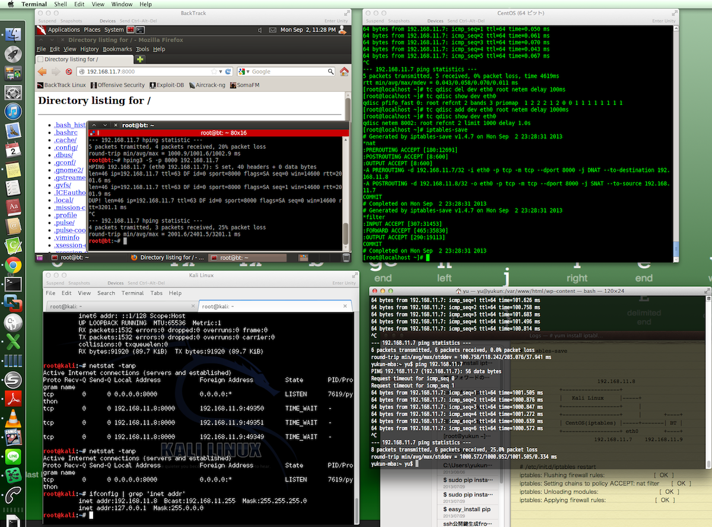

LinuxにiptablesのNAT設定とtcコマンドでネットワーク遅延環境を模擬的に構築してみたので、その手順を以下に記載する。欲を言えばクライント、サーバ側はStatic Routeに従ってルーティング出来るようルータールールの設定をしたかったが、リソース(主に時間)の関係上割愛。

### 環境

今回はMacのVMWare fusionで下記の3環境を用意した。左下のCentOS(ルーター部)以外は特にLinuxでなくとも良い。

```
            192.168.11.8
+------------------+
|   Kali Linux     |-----+
+------------------+     |
+------------------+     |       +-----------+
| CentOS (iptables)|-----+-------| BackTrack |
+------------------+ eth0        +-----------+
            192.168.11.7         192.168.11.9

```

検証のイメージとしては、BackTrackからCentOS当てへのHTTPリクエストをKail Linux側へ転送、そのレスポンスをKali Linux経由でBackTrackが受信、Webページの表示を行う。CentOS側のインターフェイスに対してdelayをかけることで疑似的な遅延環境となる。(BackTrack側でtcコマンドを実行すれば話が早いのだが、上記であれば両端の環境がLinux以外のOSでかつ遅延設定できない環境でも対応できる) 
<!-- truncate -->


### IPフォワード設定

先ずは、CentOS上でiptables関連の設定を実施。 

```bash
# cat /proc/sys/net/ipv4/ip_forward
# echo 1 >/proc/sys/net/ipv4/ip_forward
# cat /proc/sys/net/ipv4/ip_forward
1
```

 再起動後も有効にしたい場合は /etc/rc.d/rc.localにecho 1 >/proc/sys/net/ipv4/ip\_forwardを追記する。 /etc/sysctl.confに、以下を追記し 

```bash
net.ipv4.ip_forward = 1
```

 /etc/sysctl.confの再読み込みを行う。 

```bash
# sysctl -p
```

 続いて、/etc/sysconfig/networkに以下の設定を追記。 

```bash
FORWARD_IPV4=yes
GATEWAY=
VATEWAYDEV=
```

 最後に/etc/sysctl.confのnet.ipv4.ip\_forwardを1に設定し、再起動する。 

```bash
# sysctl -p
# service network restart
```


### iptablesの修正

/etc/sysconfig/iptablesを下記の通り修正する。 

```bash
*filter
:INPUT ACCEPT [0:0]
:FORWARD ACCEPT [0:0]
:OUTPUT ACCEPT [0:0]
COMMIT
*nat
:PREROUTING ACCEPT [0:0]
:POSTROUTING ACCEPT [0:0]
:OUTPUT ACCEPT [0:0]
# Same segment NAT
-A PREROUTING -i eth0 -p tcp -d 192.168.11.7 --dport 8000 -j DNAT --to-destination 192.168.11.8
-A POSTROUTING -o eth0 -p tcp -d 192.168.11.8 --dport 8000 -j SNAT --to-source 192.168.11.7
COMMIT
```

 設定の再読み込みと確認 

```bash
# /etc/init.d/iptables restart
iptables: Flushing firewall rules:                         [  OK  ]
iptables: Setting chains to policy ACCEPT: nat filter      [  OK  ]
iptables: Unloading modules:                               [  OK  ]
iptables: Applying firewall rules:                         [  OK  ]
# iptables-save
# Generated by iptables-save v1.4.7 on Tue Sep  3 00:16:36 2013
*nat
:PREROUTING ACCEPT [576:42037]
:POSTROUTING ACCEPT [10:728]
:OUTPUT ACCEPT [10:728]
-A PREROUTING -d 192.168.11.7/32 -i eth0 -p tcp -m tcp --dport 8000 -j DNAT --to-destination 192.168.11.8
-A POSTROUTING -d 192.168.11.8/32 -o eth0 -p tcp -m tcp --dport 8000 -j SNAT --to-source 192.168.11.7
COMMIT
# Completed on Tue Sep  3 00:16:36 2013
# Generated by iptables-save v1.4.7 on Tue Sep  3 00:16:36 2013
*filter
:INPUT ACCEPT [945:88671]
:FORWARD ACCEPT [958:63278]
:OUTPUT ACCEPT [844:55288]
COMMIT
# Completed on Tue Sep  2 23:16:36 2013
```


### ネットワークdelayの設定

分かり易く1秒に設定する。in/out時にそれぞれ遅延が発生するので実際のWebページ表示は2秒以上となる。 

```bash
# tc qdisc add dev eth0 root netem delay 1000ms
# tc qdisc show dev eth0
qdisc netem 8002: root refcnt 2 limit 1000 delay 1.0s
```


### Webサーバの立ち上げ

Kail Linux上でなにかサーバを立ち上げるが手っ取り早く[Pythonで簡易Webサーバ](/blog/python-simplehttpserver "Python: SimpleHTTPServerでWebサーバをたてる")を立ち上げることにする。

#### web.py


```python
import SimpleHTTPServer
SimpleHTTPServer.test()
```

 実行するとport 8000で待ち受けを開始する。 

```bash
# python web.py
Serving HTTP on 0.0.0.0 port 8000 ...
```

 念のためListenポートを確認する。 

```bash
# netstat -tanp
Active Internet connections (servers and established)
Proto Recv-Q Send-Q Local Address               Foreign Address             State       PID/Program name
tcp        0      0 0.0.0.0:8000                0.0.0.0:*                   LISTEN      7619/python
```


### Webページへアクセスする

BackTrack側からCentOSのport8000番に対してアクセスを試みると数秒待たされてページが表示されることが確認できる。下図だと左上がBackTrackクライアント画面。 [](./linux_router_network_delay.png) 表示時間がどれくらいか気になるのであれば、hping3等で8000番を指定し打ってみる。 

```bash
# hping3 -S -p 8000 192.168.11.7
HPING 192.168.11.7 (eth0 192.168.11.7): S set, 40 headers + 0 data bytes
len=46 ip=192.168.11.7 ttl=63 DF id=0 sport=8000 flags=SA seq=0 win=14600 rtt=2001.6 ms
len=46 ip=192.168.11.7 ttl=63 DF id=0 sport=8000 flags=SA seq=1 win=14600 rtt=2001.9 ms
DUP! len=46 ip=192.168.11.7 ttl=63 DF id=0 sport=8000 flags=SA seq=0 win=14600 rtt=3201.1 ms
^C
--- 192.168.11.7 hping statistic ---
4 packets tramitted, 3 packets received, 25% packet loss
round-trip min/avg/max = 2001.6/2401.5/3201.1 ms
```

 何か上手くいかないときは、hping3、traceroute、tcpdump等で設定状態の確認をする。

### 遅延設定の解除


```bash
tc qdisc del dev eth0 root netem delay 1000ms
```

 因みにtcコマンドは遅延幅の設定の他にパケットロス、パケットの重複、パケットの到着順の変更等色々ある。
