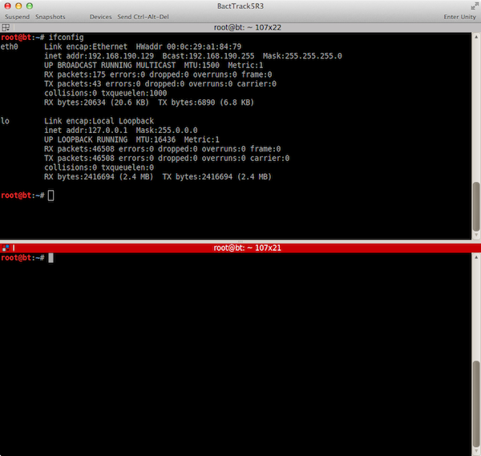

先日tcpdumpの復習をしたので、備忘録として使い方を下記にまとめておく。

### tcpdumpとは

tcpdumpはほとんどのLinuxディストリビューション、及びWindows(Windowsバージョンではwindumpという)で使用できるパケットキャプチャー、基本的なフィルタリングが出来るコマンドベースのFreewareツール。sniffer(スニッファー)ツールにカテゴライズされ、スニッフィングの対象プロトコルはIP, TCP, UDP, ICMP。 (参考) Wikipedia : [tcpdump - Wikipedia, the free encyclopedia](http://en.wikipedia.org/wiki/Tcpdump)

### 公式サイト

- tcpdump : [TCPDUMP/LIBPCAP public repository](http://www.tcpdump.org/)
- windump : [WinDump - Home](http://www.winpcap.org/windump/)


<!-- truncate -->


### 実行環境

今回はホストMac OSのVMware fusion上のBackTrack5 R3のrootユーザーで実施。ネットワーク環境は以下の通り。 

```bash
 # echo 1 > /proc/sys/net/ipv6/conf/all/disable_ipv6 # cat /proc/sys/net/ipv6/conf/all/disable_ipv6 1 # ifconfig eth0 Link encap:Ethernet HWaddr 00:0c:29:a1:84:79 inet addr:192.168.190.129 Bcast:192.168.190.255 Mask:255.255.255.0 UP BROADCAST RUNNING MULTICAST MTU:1500 Metric:1 RX packets:175 errors:0 dropped:0 overruns:0 frame:0 TX packets:43 errors:0 dropped:0 overruns:0 carrier:0 collisions:0 txqueuelen:1000 RX bytes:20634 (20.6 KB) TX bytes:6890 (6.8 KB) lo Link encap:Local Loopback inet addr:127.0.0.1 Mask:255.0.0.0 UP LOOPBACK RUNNING MTU:16436 Metric:1 RX packets:46508 errors:0 dropped:0 overruns:0 frame:0 TX packets:46508 errors:0 dropped:0 overruns:0 carrier:0 collisions:0 txqueuelen:0 RX bytes:2416694 (2.4 MB) TX bytes:2416694 (2.4 MB) 
```

 eth0はVM設定でhost-only。IPv6はdisable。今回は手軽さを考慮しeth0は使用せずlo (loopbackアドレス)を使用。

### 使い方

ターミナル上でtcpdump -helpかman tcpdumpを実行すれば基本的な使い方は記述されている。詳しく確認したい場合は公式のドキュメントを参照する。 

```bash
 # tcpdump -help tcpdump version 4.3.0 libpcap version 1.0.0 Usage: tcpdump [-aAbdDefhHIKlLnNOpqRStuUvxX] [ -B size ] [ -c count ] [ -C file_size ] [ -E algo:secret ] [ -F file ] [ -G seconds ] [ -i interface ] [ -M secret ] [ -r file ] [ -s snaplen ] [ -T type ] [ -w file ] [ -W filecount ] [ -y datalinktype ] [ -z command ] [ -Z user ] [ expression ] 
```

 

```bash
 # man tcpdump TCPDUMP(1) TCPDUMP(1) NAME tcpdump - dump traffic on a network SYNOPSIS tcpdump [ -AbdDefhHIJKlLnNOpqRStuUvxX ] [ -B buffer_size ] [ -c count ] [ -C file_size ] [ -G rotate_seconds ] [ -F file ] [ -i interface ] [ -j tstamp_type ] [ -m module ] [ -M secret ] [ -r file ] [ -s snaplen ] [ -T type ] [ -w file ] [ -W filecount ] [ -E spi@ipaddr algo:secret,... ] [ -y datalinktype ] [ -z postrotate-command ] [ -Z user ] [ expression ] DESCRIPTION Tcpdump prints out a description of the contents of packets on a network interface that match the boolean expression. It can also be run with the -w flag, which causes it to save the packet data to a file for later analysis, and/or with the -r flag, which causes it to read from a saved packet file rather than to read packets from a network interface. In all cases, only packets that match expression will be processed by tcpdump. Tcpdump will, if not run with the -c flag, continue capturing packets until it is interrupted by a SIGINT signal (generated, for example, by typing your interrupt character, typically control-C) or a SIGTERM signal (typically generated with the kill(1) command); if run with the -c flag, it will capture packets until it is interrupted by a SIGINT or SIGTERM signal or the specified num‐ ber of packets have been processed. ＜後略＞ 
```


### 通信トラフィックのキャプチャ

手始めにlocalhostに対してpingを送出し、その通信をキャプチャする。確認の際は下図のようにターミナルを２画面開いておくと良い。(下図はTerminatorというBT5に標準で導入されているターミナルを使用している。これはショートカットで画面分割や画面移動が可能で中々便利。オススメです。) [](./terminator_2screen.png) 一方の画面でtcpdump -i loを実行し、もう一方の画面でping 127.0.0.1を実行すると実行結果は下記のようになる。 

```bash
 # tcpdump -i lo tcpdump: verbose output suppressed, use -v or -vv for full protocol decode listening on lo, link-type EN10MB (Ethernet), capture size 65535 bytes 15:18:14.230170 IP localhost > localhost: ICMP echo request, id 7948, seq 1, length 64 15:18:14.230194 IP localhost > localhost: ICMP echo reply, id 7948, seq 1, length 64 15:18:15.229229 IP localhost > localhost: ICMP echo request, id 7948, seq 2, length 64 15:18:15.229256 IP localhost > localhost: ICMP echo reply, id 7948, seq 2, length 64 15:18:16.228549 IP localhost > localhost: ICMP echo request, id 7948, seq 3, length 64 15:18:16.228567 IP localhost > localhost: ICMP echo reply, id 7948, seq 3, length 64 15:18:17.228463 IP localhost > localhost: ICMP echo request, id 7948, seq 4, length 64 15:18:17.228480 IP localhost > localhost: ICMP echo reply, id 7948, seq 4, length 64 ^C 8 packets captured 16 packets received by filter 0 packets dropped by kernel 
```

 

```bash
 # ping 127.0.0.1 PING 127.0.0.1 (127.0.0.1) 56(84) bytes of data. 64 bytes from 127.0.0.1: icmp_seq=1 ttl=64 time=0.125 ms 64 bytes from 127.0.0.1: icmp_seq=2 ttl=64 time=0.187 ms 64 bytes from 127.0.0.1: icmp_seq=3 ttl=64 time=0.061 ms 64 bytes from 127.0.0.1: icmp_seq=4 ttl=64 time=0.060 ms ^C --- 127.0.0.1 ping statistics --- 4 packets transmitted, 4 received, 0% packet loss, time 2998ms rtt min/avg/max/mdev = 0.060/0.108/0.187/0.053 ms 
```

 上記はpingを4回送出後に両ターミナル上でCtrl-Cを実行してpingの送出の終了、tcpdumpの終了をしている。 下記の行がpingのICMP echoリクエストの送出を表示しており、 

```bash
 15:18:14.230170 IP localhost > localhost: ICMP echo request, id 7948, seq 1, length 64 
```

 その次の行がechoリクエストに対する応答を表示。 

```bash
 15:18:14.230194 IP localhost > localhost: ICMP echo reply, id 7948, seq 1, length 64 
```

 今回は送信元と送信先が同じlocalhostである為、localhost > localhostとなっている。 tcpdumpのオプションの一つである-iオプションはキャプチャするインターフェイスの指定。仮に指定しなかった場合には、tcpdump側がシステム上のインターフェイスリスト上から一番低いナンバーのものを選択。(但しloopbackアドレスは除く)すなわち、今回の環境で-iオプションを省略した場合はeth0が選択されることになる(下記参照 〜on eth0〜の記述)。 

```bash
 # tcpdump tcpdump: verbose output suppressed, use -v or -vv for full protocol decode listening on eth0, link-type EN10MB (Ethernet), capture size 65535 bytes 
```

 インターフェイス(NIC)が複数ある環境で、キャプチャ対象を指定したい場合は-iオプションを使用する。

#### \-nオプション

\-nオプションを使用した場合は、送信・受信アドレス、ポートの名前解決をしない。先ほどのpingキャプチャを-nオプションを使用すると下記のようになる。 

```bash
 # tcpdump -i lo -n tcpdump: verbose output suppressed, use -v or -vv for full protocol decode listening on lo, link-type EN10MB (Ethernet), capture size 65535 bytes 15:59:17.135341 IP 127.0.0.1 > 127.0.0.1: ICMP echo request, id 52236, seq 1, length 64 15:59:17.135356 IP 127.0.0.1 > 127.0.0.1: ICMP echo reply, id 52236, seq 1, length 64 15:59:18.136156 IP 127.0.0.1 > 127.0.0.1: ICMP echo request, id 52236, seq 2, length 64 15:59:18.136177 IP 127.0.0.1 > 127.0.0.1: ICMP echo reply, id 52236, seq 2, length 64 15:59:19.136058 IP 127.0.0.1 > 127.0.0.1: ICMP echo request, id 52236, seq 3, length 64 15:59:19.136075 IP 127.0.0.1 > 127.0.0.1: ICMP echo reply, id 52236, seq 3, length 64 ^C 6 packets captured 12 packets received by filter 0 packets dropped by kernel 
```

 -nオプションを指定してないときはアドレスはlocalhostだったが、指定した場合は上記の通り127.0.0.1が直接表示される。

#### \-c \[数値\] オプション

\-c \[数値\]オプションはキャプチャするパケット数の指定。-c 5とした場合の実行結果は下記の通り。 

```bash
 # tcpdump -i lo -c 5 tcpdump: verbose output suppressed, use -v or -vv for full protocol decode listening on lo, link-type EN10MB (Ethernet), capture size 65535 bytes 16:08:24.019952 IP localhost > localhost: ICMP echo request, id 59148, seq 1, length 64 16:08:24.019977 IP localhost > localhost: ICMP echo reply, id 59148, seq 1, length 64 16:08:25.019840 IP localhost > localhost: ICMP echo request, id 59148, seq 2, length 64 16:08:25.019855 IP localhost > localhost: ICMP echo reply, id 59148, seq 2, length 64 16:08:26.020723 IP localhost > localhost: ICMP echo request, id 59148, seq 3, length 64 5 packets captured 12 packets received by filter 0 packets dropped by kernel 
```

 この場合、Ctrl-Cを押下しなくとも5パケットのキャプチャ後にtcpdumpが終了しプロンプトを返す。

#### \-v オプション

\-vオプションを指定した場合は表示される情報量が少し増える。(vはverboseの略) 

```bash
 # tcpdump -i lo -v tcpdump: listening on lo, link-type EN10MB (Ethernet), capture size 65535 bytes 16:16:28.000393 IP (tos 0x0, ttl 64, id 0, offset 0, flags [DF], proto ICMP (1), length 84) localhost > localhost: ICMP echo request, id 2061, seq 1, length 64 16:16:28.000402 IP (tos 0x0, ttl 64, id 2382, offset 0, flags [none], proto ICMP (1), length 84) localhost > localhost: ICMP echo reply, id 2061, seq 1, length 64 16:16:29.000604 IP (tos 0x0, ttl 64, id 0, offset 0, flags [DF], proto ICMP (1), length 84) localhost > localhost: ICMP echo request, id 2061, seq 2, length 64 16:16:29.000623 IP (tos 0x0, ttl 64, id 2383, offset 0, flags [none], proto ICMP (1), length 84) localhost > localhost: ICMP echo reply, id 2061, seq 2, length 64 16:16:30.000213 IP (tos 0x0, ttl 64, id 0, offset 0, flags [DF], proto ICMP (1), length 84) localhost > localhost: ICMP echo request, id 2061, seq 3, length 64 16:16:30.000230 IP (tos 0x0, ttl 64, id 2384, offset 0, flags [none], proto ICMP (1), length 84) localhost > localhost: ICMP echo reply, id 2061, seq 3, length 64 ^C 6 packets captured 12 packets received by filter 0 packets dropped by kernel 
```

 追加情報としてttl(time to live), identification, total length, IPパケットのオプションなどがある。IP, ICMPヘッダーのチェックサムの検証等に活用可能。

#### \-x オプション

\-xオプションはパケットの内容(リンクレベルヘッダは除く)を16進数(hex)で表示する。 

```bash
 # tcpdump -i lo -x tcpdump: verbose output suppressed, use -v or -vv for full protocol decode listening on lo, link-type EN10MB (Ethernet), capture size 65535 bytes 16:35:40.900713 IP localhost > localhost: ICMP echo request, id 16141, seq 1, length 64 0x0000: 4500 0054 0000 4000 4001 3ca7 7f00 0001 0x0010: 7f00 0001 0800 9870 3f0d 0001 cc9d 3e52 0x0020: 0000 0000 49be 0d00 0000 0000 1011 1213 0x0030: 1415 1617 1819 1a1b 1c1d 1e1f 2021 2223 0x0040: 2425 2627 2829 2a2b 2c2d 2e2f 3031 3233 0x0050: 3435 3637 16:35:40.900729 IP localhost > localhost: ICMP echo reply, id 16141, seq 1, length 64 0x0000: 4500 0054 0951 0000 4001 7356 7f00 0001 0x0010: 7f00 0001 0000 a070 3f0d 0001 cc9d 3e52 0x0020: 0000 0000 49be 0d00 0000 0000 1011 1213 0x0030: 1415 1617 1819 1a1b 1c1d 1e1f 2021 2223 0x0040: 2425 2627 2829 2a2b 2c2d 2e2f 3031 3233 0x0050: 3435 3637 ^C 2 packets captured 4 packets received by filter 0 packets dropped by kernel 
```

 16進数の各4文字のグループは2 Bytesのデータに相当。8bits (1 Byte)は16進数の2文字で、16進数の1文字は4 bitsで表示。そうすると、0から数えて9 Bytes目(4500 0054 0000 4000 40**01**)はIPv4ヘッダ使用上プロトコルを表すもので、1はICMPとなる。20, 21 Bytes目の0800はType=8, Code=0となりEchoリクエストと分かる。

#### \-X オプション

\-Xオプションは16進数表記の隣に、そのデータのASCIIテキストを表示する。 

```bash
 # tcpdump -i lo -X tcpdump: verbose output suppressed, use -v or -vv for full protocol decode listening on lo, link-type EN10MB (Ethernet), capture size 65535 bytes 17:19:58.788124 IP localhost > localhost: ICMP echo request, id 46349, seq 1, length 64 0x0000: 4500 0054 0000 4000 4001 3ca7 7f00 0001 E..T..@.@.<..... 0x0010: 7f00 0001 0800 cc1d b50d 0001 2ea8 3e52 ..............>R 0x0020: 0000 0000 3f06 0c00 0000 0000 1011 1213 ....?........... 0x0030: 1415 1617 1819 1a1b 1c1d 1e1f 2021 2223 .............!"# 0x0040: 2425 2627 2829 2a2b 2c2d 2e2f 3031 3233 $%&'()*+,-./0123 0x0050: 3435 3637 4567 17:19:58.788139 IP localhost > localhost: ICMP echo reply, id 46349, seq 1, length 64 0x0000: 4500 0054 0954 0000 4001 7353 7f00 0001 E..T.T..@.sS.... 0x0010: 7f00 0001 0000 d41d b50d 0001 2ea8 3e52 ..............>R 0x0020: 0000 0000 3f06 0c00 0000 0000 1011 1213 ....?........... 0x0030: 1415 1617 1819 1a1b 1c1d 1e1f 2021 2223 .............!"# 0x0040: 2425 2627 2829 2a2b 2c2d 2e2f 3031 3233 $%&'()*+,-./0123 0x0050: 3435 3637 4567 ^C 2 packets captured 4 packets received by filter 0 packets dropped by kernel 
```

 これを見ると、pingコマンドはデータとして記号と数字を送受していることが分かる。(個人的にはトリビアぽい。)

#### host \[ホスト名 or IPアドレス\]オプション

フィルタリングする送信・受信hostを指定。例えば、下記のコマンドでキャプチャを開始しても、ping 127.0.0.1コマンドではhostが異なる為、キャプチャされない。 

```bash
 # tcpdump -i lo host 192.168.190.129 
```

 勿論、下記のコマンドであれば、ping 127.0.0.1コマンドでキャプチャされる。 

```bash
 # tcpdump -i lo host localhost 
```

 因みにhostオプションへの組み合わせとしてand, or , not, ()等のキーワードがあり、フィルタリング範囲を指定できる。

### Netcatでtelnetの通信をキャプチャ

これまでは、pingのリクエスト・レスポンスをキャプチャしたが、ここでは、Netcatコマンドでtelnetの待ち受けport 23番をリッスンしtelnetクライアントの通信をキャプチャする。(ターミナル画面をNetcat用に1つ追加して3画面で実施)

#### 実行コマンド

1. \# tcpdump -i lo -X
2. \# nc -l -p 23
3. \# telnet 127.0.0.1 23

#### 実行結果


```bash
 # nc -l -p 23 Hello ＜ここで、Ctrl-C＞ 
```

 

```bash
 # telnet 127.0.0.1 23 Trying 127.0.0.1... Connected to 127.0.0.1. Escape character is '^]'. Hello Connection closed by foreign host. 
```

 

```bash
 # tcpdump -i lo -X tcpdump: verbose output suppressed, use -v or -vv for full protocol decode listening on lo, link-type EN10MB (Ethernet), capture size 65535 bytes 17:52:26.854855 IP localhost.34935 > localhost.telnet: Flags [S], seq 3549458209, win 32792, options [mss 16396,sackOK,TS val 4678827 ecr 0,nop,wscale 4], length 0 0x0000: 4510 003c 0b8a 4000 4006 3120 7f00 0001 E..<..@.@.1..... 0x0010: 7f00 0001 8877 0017 d390 6f21 0000 0000 .....w....o!.... 0x0020: a002 8018 fe30 0000 0204 400c 0402 080a .....0....@..... 0x0030: 0047 64ab 0000 0000 0103 0304 .Gd......... 17:52:26.854870 IP localhost.telnet > localhost.34935: Flags [S.], seq 1531402762, ack 3549458210, win 32768, options [mss 16396,sackOK,TS val 4678827 ecr 4678827,nop,wscale 4], length 0 0x0000: 4500 003c 0000 4000 4006 3cba 7f00 0001 E..<..@.@.<..... 0x0010: 7f00 0001 0017 8877 5b47 5a0a d390 6f22 .......w[GZ...o" 0x0020: a012 8000 fe30 0000 0204 400c 0402 080a .....0....@..... 0x0030: 0047 64ab 0047 64ab 0103 0304 .Gd..Gd..... 17:52:26.854877 IP localhost.34935 > localhost.telnet: Flags [.], ack 1, win 2050, options [nop,nop,TS val 4678827 ecr 4678827], length 0 0x0000: 4510 0034 0b8b 4000 4006 3127 7f00 0001 E..4..@.@.1'.... 0x0010: 7f00 0001 8877 0017 d390 6f22 5b47 5a0b .....w....o"[GZ. 0x0020: 8010 0802 fe28 0000 0101 080a 0047 64ab .....(.......Gd. 0x0030: 0047 64ab .Gd. 17:52:29.812107 IP localhost.34935 > localhost.telnet: Flags [P.], seq 1:8, ack 1, win 2050, options [nop,nop,TS val 4679567 ecr 4678827], length 7 0x0000: 4510 003b 0b8c 4000 4006 311f 7f00 0001 E..;..@.@.1..... 0x0010: 7f00 0001 8877 0017 d390 6f22 5b47 5a0b .....w....o"[GZ. 0x0020: 8018 0802 fe2f 0000 0101 080a 0047 678f ...../.......Gg. 0x0030: 0047 64ab 4865 6c6c 6f0d 0a .Gd.Hello.. 17:52:29.812152 IP localhost.telnet > localhost.34935: Flags [.], ack 8, win 2048, options [nop,nop,TS val 4679567 ecr 4679567], length 0 0x0000: 4500 0034 3ea0 4000 4006 fe21 7f00 0001 E..4>.@.@..!.... 0x0010: 7f00 0001 0017 8877 5b47 5a0b d390 6f29 .......w[GZ...o) 0x0020: 8010 0800 fe28 0000 0101 080a 0047 678f .....(.......Gg. 0x0030: 0047 678f .Gg. ^C 5 packets captured 10 packets received by filter 0 packets dropped by kernel 
```


### tracerouteコマンドのパケットデータ

上述でpingのデータが記号と数字であったが、tracerouteの結果は下記のようになる。 

```bash
 # traceroute localhost traceroute to localhost (127.0.0.1), 30 hops max, 60 byte packets 1 localhost (127.0.0.1) 0.036 ms 0.012 ms 0.026 ms 
```

 

```bash
 # tcpdump -i lo -X tcpdump: verbose output suppressed, use -v or -vv for full protocol decode listening on lo, link-type EN10MB (Ethernet), capture size 65535 bytes 07:43:54.033727 IP localhost.46058 > localhost.33434: UDP, length 32 0x0000: 4500 003c 7d85 0000 0111 3e2a 7f00 0001 E..<}.....>*.... 0x0010: 7f00 0001 b3ea 829a 0028 fe3b 4041 4243 .........(.;@ABC 0x0020: 4445 4647 4849 4a4b 4c4d 4e4f 5051 5253 DEFGHIJKLMNOPQRS 0x0030: 5455 5657 5859 5a5b 5c5d 5e5f TUVWXYZ[\]^_ 07:43:54.033739 IP localhost > localhost: ICMP localhost udp port 33434 unreachable, length 68 0x0000: 45c0 0058 7d86 0000 4001 fe5c 7f00 0001 E..X}...@..\.... 0x0010: 7f00 0001 0303 d30e 0000 0000 4500 003c ............E..< 0x0020: 7d85 0000 0111 3e2a 7f00 0001 7f00 0001 }.....>*........ 0x0030: b3ea 829a 0028 fe3b 4041 4243 4445 4647 .....(.;@ABCDEFG 0x0040: 4849 4a4b 4c4d 4e4f 5051 5253 5455 5657 HIJKLMNOPQRSTUVW 0x0050: 5859 5a5b 5c5d 5e5f XYZ[\]^_ 07:43:54.033752 IP localhost.33125 > localhost.33435: UDP, length 32 0x0000: 4500 003c 7d87 0000 0111 3e28 7f00 0001 E..<}.....>(.... 0x0010: 7f00 0001 8165 829b 0028 fe3b 4041 4243 .....e...(.;@ABC 0x0020: 4445 4647 4849 4a4b 4c4d 4e4f 5051 5253 DEFGHIJKLMNOPQRS 0x0030: 5455 5657 5859 5a5b 5c5d 5e5f TUVWXYZ[\]^_ 07:43:54.033755 IP localhost > localhost: ICMP localhost udp port 33435 unreachable, length 68 0x0000: 45c0 0058 7d88 0000 4001 fe5a 7f00 0001 E..X}...@..Z.... 0x0010: 7f00 0001 0303 0593 0000 0000 4500 003c ............E..< 0x0020: 7d87 0000 0111 3e28 7f00 0001 7f00 0001 }.....>(........ 0x0030: 8165 829b 0028 fe3b 4041 4243 4445 4647 .e...(.;@ABCDEFG 0x0040: 4849 4a4b 4c4d 4e4f 5051 5253 5455 5657 HIJKLMNOPQRSTUVW 0x0050: 5859 5a5b 5c5d 5e5f XYZ[\]^_ ＜後略＞ 
```

 一部の記号と英大文字であることが分かる。

### ApacheにFirefoxでアクセス

BT5上でApacheを立ち上げ、ブラウザFirefoxでアクセスした際のパケットデータは下記の通り。 

```bash
 # tcpdump -i lo -X tcpdump: verbose output suppressed, use -v or -vv for full protocol decode listening on lo, link-type EN10MB (Ethernet), capture size 65535 bytes 07:49:13.112056 IP localhost.37764 > localhost.www: Flags [S], seq 511015161, win 32792, options [mss 16396,sackOK,TS val 1081120 ecr 0,nop,wscale 4], length 0 0x0000: 4500 003c 07d9 4000 4006 34e1 7f00 0001 E..<..@.@.4..... 0x0010: 7f00 0001 9384 0050 1e75 78f9 0000 0000 .......P.ux..... 0x0020: a002 8018 fe30 0000 0204 400c 0402 080a .....0....@..... 0x0030: 0010 7f20 0000 0000 0103 0304 ............ 07:49:13.112066 IP localhost.www > localhost.37764: Flags [S.], seq 1232186540, ack 511015162, win 32768, options [mss 16396,sackOK,TS val 1081120 ecr 1081120,nop,wscale 4], length 0 0x0000: 4500 003c 0000 4000 4006 3cba 7f00 0001 E..<..@.@.<..... 0x0010: 7f00 0001 0050 9384 4971 acac 1e75 78fa .....P..Iq...ux. 0x0020: a012 8000 fe30 0000 0204 400c 0402 080a .....0....@..... 0x0030: 0010 7f20 0010 7f20 0103 0304 ............ 07:49:13.112075 IP localhost.37764 > localhost.www: Flags [.], ack 1, win 2050, options [nop,nop,TS val 1081120 ecr 1081120], length 0 0x0000: 4500 0034 07da 4000 4006 34e8 7f00 0001 E..4..@.@.4..... 0x0010: 7f00 0001 9384 0050 1e75 78fa 4971 acad .......P.ux.Iq.. 0x0020: 8010 0802 fe28 0000 0101 080a 0010 7f20 .....(.......... 0x0030: 0010 7f20 .... 07:49:13.112710 IP localhost.37764 > localhost.www: Flags [P.], seq 1:408, ack 1, win 2050, options [nop,nop,TS val 1081120 ecr 1081120], length 407 0x0000: 4500 01cb 07db 4000 4006 3350 7f00 0001 E.....@.@.3P.... 0x0010: 7f00 0001 9384 0050 1e75 78fa 4971 acad .......P.ux.Iq.. 0x0020: 8018 0802 ffbf 0000 0101 080a 0010 7f20 ................ 0x0030: 0010 7f20 4745 5420 2f20 4854 5450 2f31 ....GET./.HTTP/1 0x0040: 2e31 0d0a 486f 7374 3a20 6c6f 6361 6c68 .1..Host:.localh 0x0050: 6f73 740d 0a55 7365 722d 4167 656e 743a ost..User-Agent: 0x0060: 204d 6f7a 696c 6c61 2f35 2e30 2028 5831 .Mozilla/5.0.(X1 0x0070: 313b 204c 696e 7578 2069 3638 3620 6f6e 1;.Linux.i686.on 0x0080: 2078 3836 5f36 343b 2072 763a 3134 2e30 .x86_64;.rv:14.0 0x0090: 2920 4765 636b 6f2f 3230 3130 3031 3031 ).Gecko/20100101 0x00a0: 2046 6972 6566 6f78 2f31 342e 302e 310d .Firefox/14.0.1. 0x00b0: 0a41 6363 6570 743a 2074 6578 742f 6874 .Accept:.text/ht 0x00c0: 6d6c 2c61 7070 6c69 6361 7469 6f6e 2f78 ml,application/x 0x00d0: 6874 6d6c 2b78 6d6c 2c61 7070 6c69 6361 html+xml,applica 0x00e0: 7469 6f6e 2f78 6d6c 3b71 3d30 2e39 2c2a tion/xml;q=0.9,* 0x00f0: 2f2a 3b71 3d30 2e38 0d0a 4163 6365 7074 /*;q=0.8..Accept 0x0100: 2d4c 616e 6775 6167 653a 2065 6e2d 7573 -Language:.en-us 0x0110: 2c65 6e3b 713d 302e 350d 0a41 6363 6570 ,en;q=0.5..Accep 0x0120: 742d 456e 636f 6469 6e67 3a20 677a 6970 t-Encoding:.gzip 0x0130: 2c20 6465 666c 6174 650d 0a43 6f6e 6e65 ,.deflate..Conne 0x0140: 6374 696f 6e3a 206b 6565 702d 616c 6976 ction:.keep-aliv 0x0150: 650d 0a49 662d 4d6f 6469 6669 6564 2d53 e..If-Modified-S 0x0160: 696e 6365 3a20 5361 742c 2030 3420 4a75 ince:.Sat,.04.Ju 0x0170: 6e20 3230 3131 2031 373a 3033 3a30 3020 n.2011.17:03:00. 0x0180: 474d 540d 0a49 662d 4e6f 6e65 2d4d 6174 GMT..If-None-Mat 0x0190: 6368 3a20 2231 3438 6364 312d 6231 2d34 ch:."148cd1-b1-4 0x01a0: 6134 6535 6437 6230 6439 3030 220d 0a43 a4e5d7b0d900"..C 0x01b0: 6163 6865 2d43 6f6e 7472 6f6c 3a20 6d61 ache-Control:.ma 0x01c0: 782d 6167 653d 300d 0a0d 0a x-age=0.... 07:49:13.112740 IP localhost.www > localhost.37764: Flags [.], ack 408, win 2115, options [nop,nop,TS val 1081120 ecr 1081120], length 0 0x0000: 4500 0034 d38d 4000 4006 6934 7f00 0001 E..4..@.@.i4.... 0x0010: 7f00 0001 0050 9384 4971 acad 1e75 7a91 .....P..Iq...uz. 0x0020: 8010 0843 fe28 0000 0101 080a 0010 7f20 ...C.(.......... 0x0030: 0010 7f20 .... 07:49:13.113360 IP localhost.www > localhost.37764: Flags [P.], seq 1:212, ack 408, win 2115, options [nop,nop,TS val 1081120 ecr 1081120], length 211 0x0000: 4500 0107 d38e 4000 4006 6860 7f00 0001 E.....@.@.h`.... 0x0010: 7f00 0001 0050 9384 4971 acad 1e75 7a91 .....P..Iq...uz. 0x0020: 8018 0843 fefb 0000 0101 080a 0010 7f20 ...C............ 0x0030: 0010 7f20 4854 5450 2f31 2e31 2033 3034 ....HTTP/1.1.304 0x0040: 204e 6f74 204d 6f64 6966 6965 640d 0a44 .Not.Modified..D 0x0050: 6174 653a 204d 6f6e 2c20 3032 2053 6570 ate:.Mon,.02.Sep 0x0060: 2032 3031 3320 3232 3a34 393a 3133 2047 .2013.22:49:13.G 0x0070: 4d54 0d0a 5365 7276 6572 3a20 4170 6163 MT..Server:.Apac 0x0080: 6865 2f32 2e32 2e31 3420 2855 6275 6e74 he/2.2.14.(Ubunt 0x0090: 7529 0d0a 436f 6e6e 6563 7469 6f6e 3a20 u)..Connection:. 0x00a0: 4b65 6570 2d41 6c69 7665 0d0a 4b65 6570 Keep-Alive..Keep 0x00b0: 2d41 6c69 7665 3a20 7469 6d65 6f75 743d -Alive:.timeout= 0x00c0: 3135 2c20 6d61 783d 3130 300d 0a45 5461 15,.max=100..ETa 0x00d0: 673a 2022 3134 3863 6431 2d62 312d 3461 g:."148cd1-b1-4a 0x00e0: 3465 3564 3762 3064 3930 3022 0d0a 5661 4e5d7b0d900"..Va 0x00f0: 7279 3a20 4163 6365 7074 2d45 6e63 6f64 ry:.Accept-Encod 0x0100: 696e 670d 0a0d 0a ing.... 07:49:13.113422 IP localhost.37764 > localhost.www: Flags [.], ack 212, win 2117, options [nop,nop,TS val 1081120 ecr 1081120], length 0 0x0000: 4500 0034 07dc 4000 4006 34e6 7f00 0001 E..4..@.@.4..... 0x0010: 7f00 0001 9384 0050 1e75 7a91 4971 ad80 .......P.uz.Iq.. 0x0020: 8010 0845 fe28 0000 0101 080a 0010 7f20 ...E.(.......... 0x0030: 0010 7f20 .... ^C 7 packets captured 14 packets received by filter 0 packets dropped by kernel 
```

 お馴染みのGET〜の文言に続いてUser-Agentと等色々送出していることが分かる。ただ、ここまで来るとコマンドライン上で読むのはきつくなってくる。実際にはファイルに書き出しの上、WireSharkで解析する。書き出しする際は以下の-s, -wオプションを付加する。 

```bash
 tcpdump -n -i [I/F名] -s 0 -w filename.cap [フィルタ] 
```


