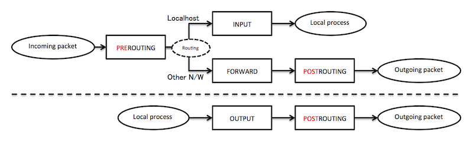

iptablesのパケットのフィルタチェインの処理フローを復習したので下記に纏める。基本技術なので参考文献が充実しており今更感があるが、手を動かしておかないと忘れそう。。当記事の後続はiptablesコマンドによるルールの設定やnmapによるスキャン検査を記載予定。尚、参考サイトはいつも通り記事末尾に記載(公式ドキュメントで理解を深める or iptableって？方向け)。 
<!-- truncate -->

### フィルタチェインの種類

ネットワークインターフェースに入る／から出るパケットをどのタイミングで処理するのかを下記のチェインを用いて指定する。下表の内よく使うものは上から3つ目まで。

| チェイン | 説明 |
| --- | --- |
| INPUT | 受信パケットに対して適用 |
| FORWARD | 転送パケットに対して適用 |
| OUTPUT | 送信パケットに対して適用 |
| PREROUTING | ルーティング前に適用 |
| POSTRUTING | ルーティング後に適用 |

### パケット処理フロー

 パケットがチェイン内のルールに合致した場合はACCEPT, DROPを行う。LOGはsyslogにロギングしつつ当該フィルタのチェインは継続して適用する。パケットに対してチェインの全てのルールに合致するものが無い場合はチェインのデフォルトポリシーが適用される。尚、INPUT, FORWARD, OUTPUTのデフォルトポリシーはACCEPT。

### 参考サイト

- [netfilter/iptables project homepage - Documentation about the netfilter/iptables project](https://www.netfilter.org/documentation/index.html)
- [Linux 2.4 Packet Filtering HOWTO](https://www.netfilter.org/documentation/HOWTO/packet-filtering-HOWTO.html)
- [Man page of IPTABLES](http://linuxjm.osdn.jp/html/iptables/man8/iptables.8.html)
- [iptables - Wikipedia, the free encyclopedia](http://en.wikipedia.org/wiki/Iptables)
