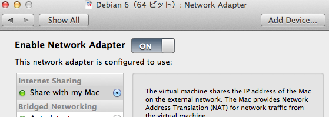
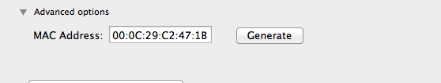

本記事はVMware Fusion上の仮想(ゲスト)マシン上でサーバサービスを起動してホスト(Mac)側から常時固定IPでアクセスしたい場合や、Retina Displayを活用するべくホスト側の対応コンソールを用いてRetina非対応のゲストマシンに手軽にsshログインしたい場合に有用なテクニック。 IPアドレスの固定化の手段は2通りあり、一つはゲスト側で固定IPを設定する手順、二つめはホスト側・VMware側のネットワーク設定にてゲスト側のIPを固定化する手順。本記事は後者の手法をゲストのDebian Linuxを用いて紹介。(当手順は対象がWindows系であっても使用可能) 
<!-- truncate -->


### VMware Fusion 上の設定

対象マシンのNetwork Adapter設定を開きInternet Sharing の Share with my Macラジオボタンを選択。 [](./vmware_fusion_network_adapter_setting.png) 続いて、同画面下部のAdvanced optionsで対象仮想NICのMACアドレスを控えておく。後述で当該MACとIPアドレスのひも付けに使う為。 [](./vmware_fusion_network_mac_setting.png)

### ホスト側(Mac OS)のコンソールでの設定

VMware Fusionをインストール後、ifconfigコマンドを実行すると下記のI/Fが追加されているのを確認できる。 

```bash
 $ ifconfig ＜中略＞ vmnet1: flags=8863 mtu 1500 ether 00:50:56:c0:00:01 inet 192.168.190.1 netmask 0xffffff00 broadcast 192.168.190.255 vmnet8: flags=8863 mtu 1500 ether 00:50:56:c0:00:08 inet 172.16.56.1 netmask 0xffffff00 broadcast 172.16.56.255 
```

 vmnet1はPrivate to Mac用のGW、vmnet8はShare with my Mac用のGW。今回vmnet8のサブネットにDHCPで割り振られるIPを固定化するには下記の設定ファイルを修正する。

```
$ sudo vim /Library/Preferences/VMware\ Fusion/vmnet8/dhcpd.conf

```

既存の設定の末尾に下記の定義を追加。

```
host vmnet8-debian {
        hardware ethernet 00:0c:29:c2:47:1b;　← Network Adapterで控えたMAC
        fixed-address 172.16.56.10;　← 設定したいIPアドレス
}

```

保存後に一度VMware Fusionを終了・起動後にゲストマシンを立ち上げれば常に設定したIPが割り振られる。なお、dhcpd.confを読むと分かるが、DHCPの自動IP割り当ては第4オクテットが128-254である為、固定IPは3-127の間で割り振ると良い。 後はhostsで当該ゲストマシンを名前解決させれば、仮想マシンへのアクセスがし易くなる。

### 参考サイト

- [VMware DHCPサービスで割り当てられるアドレスを固定する](http://ocg.aori.u-tokyo.ac.jp/member/daigo/comp/memo/?val=all&typ=all&nbr=2013012302)
- [てふてふ、なのはにとまれ？ VMwareでのネットワーク設定](http://mayacat.blog.shinobi.jp/%E3%83%A1%E3%83%A2/vmware%E3%81%A7%E3%81%AE%E3%83%8D%E3%83%83%E3%83%88%E3%83%AF%E3%83%BC%E3%82%AF%E8%A8%AD%E5%AE%9A)
