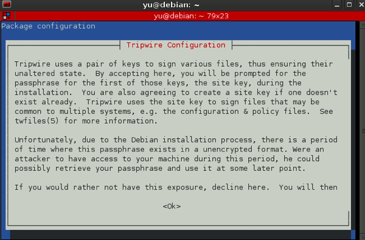
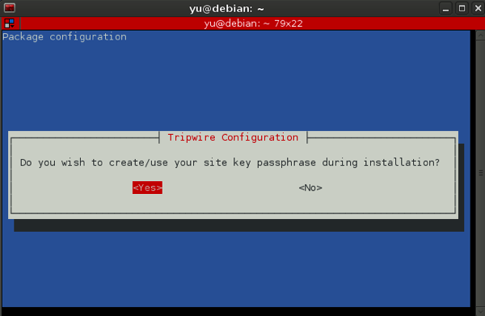
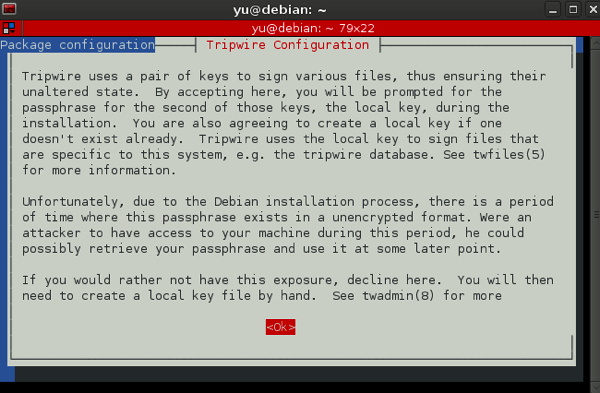
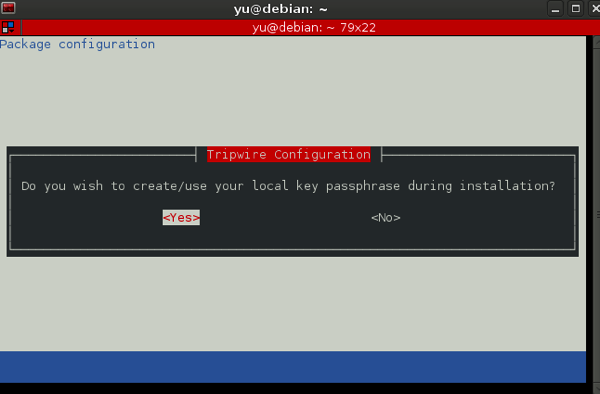
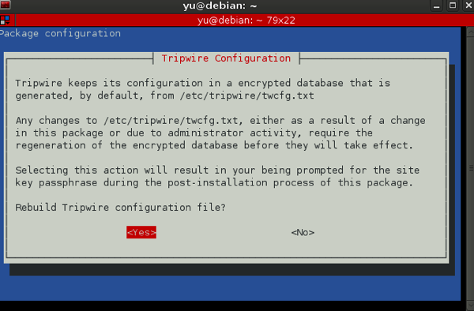
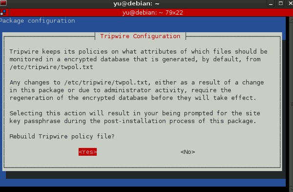
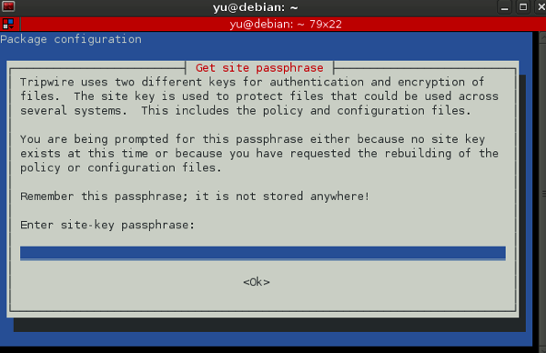
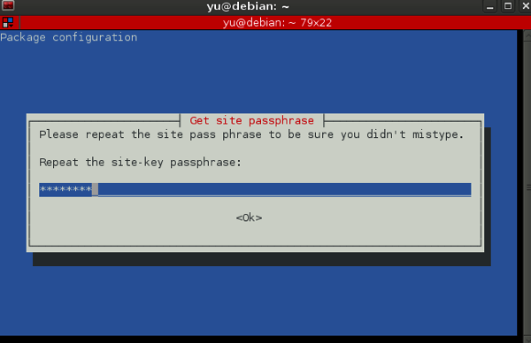
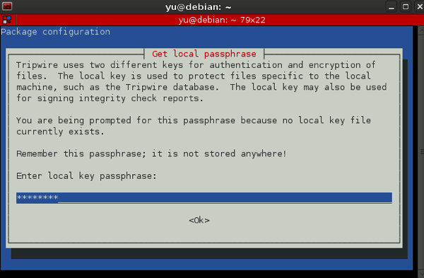
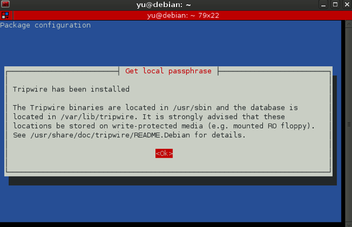

本記事では先日学習したファイル改竄検知検知ツールのTripwireのインストールについて記載。インストール中のスクリーンショットが多いため、インストール後の設定や使い方については[別記事として掲載](/blog/linux-tripwire-setting-check "Linux: Tripwireの設定と改竄チェック・DB更新")予定。

### Tripwire概要

正常状態でのスナップショットをデータベースに保存し、現在の状態のスナップショット(ハッシュ値)と比較することで改竄を検知。検知対象はポリシーファイルで設定。チェック結果レポートは記載レベルをカスタマイズ可能。レポートのメール送信機能など。また、各種設定ファイルの暗号化機能(大事)。 Tripwire社は商用版・Open Source版の両方を提供。Open Source版は↓。 [Looking for Open Source Tripwire? | Tripwire, Inc.](http://www.tripwire.org/)

### 使用環境

- Linux debian (VMware fusion上)
- インターネット環境(apt-get install用)

なお、学習用のインストール手法の為、本運用を考慮した手順は省いている。 
<!-- truncate -->


### インストール方法

```
# apt-get install tripwire

```

コマンド実行後にパッケージ設定画面が下記の通り何画面か続く。 「これからサイトキー作るけれどアタッカーにアクセスされている状況では実施しないこと。」→OKを押下。  「サイトキーパスフレーズをインストール中に生成する？」→Yesを押下。  「あとローカルキーも作るけれどアタッカーにアクセスされている状況では実施しないこと。」→OKを押下。  「ローカルキーパスフレーズをインストール中に生成する？」→Yesを押下。  「設定ファイルは/etc/tripwire/twcfg.txtに保管する。リビルドする？」→Yesを押下。  「どのファイルを監視するかを記載したポリシーファイルを/etc/tripwire/twpol.txtに保管するぜ。リビルドするかい？」→Yesを押下。  「Tripwireのポリシー、設定等を含むファイルの認証と暗号化の為に2つの異なるキーを使う。先ずはポリシーと設定ファイルのリビルド用にサイトキーのパスフレーズを入力すること。これは覚えておいてどこにも保管してはならない。」→適当なパスフレーズを入力しOKを押下。(ちなみに8文字以上)  「ミスタイプでないことを確認するために、もう一度サイトパスフレーズを入力すること。」→前画面で設定した文字列を打ち直す。  「2つ目のキーはローカルキー。Tripwireのデータベースファイルやレポートファイルの暗号化に使用する。」→適当なパスフレーズを入力しOKを押下。  「インストールは完了。Tripwireのバイナリは/usr/sbin、データベースは/var/lib/tripwire。これらは書き込み保護のメディアに保管することを強く勧める(Read only floppyとかな)。詳細はReadmeを参照すること。」→OKを押下。(フロッピーは時代を感じさせる。今はCD-ROMかな)  後は手放しで、インストールは完了。 ※全然関係ないがハッシュと聞くと、学生の時に拡張ハッシュ探索アルゴリズムの学習でアドレスのかちあい時の処理を書き忘れでセグメントエラーを頻発していた頃を思い出させる。。。
