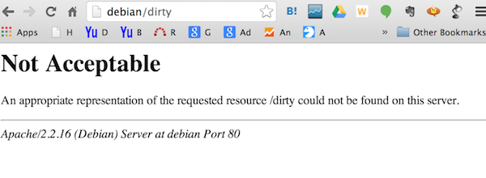
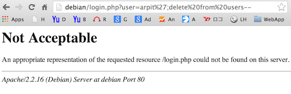
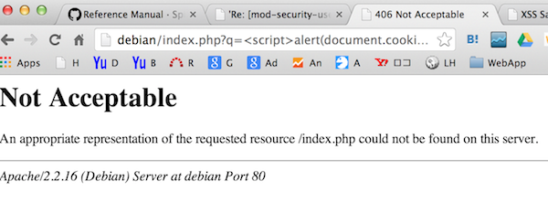

本記事はWAF (Web Application Firewall)ソフトでApacheモジュールの一つである、ModSecurityのインストール及び簡易的な設定方法を記載する。本運用を考慮した設定は本記事では割愛するが、必要な参考リンクは適時記載するので参照されたし。

### 概要 (全体像)

ModSecurity：TrustWave社がGPLv2 ライセンスのもと提供しているOSSのWAF。 [ModSecurity: Open Source Web Application Firewall](http://www.modsecurity.org/) 下記の資料にWAFの概要からModSecurityの導入〜運用までの検討ポイントが記載されている。 [IPA 独立行政法人 情報処理推進機構：Web Application Firewall 読本](http://www.ipa.go.jp/security/vuln/waf.html) OWASP Core Rule Set：OWASP(Open Web Application Security Project)がGPLv2 ライセンスのもと提供しているModSecurityのルール（シグネチャ）。 [Category:OWASP ModSecurity Core Rule Set Project - OWASP](https://www.owasp.org/index.php/Category:OWASP_ModSecurity_Core_Rule_Set_Project) [Category:OWASP Best Practices: Use of Web Application Firewalls - OWASP](https://wiki.owasp.org/index.php/Category:OWASP_Best_Practices:_Use_of_Web_Application_Firewalls) [OWASP](https://www.owasp.org/) 当サイトを含む下手なブログ記事等を参照するよりも先ずは公式と上記のリンクを読んだ方が理解が早い。 
<!-- truncate -->


### 前提環境

当記事ではVMWare上のDebian 6 (64bit)、Apache/2.2.16 (Debian)で実施。尚、当該仮想OSはホスト名「debian」で名前解決するよう設定しており、一部のブラウザのスクリーンショットで使用されている。

### インストール方法

公式サイトをご参照。 [ModSecurity: Open Source Web Application Firewall - Download](https://www.modsecurity.org/) [Reference Manual · SpiderLabs/ModSecurity Wiki - Installation for Apache · GitHub](https://github.com/SpiderLabs/ModSecurity/wiki/Reference-Manual#wiki-Installation_for_Apache) 最新のv2.7.7を使用したい場合は、ソースからmake installする。下記は当方環境でのapt-getでのインストール例。

```
# apt-get install libapache-mod-security
Reading package lists... Done
Building dependency tree
Reading state information... Done
The following extra packages will be installed:
  mod-security-common
The following NEW packages will be installed:
  libapache-mod-security mod-security-common
0 upgraded, 2 newly installed, 0 to remove and 0 not upgraded.
Need to get 1,083 kB of archives.
After this operation, 3,314 kB of additional disk space will be used.
Do you want to continue [Y/n]?
Get:1 http://ftp.riken.jp/Linux/debian/debian/ squeeze/main mod-security-common all 2.5.12-1+squeeze3 [960 kB]
Get:2 http://ftp.riken.jp/Linux/debian/debian/ squeeze/main libapache-mod-security amd64 2.5.12-1+squeeze3 [123 kB]
Fetched 1,083 kB in 0s (1,325 kB/s)
Selecting previously deselected package mod-security-common.
(Reading database ... 126120 files and directories currently installed.)
Unpacking mod-security-common (from .../mod-security-common_2.5.12-1+squeeze3_all.deb) ...
Selecting previously deselected package libapache-mod-security.
Unpacking libapache-mod-security (from .../libapache-mod-security_2.5.12-1+squeeze3_amd64.deb) ...
Setting up mod-security-common (2.5.12-1+squeeze3) ...
Setting up libapache-mod-security (2.5.12-1+squeeze3) ...
Reloading web server config: apache2.

```

私の環境だと公式とは指定パッケージ名が下記の通り異なった。 ※ 'libapache-mod-security' instead of 'libapache2-mod-security2'となる。

### 設定方法

設定の要領はApacheに対する設定と変わらず。以下にmodsecurityの動きを確認できる簡単なサンプルを示す。「←」以降はコメントである為、実際には打ち込まない。

```
# vi /etc/apache2/apache2.conf

```

```
＜前略＞

  SecRuleEngine On ← modsecurityを有効化
  SecDefaultAction "phase:2,deny,log,auditlog,status:406" ← ルールにマッチした際のデフォルトのアクションを設定。ここでは、レスポンスコード406で拒否しログに書き込む。
  SecRule REQUEST_URI dirty "id:'3000001'" ← フィルタするルールを設定。ここではルールiD 3000001、リクエストURIに文字列「dirty」の場合にデフォルトのアクション↑を実行
  SecRule ARGS "delete[[:space:]]+from" "id:'3000002'" ← SQLインジェクションのフィルタの一例
  SecRule ARGS "

```

各ディレクティブの説明は公式（大事！）のWikiを参照するとよい。上記のルールはあくまで動作確認用のものである為、 [Reference Manual · SpiderLabs/ModSecurity Wiki · GitHub](https://github.com/SpiderLabs/ModSecurity/wiki/Reference-Manual) 因みに最近のバージョンだとidは4000000番以上を使用する用に言われている。。。以前は3000000以上で良かったのに。。。 尚、本体のconfを汚したくない人は下記の通り、設定ファイルを別途作成して、本体でIncludeさせるとよい。 設定ファイルの作成先↓

```
# vi /etc/apache2/conf.d/modsec.conf

```

本体の設定ファイルから参照させる↓

```
# vi /etc/apache2/apache2.conf
# Include the mod_security config
Include conf.d/modsec.conf

```

設定が完了したら下記コマンドにて書式のチェックと反映。

```
# apachectl configtest
# apachectl restart

```

コマンドが正常完了した場合は、この時点でSecAuditLogログファイルが作成されているので確認すると良い。

### 実行結果

ルールID (3000001, 3000002, 3000003)に対してブラウザからフィルタリングのテストをした結果が下記の通り。尚、当方環境ではマシンのホスト名を「debian」と設定・名前解決させているのでブラウザのアドレス欄は適時読み替えること。

#### 指定文字列のフィルタ

[](./modsecurity_result_dirty.png)

```
# tail -f /var/log/apache2/access.log
172.16.56.1 - - [01/Mar/2014:00:23:01 +0900] "GET /dirty HTTP/1.1" 406 527 "-" "Mozilla/5.0 (Macintosh; Intel Mac OS X 10_9_1) AppleWebKit/537.36 (KHTML, like Gecko) Chrome/33.0.1750.117 Safari/537.36"

```

```
# tail -f /var/log/apache2/audit.log
--c369a170-A--
[01/Mar/2014:00:23:01 +0900] UxCp1X8AAQEAAAqqAT4AAAAC 172.16.56.1 51784 172.16.56.10 80
--c369a170-B--
GET /dirty HTTP/1.1
Host: debian
Connection: keep-alive
Accept: text/html,application/xhtml+xml,application/xml;q=0.9,image/webp,*/*;q=0.8
User-Agent: Mozilla/5.0 (Macintosh; Intel Mac OS X 10_9_1) AppleWebKit/537.36 (KHTML, like Gecko) Chrome/33.0.1750.117 Safari/537.36
Accept-Encoding: gzip,deflate,sdch
Accept-Language: ja,en-US;q=0.8,en;q=0.6
--c369a170-F--
HTTP/1.1 406 Not Acceptable
Vary: Accept-Encoding
Content-Encoding: gzip
Content-Length: 258
Keep-Alive: timeout=15, max=98
Connection: Keep-Alive
Content-Type: text/html; charset=iso-8859-1
--c369a170-H--
Message: Access denied with code 406 (phase 2). Pattern match "dirty" at REQUEST_URI. [file "/etc/apache2/conf.d/modsec.conf"] [line "4"] [id "3000001"]
Action: Intercepted (phase 2)
Stopwatch: 1393600981046207 545 (148 218 -)
Producer: ModSecurity for Apache/2.5.12 (http://www.modsecurity.org/).
Server: Apache/2.2.16 (Debian)
--c369a170-Z--

```

#### SQLインジェクションのフィルタ例

[](./modsecurity_result_sql_injection.png)

```
# tail -f /var/log/apache2/access.log
172.16.56.1 - - [01/Mar/2014:00:37:56 +0900] "GET /login.php?user=arpit%27;DELETE%20FROM%20users-- HTTP/1.1" 404 496 "-" "Mozilla/5.0 (Macintosh; Intel Mac OS X 10_9_1) AppleWebKit/537.36 (KHTML, like Gecko) Chrome/33.0.1750.117 Safari/537.36"

```

```
# tail -f /var/log/apache2/audit.log
--36b20258-A--
[01/Mar/2014:00:42:26 +0900] UxCuYn8AAQEAAAuwANoAAAAA 172.16.56.1 52315 172.16.56.10 80
--36b20258-B--
GET /login.php?user=arpit%27;delete%20from%20users-- HTTP/1.1
Host: debian
Connection: keep-alive
Cache-Control: max-age=0
Accept: text/html,application/xhtml+xml,application/xml;q=0.9,image/webp,*/*;q=0.8
User-Agent: Mozilla/5.0 (Macintosh; Intel Mac OS X 10_9_1) AppleWebKit/537.36 (KHTML, like Gecko) Chrome/33.0.1750.117 Safari/537.36
Accept-Encoding: gzip,deflate,sdch
Accept-Language: ja,en-US;q=0.8,en;q=0.6
--36b20258-F--
HTTP/1.1 406 Not Acceptable
Vary: Accept-Encoding
Content-Encoding: gzip
Content-Length: 260
Keep-Alive: timeout=15, max=100
Connection: Keep-Alive
Content-Type: text/html; charset=iso-8859-1
--36b20258-H--
Message: Access denied with code 406 (phase 2). Pattern match "delete[[:space:]]+from" at ARGS:user. [file "/etc/apache2/conf.d/modsec.conf"] [line "5"] [id "3000002"]
Action: Intercepted (phase 2)
Apache-Handler: application/x-httpd-php
Stopwatch: 1393602146129825 1140 (512 624 -)
Producer: ModSecurity for Apache/2.5.12 (http://www.modsecurity.org/).
Server: Apache/2.2.16 (Debian)
--36b20258-Z--

```

#### XSSのフィルタ例

[](./modsecurity_result_xss.png)

```
# tail -f /var/log/apache2/access.log
172.16.56.1 - - [01/Mar/2014:03:04:31 +0900] "GET /index.php?q=%3Cscript%3Ealert(document.cookie);%3C/script%3E HTTP/1.1" 406 530 "-" "Mozilla/5.0 (Macintosh; Intel Mac OS X 10_9_1) AppleWebKit/537.36 (KHTML, like Gecko) Chrome/33.0.1750.117 Safari/537.36"

```

```
# tail -f /var/log/apache2/audit.log
--3da77b30-A--
[01/Mar/2014:03:04:31 +0900] UxDPr38AAQEAABIyAU8AAAAA 172.16.56.1 55317 172.16.56.10 80
--3da77b30-B--
GET /index.php?q=%3Cscript%3Ealert(document.cookie);%3C/script%3E HTTP/1.1
Host: debian
Connection: keep-alive
Accept: text/html,application/xhtml+xml,application/xml;q=0.9,image/webp,*/*;q=0.8
User-Agent: Mozilla/5.0 (Macintosh; Intel Mac OS X 10_9_1) AppleWebKit/537.36 (KHTML, like Gecko) Chrome/33.0.1750.117 Safari/537.36
Accept-Encoding: gzip,deflate,sdch
Accept-Language: ja,en-US;q=0.8,en;q=0.6
--3da77b30-F--
HTTP/1.1 406 Not Acceptable
Vary: Accept-Encoding
Content-Encoding: gzip
Content-Length: 260
Keep-Alive: timeout=15, max=100
Connection: Keep-Alive
Content-Type: text/html; charset=iso-8859-1
--3da77b30-H--
Message: Access denied with code 406 (phase 2). Pattern match "
ログのフォーマット等は下記リンクが参考になる。
ModSecurity 2 Data Formats · SpiderLabs/ModSecurity Wiki · GitHub
Modsecurity audit log - Atomicorp Wiki
次記事はiptablesの復習に戻る予定。
```
