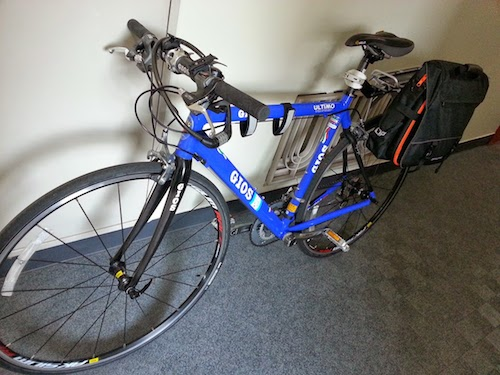
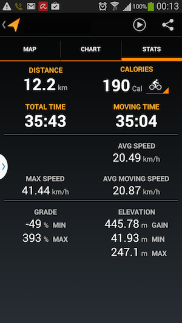

 2013年の9月頃にクロスバイクを購入して以来、都内の主要な移動手段が電車から自転車に変わった。背景として、

1. 12km圏内だと徒歩＋電車より徒歩＋自転車の方が速い
2. 運動になる
3. 道を覚える

<!-- truncate -->
 のでかなりお得感を感じている。左図はGoogle Trackで計った最近のスコア。最初はもっと遅かったが(12kmを50分位)、日に日に向上していくので、それも楽しめている。机仕事の生活には移動が運動を兼ねているのはありがたい。 因みに、スマホ(私の場合はGalaxy Note2)を自転車に取り付ける際は、下記のホルダーケースがオススメ。この手の製品は耐久性が第一であることを考えると、半年以上使ってががたつきがないのは良いと思う。

<iframe src="http://rcm-fe.amazon-adsystem.com/e/cm?lt1=_blank&amp;bc1=FFFFFF&amp;IS2=1&amp;bg1=FFFFFF&amp;fc1=000000&amp;lc1=0000FF&amp;t=bitsmining-22&amp;o=9&amp;p=8&amp;l=as4&amp;m=amazon&amp;f=ifr&amp;ref=ss_til&amp;asins=B00962353C" style="width:120px;height:240px;" scrolling="no" marginwidth="0" marginheight="0" frameborder="0"></iframe>
