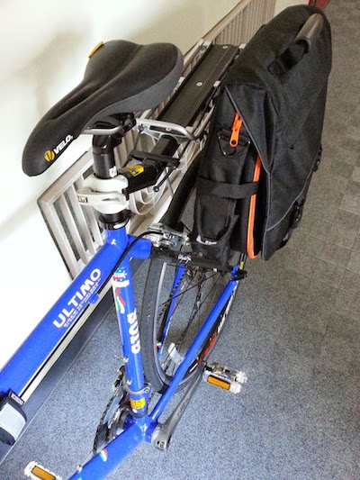

[昨年よりクロスバイクを生活の足として活用し始め](/blog/crossbike-gios "クロスバイクでの移動が楽しい")、鍵・ライト・ヘルメット・ズボン裾のバンド等の基本的な装備の後、最初にカスタマイズ、追加購入したのは下記のリヤキャリヤとパニアバックである。 

<iframe src="http://rcm-fe.amazon-adsystem.com/e/cm?lt1=_blank&amp;bc1=FFFFFF&amp;IS2=1&amp;bg1=FFFFFF&amp;fc1=000000&amp;lc1=0000FF&amp;t=bitsmining-22&amp;o=9&amp;p=8&amp;l=as4&amp;m=amazon&amp;f=ifr&amp;ref=ss_til&amp;asins=B00I0QXF3U" style="width:120px;height:240px;" scrolling="no" marginwidth="0" marginheight="0" frameborder="0"></iframe>

<iframe src="http://rcm-fe.amazon-adsystem.com/e/cm?lt1=_blank&amp;bc1=FFFFFF&amp;IS2=1&amp;bg1=FFFFFF&amp;fc1=000000&amp;lc1=0000FF&amp;t=bitsmining-22&amp;o=9&amp;p=8&amp;l=as4&amp;m=amazon&amp;f=ifr&amp;ref=ss_til&amp;asins=B004BUC9OU" style="width:120px;height:240px;" scrolling="no" marginwidth="0" marginheight="0" frameborder="0"></iframe>

<iframe src="http://rcm-fe.amazon-adsystem.com/e/cm?lt1=_blank&amp;bc1=FFFFFF&amp;IS2=1&amp;bg1=FFFFFF&amp;fc1=000000&amp;lc1=0000FF&amp;t=bitsmining-22&amp;o=9&amp;p=8&amp;l=as4&amp;m=amazon&amp;f=ifr&amp;ref=ss_til&amp;asins=B000BS0I4E" style="width:120px;height:240px;" scrolling="no" marginwidth="0" marginheight="0" frameborder="0"></iframe>

<!-- truncate -->
 主な用途は開発機MacBook Pro 15inch (約2kg)を自転車で安全・手軽に運搬する為。 私は自宅ではあまり集中してコーディングや勉強をしないタイプなので、作業などはよくacademyhillsや喫茶店の隅っこで実施している。最近はドキュメント作成的な軽めの作業は、タブレット＋Bluetoothキーボードの軽量組み合わせであるが、コーディングをする場合はMBPが必要になるので、結構な頻度で持ち運びしている。 上記の組み合わせは試行錯誤の結果で、当初はメッセンジャーバックやロードバイク乗りに人気のリュックサックなども買って試してみたが、あまり快適ではなかった。と言うのも、先ず、構造上致し方ないのだが、背中が汗で蒸れて不快。これは通気性を謳っている製品でも程度の差はあるが同様。第2に重い荷物を背負うと(重心が上)になると必要以上に腰(体幹)に負荷が来る。自転車をこぐのには思いのほか腰から上の筋肉を使うので、体に荷物を背負っていると疲れやすい。 上記2点を解決してくれたツールが冒頭の製品の組み合わせで、装備した結果は下の写真の通り。  私のクロスバイク(GIOS Ultimo)のタイプだとシートポスト(座るところ)に取り付けるタイプのリアキャリアしか選択肢は無かった。もしフレームに取り付けれられる自転車であれば、そちらの方が耐荷重が2倍以上違うので(シートポスト型が最大9kgに対してフレーム取り付け型は20kg以上積載可能)、それを選ぶことをお勧めする。 リアキャリアのメーカーは要件(耐荷重＋サイドガード)を満たしていれば何でも良いが、後々そのキャリアのマウントレールに設置するバックの購入を考えている場合はそれらの製品ラインナップを考慮してい選ぶと良い。 このDoppelgangerのバックは数ヶ月使っているが、今のところほつれやパニアの金具部分のがたつきもなく、中々使える。また、容量としても、MBP＋参考書2冊＋その他の小物を十分収納可能。クッションも入っているので移動中の振動で、MBPがおかしくなることは今のところなし。 ただし、シートポストへの取り付け部分とキャリアの各所のネジは振動等で段々(微々たる物であるが)緩んでくるので、定期的(月一)に締め直した方が良い。(ゴムなども時間と共に劣化潰れてくるので(勿論一般的な使用頻度で数ヶ月で消耗するもでも無いが。。)、定期的なチェックは必須)

<iframe src="http://rcm-fe.amazon-adsystem.com/e/cm?lt1=_blank&amp;bc1=FFFFFF&amp;IS2=1&amp;bg1=FFFFFF&amp;fc1=000000&amp;lc1=0000FF&amp;t=bitsmining-22&amp;o=9&amp;p=8&amp;l=as4&amp;m=amazon&amp;f=ifr&amp;ref=ss_til&amp;asins=B00I0QXF3U" style="width:120px;height:240px;" scrolling="no" marginwidth="0" marginheight="0" frameborder="0"></iframe>

<iframe src="http://rcm-fe.amazon-adsystem.com/e/cm?lt1=_blank&amp;bc1=FFFFFF&amp;IS2=1&amp;bg1=FFFFFF&amp;fc1=000000&amp;lc1=0000FF&amp;t=bitsmining-22&amp;o=9&amp;p=8&amp;l=as4&amp;m=amazon&amp;f=ifr&amp;ref=ss_til&amp;asins=B004BUC9OU" style="width:120px;height:240px;" scrolling="no" marginwidth="0" marginheight="0" frameborder="0"></iframe>

<iframe src="http://rcm-fe.amazon-adsystem.com/e/cm?lt1=_blank&amp;bc1=FFFFFF&amp;IS2=1&amp;bg1=FFFFFF&amp;fc1=000000&amp;lc1=0000FF&amp;t=bitsmining-22&amp;o=9&amp;p=8&amp;l=as4&amp;m=amazon&amp;f=ifr&amp;ref=ss_til&amp;asins=B000BS0I4E" style="width:120px;height:240px;" scrolling="no" marginwidth="0" marginheight="0" frameborder="0"></iframe>
