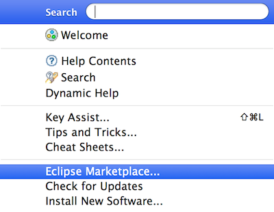
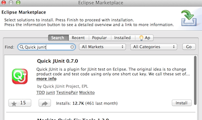
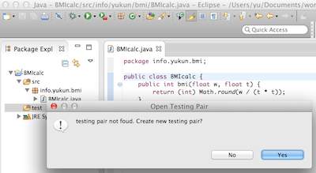
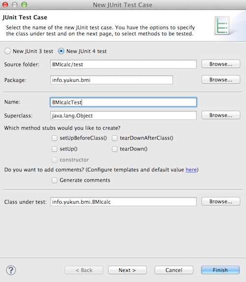
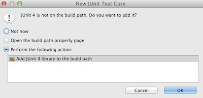
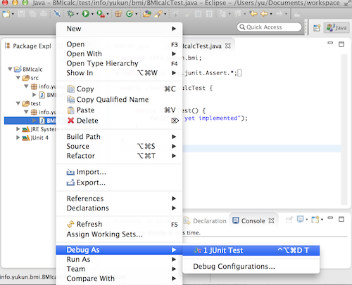
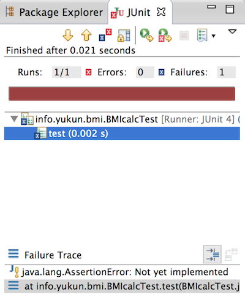
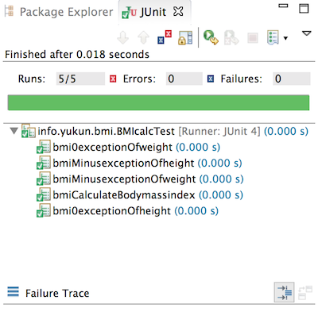
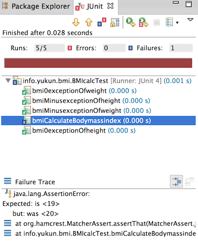

本記事はEclipseとJUnitによるコーディング・ユニットテストサイクルを便利にするQuick JUnitプラグインのインストール方法と基本的なテストコード・テスト実行のチュートリアルを記載している。

### 本記事の実行環境

Mac OS, Java7, Eclipse 4.32, JUnit4, Quick JUnit v0.7となる。仮にOSがWindows版だとしても内容の大筋は大差ない。 
<!-- truncate -->


### Quick JUnitのインストール

Eclipseのメニューバー「Window」→「Eclipse Marketplace」をクリック。 [](./eclipse_marketplace_menu.png) 検索ボックスにquick junitを入力して検索するとプラグインが表示されるので、installボタンをクリック。 [](./install_quick_junit.png) 後はウィザードに従ってダウンロード、再起動するとインストールは完了する。

### テスト対象クラス・メソッドの作成

ここでは、サンプルとして下記のBMI ([ボディマス指数](http://en.wikipedia.org/wiki/Body_mass_index "Body mass index"))を計算するクラス・メソッドをテスト対象とする。 

```java
package info.yukun.bmi;
public class BMIcalc {
	/**
	 *
	 * @param w weight (kg)
	 * @param h height (m)
	 * @return BMI (body mass index) value
	 */
	public int bmi(double w, double h) {
		if (w <= 0 || h <= 0) throw new IllegalArgumentException("weight or height is zero or minus number.");
		return (int) Math.round(w / (h * h));
	}
}
```

 上記コードを入力後、プロジェクトにテストコードを保管する為の「test」ソースフォルダを作成しておく。

### テストコードの作成

続いてテスト対象コードのクラス宣言行(public class BMIcalc { の箇所)でcommand+9 (Win環境ではCtrl+9)を押下すると、そのクラスに対応するテストクラスが作成されていない場合は、テストクラスを作成するよう、プロンプトが表示される。 [](./junit_create_test_class_prompt.png) ここで、Yesを押下すると、下図のようにテストクラスの作成画面に遷移する。 [](./junit_create_test_class.png) テストコードの保管先がtestになっていることを確認してfinishを押下。 下図のようにJUnitをパスに追加するかの確認画面が表示されるので、追加するでOKを押下。 [](./junit_add_path_prompt.png) 初期のテストコードは下記の通りとなる。 

```java
package info.yukun.bmi;
import static org.junit.Assert.*;
import org.junit.Test;
public class BMIcalcTest {
	@Test
	public void test() {
		fail("Not yet implemented");
	}
}
```


### テストコードの実行

この状態で試しにテストコードを実行するには、このテストコードファイルを右クリックしコンテキストメニューのDebug As→JUnit Testをクリック。 [](./junit_test_excute.png) まだ実装していない為、実行結果は以下の通りfailureとなる。 [](./junit_test_fail_nocode.png)

### テストコードの実装

以下が、今回のテストコードとなる。 

```java
package info.yukun.bmi;
import static org.hamcrest.CoreMatchers.is;
import static org.junit.Assert.*;
import org.junit.Test;
public class BMIcalcTest {
	@Test
	public void bmiCalculateBodymassindex() {
		BMIcalc calc = new BMIcalc();
		int expected = 20;
		int actual = calc.bmi(50.0, 1.6);
		assertThat(actual, is(expected));
	}
	@Test(expected = IllegalArgumentException.class)
	public void bmi0exceptionOfweight() {
		BMIcalc calc = new BMIcalc();
		calc.bmi(0, 1.6);
	}
	@Test(expected = IllegalArgumentException.class)
	public void bmiMinusexceptionOfweight() {
		BMIcalc calc = new BMIcalc();
		calc.bmi(-50.0, 1.6);
	}
	@Test(expected = IllegalArgumentException.class)
	public void bmi0exceptionOfheight() {
		BMIcalc calc = new BMIcalc();
		calc.bmi(50, 0);
	}
	@Test(expected = IllegalArgumentException.class)
	public void bmiMinusexceptionOfheight() {
		BMIcalc calc = new BMIcalc();
		calc.bmi(50, -1.6);
	}
}
```

 JUnitのフレームワーク上、テストクラスはpublic、メソッドはorg.junit.Testアノテーション(@Test)を付与したpublicメソッド、かつ戻り値void、引数無しとする。 メソッドの中身のテストコードはテスト対象のコードの実行結果値と期待される値の比較で検証する。その比較に用いられるメソッドが、junit.AssertクラスのassertThatメソッド。上述の第二引数に使われているisメソッドはassertThatに使われるMatcherオブジェクトを作成するためのファクトリメソッド。 再度テストを実行すると以下の通り緑のバーで全量正常完了を示す。 [](./junit_test_noerror.png) 仮にbmiCalculateBodymassindex()のexpectedの値を19にセットして実行すつと当然failureとなるがFailure Trace画面でExpectedと実際の値を確認できるので、次のアクションを取りやすい。 [](./junit_test_fail.png)

### 参考サイト

- [JUnit - Wikipedia, the free encyclopedia (英語)](http://en.wikipedia.org/wiki/JUnit)
- [JUnit - Wikipedia (日本語)](http://ja.wikipedia.org/wiki/JUnit)
- [JUnit (公式サイト)](http://junit.org/)
