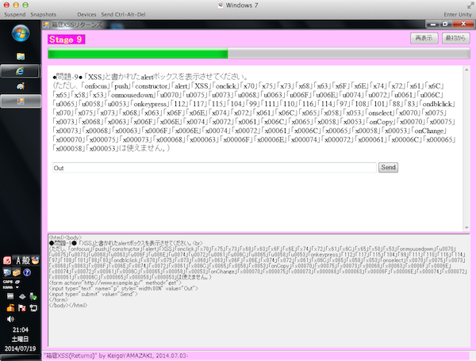

 I participated in SECCON at the Japanese competition of information security with my colleagues as a team in 19th, July. The final ranking was 43 out of 425 teams. (Japanese official site)

- [http://www.seccon.jp](http://www.seccon.jp)
- [http://2014.seccon.jp](http://2014.seccon.jp)

We started from 9:00 and ended at 21:00 (12 hours!) so I was very exhausted but I was so excited when I was able to solve the parts of some problems. Moreover, I could improve my security skills and recognize my weak points in the field. It was a very valuable event. When I have a chance to attend such competition in the near future, I'll participate again and of course, I'll prepare by improving my skill every day to contribute.
