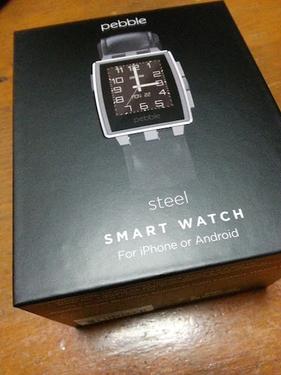

 The smart watch "Pebble watch" was delivered to me today from Amazon US. I think that Pebble is the best smart watch from among the other current smart watches available in terms of battery life. Pebble's uninterrupted usage time is about 5 -7 days, but others are about 1 -3 days. I'm interested in programming apps for Pebble, so I'm planning to look for instructions on how doing it this weekend. Anyway, I'm happy to get it (^\_^) Thank you for reading.
