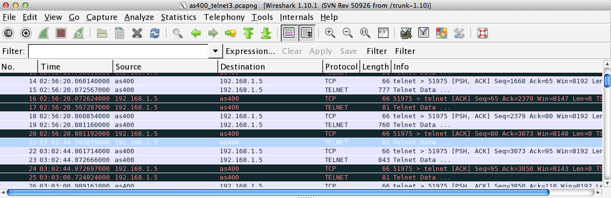

### 事象

IBM System i (AS400)に5250エミュレータ (かつtelnetプロトコル)でログインの上、一定時間無操作状態の後、セッション断となる場合。

### 対処法

以下の設定値を確認する。(1〜3はIBM i上、4はルータ上の設定。)

1. WRKSYSVALでシステム値のQINACTITV。
2. CHGTCPAでTCP keep aliveパラメータであるTCPKEEPALV。
3. CHGTELNAでtelnetセッションkeep alive timeoutパラメータであるTIMMRKTIMO。
4. 通信経路間のルータのSPIタイムアウト値。


<!-- truncate -->
 各設定値については使用環境(サーバ、クライアント、ネットワーク)によって変わるため、本記事では具体的な設定値への言及は避ける。 因みにTIMMRKTIMOのHelp記述は以下の通り。

```
      Session keep alive timeout (TIMMRKTIMO) - Help
Specifies the number of seconds between connection
validation.  TCP tests each TELNET connection at the
specified time interval.  If TCP does not get a response,
it ends the connection.
This parameter determines how frequently the session
connection is verified.  A high value can result in a
longer time before a lost connection gets detected.  A
lower value tests the session more frequently, but if set
too low then normal network delays may result in
connections being considered lost.
An explanation of keep alive can be found in the help
information for command CHGTCPA parameter TCPKEEPALV.
Note that TCPKEEPALV is defined in minutes, while
TIMMRKTIMO is defined in seconds.

```

QINACTITVを\*NONE、TIMMRKTIMOを60秒、その他はデフォルト設定(ルーターのSPIは300秒)にして無操作を続けた結果が以下のWiresharkのログだが、1分後に端末側がKeep alive確認の受信ができていない。この5分後に再度Telnet操作を試みたところ正常にセッションを継続できている。このパラメータが関係しているのか、使用しているOSv5.3のバグなのか。。本件については当初の目的である自宅環境におけるセッション断を解消できたのでよしとするが、後味が悪いので、作業経過を本記事の通り残しておく。 [](./ibmi_telnet_wireshark_log.png)

### 参考サイト

- 障害と解決の実例集
