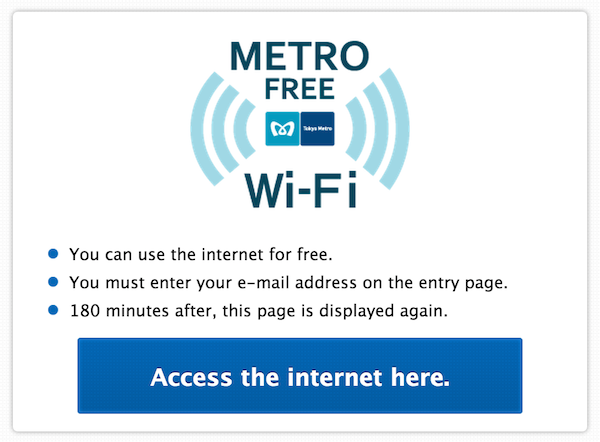

[](./metro_wifi_tullys_nishi-shinjuku.png) This cafe is very convenient for me to get free Wi-Fi and it is called "METRO FREE Wi-Fi", because it is close to Nishi-Shinjuku metro station. By the way, before users are authorized by the server, users can send ping any destination but aren't allowed to transfer any TCP/IP packets. It's to be expected that the provider wants to restrict the unauthorized user to prevent any unexpected and malicious behavior.

### Logs of ping and ssh before I start to authorize:

```
$ ping google.co.jp
PING google.co.jp (173.194.126.247): 56 data bytes
64 bytes from 173.194.126.247: icmp_seq=0 ttl=47 time=14.569 ms
64 bytes from 173.194.126.247: icmp_seq=1 ttl=50 time=10.830 ms
^C
--- google.co.jp ping statistics ---
3 packets transmitted, 2 packets received, 33.3% packet loss
round-trip min/avg/max/stddev = 10.830/12.700/14.569/1.869 ms
$ ssh yukun.info
^C # <-- I can't connect the server.

```
