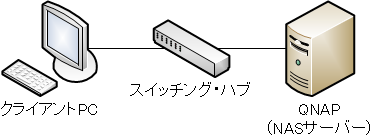

首題の構成でもQNAP NASサーバー内のサービスは使用可能。勿論internet接続が前提となる、NTP、Firmware update等は不可となる。接続構成としては下図の通り「QNAP⇔スイッチングハブ⇔クライアントPC」となる。

QNAPサーバー、及び、クライアントPCのネットワーク設定は下表の通りとなる。

| 機器 | 設定 |
| --- | --- |
| クライアントPC | 固定IP (e.g. 192.168.10.5) |
| QNAP | 固定IP (e.g. 192.168.10.10) |

設定完了後、PCからQNAPへping疎通出来ていれば問題なし。

仮にQNAPのDHCP設定ONで本構成で立ち上げてしまった場合、PCからQFinderアプリを用いてネットワーク設置を変更する。当該アプリはブロードキャストドメイン内のQNAPサーバーを検索してくれるので、仮にIP設定を間違えても再設定が可能。
