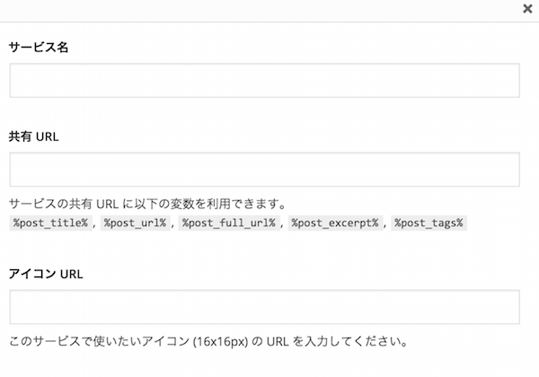

WordPressのJetpactプラグインを用いてLINEの共有ボタン「LINEで送る」を各記事に追加する方法は下記の通り。(前提：Jetpactプラグインがインストールされていること) 
<!-- truncate -->

### 設定方法

1. Jetpactプラグインのパブリサイズ共有設定画面へ移動
2. 「新サービスを追加」リンクをクリックし下図のポップアップ画面を開く 
3. 各項目にそれぞれ以下の通り入力
    
    | **項目** | **入力値** |
    | --- | --- |
    | サービス名 | LINE |
    | 共有 URL | http://line.me/R/msg/text/?%post\_title%%0D%0A%post\_url% |
    | アイコン URL | ＜_アイコン画像ファイルのURL_＞ |
    
    ※ここでのアイコン画像ファイルのURLは下記の公式サイトよりファイルをダウンロードして所定のディレクトリに前もってUploadしたものを使用。 [LINEで送るボタン｜メディア運営者の方へ](http://media.line.me/ja/)
4. 上記の項目を入力してボタンを作成の後、「利用可能なサービス」→有効化済みのサービスへボタンを移動、その変更を保存すればLINEボタンが記事の所定の位置に表示される。

### 動作確認

動作確認についてはPCブラウザからのボタンクリックは機能しないが、携帯電話・スマホ経由でクリックすればLINEアプリが立ち上がり、記事のタイトル・URLを友達に送信可能。
