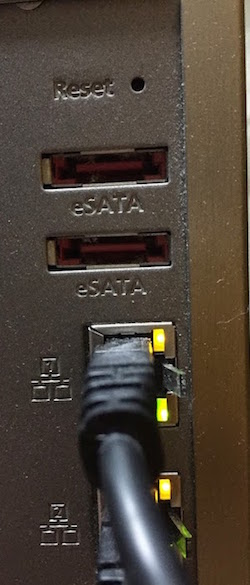
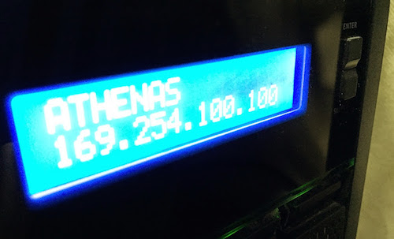

### 事象

先日、自宅のブレーカーが不意にダウンした為、運用していたQNAP NASが異常終了状態となった。電源復旧後にQNAPを立ち上げたところ、ping疎通は確認できたものの、各種サービス(httpd, ssh, telnet, etc...)が利用不可。(Qfinder上からの操作も、Webインターフェイスからの操作もできない。) 
<!-- truncate -->


```
$ ping nas
PING nas (192.168.1.10): 56 data bytes
64 bytes from 192.168.1.10: icmp_seq=0 ttl=64 time=0.053 ms
64 bytes from 192.168.1.10: icmp_seq=1 ttl=64 time=0.136 ms
64 bytes from 192.168.1.10: icmp_seq=2 ttl=64 time=0.124 ms
64 bytes from 192.168.1.10: icmp_seq=3 ttl=64 time=0.117 ms
^C
--- athenas ping statistics ---
4 packets transmitted, 4 packets received, 0.0% packet loss
round-trip min/avg/max/stddev = 0.053/0.107/0.136/0.032 ms
$ nmap nas
Starting Nmap 6.40-2 ( http://nmap.org ) at 2015-02-19 20:28 JST
Nmap scan report for nas (192.168.1.10)
Host is up (0.00099s latency).
Not shown: 501 filtered ports, 498 closed ports
PORT STATE SERVICE
3689/tcp open rendezvous
Nmap done: 1 IP address (1 host up) scanned in 2.84 seconds
$

```

QNAPにシリアルコンソールによるアクセスを試みるには基盤を物理的にいじらなければならず、時間と手間が掛かるため、今回は手っ取り早い設定初期化にて復旧を試み、結果として上手くいった。

### 対応 (基本システムリセットの手順)

下記の公式ドキュメントをご参照。尚、このリセットに伴い、NASのユーザーデータが初期化されることはない。あくまで設定のリセットとなる。 QNAP Turbo NAS 取扱説明書：[http://docs.qnap.com/nas/4.1/SMB/jp/index.html?hardware.htm](http://docs.qnap.com/nas/4.1/SMB/jp/index.html?hardware.htm)

> 基本システムリセット(3秒) **設定リセットスイッチを有効にする： この機能をオンにすると、リセットボタンを 3 秒間押して管理者パスワードとシステム設定を初期設定にリセットできます（ディスクのデータは維持されます）。詳細システムリセットの場合は 10 秒間押します。** o 基本のシステムリセット： リセットボタンを押したままにすると、ビープ音が 1 回鳴ります。 次の設定はデフォルト値にリセットされます： ▪ システム管理者のパスワード：admin。 ▪ TCP/IP設定： DHCPを通してIPアドレス設定を自動的に取得します。 ▪ TCP/IP設定： ジャンボフレームを無効にします。 ▪ TCP/IP設定： ポートトランキングが有効な場合（デュアルLANモードのみ）、ポートトランキングモードは「Active Backup （Failover） （アクティブバックアップ（フェールオーバー）」にリセットされます。 ▪ システムポート： 8080 （システムサービスポート）。 ▪ セキュリティレベル： 低（すべての接続を許可）。 ▪ LCD パネルパスワード： （空白）; この機能が装備されているのは LCD パネルのある NAS モデルだけです。詳細については、http：//www.qnap.com を参照してください。 ▪ VLANが無効になります。 ▪ サービスバインディング： すべてのNASサービスは、利用可能なすべてのネットワークインターフェース上で作動します。 上で作動します。

リセットボタンは下図の様に筐体背面にある。 [](./qnap-reset-button.jpg)

### QNAPへの再接続

リセット後はDHCPが有効になるため、適当なルーター(兼DHCPサーバー)がネットワーク内にある場合はQFinderアプリを用いてサブネット内を検索すれば良い。仮に[ルーター無しの構成の場合](/blog/qnap-no-router-only-sw-hub "QNAP: スイッチングハブのみの接続構成 (インターネット接続無し)")は、QNAPのIPアドレスが端末と同サブネット内に割り振られるか不明の為、フロントパネル上でIPアドレスを確認した上で(パネル右のボタンを1回押下)、端末のネットワークアドレスをQNAPのそれに合わせる。 [](./qnap-front-panel.jpg)

### サービスの起動確認

ネットワーク設定を確認後、nmapコマンドを用いてQNAPサーバー上のサービスが立ち上がっていることを確認する。

```
$ nmap nas
Starting Nmap 6.40-2 ( http://nmap.org ) at 2015-02-19 22:17 JST
Nmap scan report for nas (169.254.100.100)
Host is up (0.00026s latency).
Not shown: 978 closed ports
PORT STATE SERVICE
22/tcp open ssh
25/tcp open smtp
79/tcp open finger
80/tcp open http
110/tcp open pop3
111/tcp open rpcbind
139/tcp open netbios-ssn
443/tcp open https
445/tcp open microsoft-ds
465/tcp open smtps
514/tcp open shell
548/tcp open afp
631/tcp open ipp
873/tcp open rsync
995/tcp open pop3s
1935/tcp open rtmp
2049/tcp open nfs
6666/tcp open irc
8009/tcp open ajp13
8080/tcp open http-proxy
8100/tcp open xprint-server
9999/tcp open abyss
Nmap done: 1 IP address (1 host up) scanned in 0.08 seconds

```
