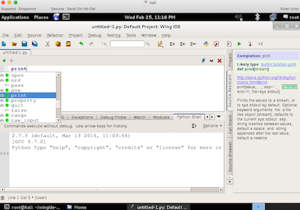

Kali LinuxにPythonの統合開発環境の一つであるWingIDEのインストール手順を記載。

### 前提情報

- インストール環境: 3.18.0-kali1-amd64
- 公式サイト (WingIDEのダウンロード先): [Python IDE for Python Developers - Wingware Python IDE](https://wingware.com/)


<!-- truncate -->


### インストール手順

上記の公式サイトより\*.tar.gz形式のインストーラーファイルをダウンロード後、プロンプトから下記のコマンドでインストールしていく。

```
# tar zxvf wingide-5.1.1-1-x86_64-linux.tar.gz
# cd wingide-5.1.1-1-x86_64-linux/
# python wing-install.py
Where do you want to install the support files for Wing IDE (default =
/usr/local/lib/wingide5.1)?
/usr/local/lib/wingide5.1 does not exist, create it (y/N)? y
Where do you want to install links to the Wing IDE startup scripts
(default = /usr/local/bin)?
Installing binaries
Tar command is sh -c "export UMASK=0022; tar -x -v -k
--directory="/usr/local/lib/wingide5.1"
--file="binary-package-5.1.1-1.tar" 2>&1"
Set ownership of installation to user=0
Set ownership of installation to group=0
Writing /usr/local/lib/wingide5.1/CHANGELOG.txt
＜中略＞
Writing /usr/local/lib/wingide5.1/zope/WingDBG-5.1.1-1.tar
Setting up WINGHOME in /usr/local/lib/wingide5.1/wingdbstub.py
Creating symbolic link /usr/local/bin/wing5.1 (-> ../lib/wingide5.1/wing)
Writing file-list.txt
Done installing. Make sure that /usr/local/bin is in your path and type
"wing5.1" to start Wing IDE.
#

```

インストール終了後、下記のコマンドでWingIDEのGUIが起動する。

```
# wing5.1

```

[](./python-wingide-screen.png)

### 参考: debパッケージ版でのインストール過程

結論から言うと、debパッケージ版では依存関係が解消できず、インストールできなかった。

```
# dpkg -i wingide5_5.1.1-1_amd64.deb
Selecting previously unselected package wingide5.
(Reading database ... 316680 files and directories currently installed.)
Unpacking wingide5 (from wingide5_5.1.1-1_amd64.deb) ...
dpkg: dependency problems prevent configuration of wingide5:
wingide5 depends on libqt4-webkit (>= 4.6.2); however:
Package libqt4-webkit is not installed.
wingide5 depends on libjpeg62; however:
Package libjpeg62 is not installed.
dpkg: error processing wingide5 (--install):
dependency problems - leaving unconfigured
Processing triggers for menu ...
Errors were encountered while processing:
wingide5
# apt-get -f install
Reading package lists... Done
Building dependency tree
Reading state information... Done
Correcting dependencies... Done
The following packages will be REMOVED:
wingide5
0 upgraded, 0 newly installed, 1 to remove and 0 not upgraded.
1 not fully installed or removed.
After this operation, 213 MB disk space will be freed.
Do you want to continue [Y/n]?
(Reading database ... 325784 files and directories currently installed.)
Removing wingide5 ...
Processing triggers for menu ...
#

```

libqt4-webkit libjpeg62のインストールを試みたところ、libqtwebkit4で置き換わってる旨のreplyがあり、Kaliは既にlibqtwebkit4をインストール済みであった。。。

```
# apt-get install libqt4-webkit libjpeg62
Reading package lists... Done
Building dependency tree
Reading state information... Done
Package libqt4-webkit is not available, but is referred to by another package.
This may mean that the package is missing, has been obsoleted, or
is only available from another source
However the following packages replace it:
libqtwebkit4
Package libjpeg62 is not available, but is referred to by another package.
This may mean that the package is missing, has been obsoleted, or
is only available from another source
E: Package 'libqt4-webkit' has no installation candidate
E: Package 'libjpeg62' has no installation candidate
# apt-get install libqtwebkit4
Reading package lists... Done
Building dependency tree
Reading state information... Done
libqtwebkit4 is already the newest version.
libqtwebkit4 set to manually installed.
0 upgraded, 0 newly installed, 0 to remove and 0 not upgraded.
#

```
