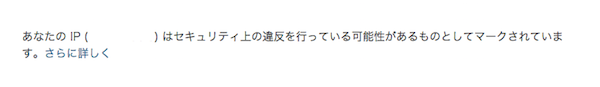

### 事象

WordPressログイン時に下記のメッセージが出力されて管理画面にログインできない。 [](./wordpress-jetpack-block-ip.png) 
<!-- truncate -->


### 原因

インストール型WordPressでJetPackプラグインのセキュリティ機能。プラグイン有効化後に一定回数ログインID・パスワードを間違えると出力され、当該IPからの接続が不可となる仕様。当機能は不正アクセス防止用だが、今回は2段階認証設定後に自端末からサードパーティー製のアプリの認証に手間取り(アプリパスワードの発行を忘れて、従来のパスワードでログイン試行回数を超過orz)、当事象が発生したもの。

### 対処手順

下記ドキュメントの項番3に記載。 [Security Features — Jetpack for WordPress](http://jetpack.me/support/security-features/) ※How to [unblock and whitelist your IP address](http://jetpack.me/support/security-features/#unblock) from WordPress.com もしくは自端末のIPを変更する。

### 対処例

上記リンクのwp-config.phpにホワイトリストを追記する手法で対処する場合だと、wp-config.phpに下記の行を追記すれば即時反映される。 

```php
define('JETPACK_IP_ADDRESS_OK', '＜許可するIPv4アドレス＞');
```


