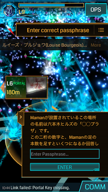
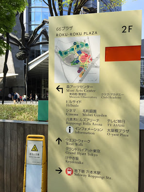

本日は[Ingress First Saturday](https://plus.google.com/+Ingress/posts/hDSdn4ugp2b "Ingress FS")ということで、久々にIT系以外の記事も書いてみる。

### 当記事の投稿背景

首題のミッション地域は激戦区の為、キャプチャー・リンク構築が可能なタイミングを図る必要があり、Academyhills等、Maman直近ではなくビル内からミッションを進める場合は、予め最後のpassphrase問題内容を押さえておくと捗る為。 (以下ネタバレ注意) 
<!-- truncate -->

### 問題内容

ミッションの最後にパスフレーズ問題の内容は下記の通り。 

### 解答のヒント

尚、プラザ名は以下の写真に記載の通りで、Mamanの足の数は蜘蛛の足の本数と同数。 
