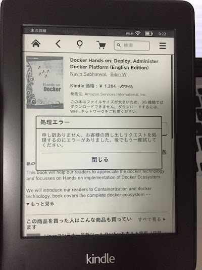

首題の事象の対処例を記載。

### 事象

Amazon.co.jpのオーナーライブラリから電子書籍のダウンロードを試みたところ下図のエラーメッセージが出力され、電子書籍をダウンロードできない。 
<!-- truncate -->
 

### 原因

Kindle Customer Serviceへ照会したところ、過去にAmazon.com版のKindleを使用後、現在Amazon.co.jpのアカウントにマージしたアカウントに本事象が発生する場合があるとのこと。（根本原因は不明）

### 対応

下記の手順で解決できた。

#### Amazon.comへ購入先サイトの変更

1. [http://www.amazon.co.jp/mycd](http://www.amazon.co.jp/mycd)の「コンテンツと端末の管理」にアクセス。
2. 設定タブを開く。
3. 居住国設定から「変更」をクリックし、「お住まいの国からの購入に対応しているAmazonサイトの詳細については、ここをクリックしてください。」の「ここ」をクリック。
4. 「Amazon.comを利用するには」をクリック。
5. 「はい。好みのショッピングサイトを変更します。」をクリック。

その後、以下の手順にてAmazon.co.jpへ、購入先サイトを変更。

#### Amazon.co.jpへ購入先サイトの変更

1. [http://www.amazon.com/mycd](http://www.amazon.com/mycd)の「Manage Your Content and Devices」にアクセス。
2. 「Settings」を開く。
3. 「Country Settings」から「Change」をクリックし、「Click here to learn more about other Amazon sites you are eligible to shop on based on your country of residence.」の「here」をクリック。
4. 「Learn about transferring your Kindle account to Amazon.co.jp」をクリック。
5. 「Yes,Change Preferred Shopping Site」をクリック。

以上の手順にて、購入先サイトを切り替え後に、Kindle Paperwhite側にて登録解除を行い、再登録を行う。 この後オーナーライブラリの本のダウンロードを試みたところ正常に処理が完了した。 因みに今回読もうとした本は下記の通り。 Docker Hands on: Deploy 

<iframe src="http://rcm-fe.amazon-adsystem.com/e/cm?lt1=_blank&amp;bc1=FFFFFF&amp;IS2=1&amp;bg1=FFFFFF&amp;fc1=000000&amp;lc1=0000FF&amp;t=bitsmining-22&amp;o=9&amp;p=8&amp;l=as4&amp;m=amazon&amp;f=ifr&amp;ref=ss_til&amp;asins=B00RXFHYZY" style="width:120px;height:240px;" scrolling="no" marginwidth="0" marginheight="0" frameborder="0"></iframe>

本記事の投稿時点、Docker本は数えるほどしかなく、オーナーライブラリで読めるのは確かこれだけ。
