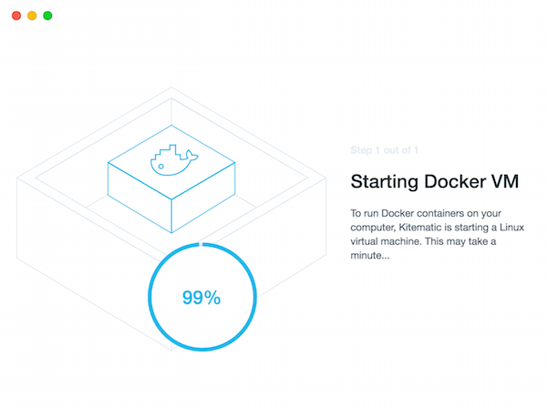

### 事象

下図の通り、Kitematic (Beta) の初期設定画面 “Starting Docker VM”の進行状況が99%で停まり、アプリがフリーズする。 [](./docker_kitematic_init.png) 
<!-- truncate -->


### 発生環境

| OS | Mac OS X |
| --- | --- |
| Docker Kitematic | 0.8.3 |
| Docker Engine | 1.8.1 |
| Docker Machine | 0.4.1 |

### 原因

Boot2dockerで作成した”default” VMが残存していた為。これはあくまで後述の操作で解決した事による推測。

### 解決例

1. Boot2dockerで作成したVMの削除
2. Docker Toolboxのアンインストール
3. Boot2dockerのアンインストール
4. Docker Toolboxの再インストール
5. Kitematicの起動

VMの削除はdocker-machine rm コマンド。

```
$ docker-machine rm -f default ← Linux VM “default”を削除
Successfully removed default
$ docker-machine ls ← VMの削除確認
NAME   ACTIVE   DRIVER   STATE   URL   SWARM
※ 全てのVMが削除されていることを確認
$

```

Docker Toolboxのアンインストール手順は公式に記載の通り実施。 [Installation on Mac OS X](https://docs.docker.com/engine/installation/mac/#uninstall-docker-toolbox) boot2dockerのアンインストールはAppアイコンをゴミ箱へドラック＆ドロップ。その後、下記の公式uninstall.shで残存しているファイルを削除。 [osx-installer/uninstall.sh at master · boot2docker/osx-installer](https://github.com/boot2docker/osx-installer/blob/master/uninstall.sh)

```
rm -f /usr/local/bin/boot2docker
rm -rf ~/.boot2docker
rm -rf /usr/local/share/boot2docker
rm -f ~/.ssh/id_boot2docker*
rm -f /private/var/db/receipts/io.boot2docker.*
rm -f /private/var/db/receipts/io.boot2dockeriso.*
rm -f /usr/local/bin/docker

```

最後に再度Docker ToolboxをインストールしKitematicを実行すると正常起動する。この時点でdocker-machine lsを実行すると、

```
$ docker-machine ls
NAME      ACTIVE   DRIVER       STATE     URL                         SWARM
default   *        virtualbox   Running   tcp://192.168.99.102:2376
$
```

Name:defaultのVMが作成されてる状態となる。

### 参考サイト

- [Kitematic freezes at 99% in setup · Issue #386 · kitematic/kitematic](https://github.com/kitematic/kitematic/issues/386)
