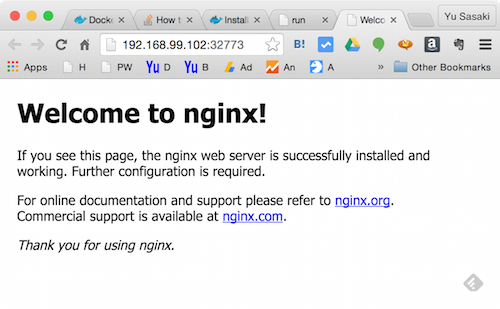
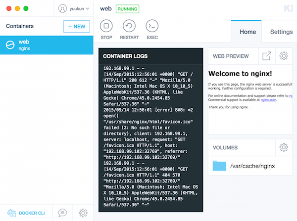

Dockerコマンドの基本的な動作を確認する為のnginx Webサーバコンテナを用いたwebページの表示確認操作の手順を記載。

### 実行環境

| OS | Mac OS X |
| --- | --- |
| Docker version | 1.8.1 |


<!-- truncate -->


### コンテナの作成・実行

```
$ docker-machine ls ← docker containerを動かすVMのステータス確認
NAME      ACTIVE   DRIVER       STATE     URL                         SWARM
default   *        virtualbox   Running   tcp://192.168.99.102:2376

```

docker runコマンドを用いて公式nginxコンテナを起動する。仮にnginxのイメージが無い場合は下記実行結果の通り、リポジトリからpullした上でコンテナを実行する。尚、-dオプションはバックグラウンド実行(detach)、-Pオプションはコンテナ側でEXPOSE指定されたポート([ここでは、80, 443](https://github.com/nginxinc/docker-nginx/blob/a8b6da8425c4a41a5dedb1fb52e429232a55ad41/Dockerfile))とVMのポートの対応をランダムで割り付ける。

```
$ docker run -d -P --name web nginx
Unable to find image 'nginx:latest' locally
Pulling repository docker.io/library/nginx
0b354d33906d: Download complete
＜中略＞
Status: Downloaded newer image for nginx:latest
1b18cbc13ba2129cf3a74aa86bb09f8a5eb7832e3f4113889e1b8c110179b63c

```

"nginx"とコンテナイメージタグを何も指定しない場合、latest(最新)tagのイメージをデフォルトでダウンロードする。他のタグが利用可能かどうかは[Docker Hub (nginx)のドキュメント](https://hub.docker.com/_/nginx/)を参照。

```
$ docker ps ← dockerプロセスの確認
CONTAINER ID        IMAGE               COMMAND                  CREATED             STATUS              PORTS                                           NAMES
1b18cbc13ba2        nginx               "nginx -g 'daemon off"   29 minutes ago      Up 29 minutes       0.0.0.0:32773->80/tcp, 0.0.0.0:32768->443/tcp   web

```

ここではVMのポート32773が"web"コンテナの80番に紐付けられている。その為、ブラウザからのアクセスの際は、アドレス となる。 [](./docker_nginx_default_page.png) Kitematicを起動している場合は下図の通りプレビューウィンド上のボタンから対象ページをブラウザ起動してくれるので、アドレスを打ち込む手間が省ける。 [](./docker_kitematic_nginx.png)

### コンテナの停止・削除

```
$ docker stop web ← コンテナの停止
web
$ docker ps -a ← aオプションで停止状態のコンテナステータスまで表示
CONTAINER ID        IMAGE               COMMAND                  CREATED             STATUS                     PORTS               NAMES
e97205fa03d7        nginx               "nginx -g 'daemon off"   14 minutes ago      Exited (0) 2 minutes ago                       web
$ docker rm web ← コンテナの削除
web
$ docker ps -a
CONTAINER ID        IMAGE               COMMAND             CREATED             STATUS              PORTS               NAMES
※確かにコンテナが削除されている。

```

### コンテナの外部ポートを指定して起動

nginxのポートをVM (docker-machine)の指定のポートに紐づけたい場合は-p(小文字)オプションを用いる。下記はVMのport 80、443をコンテナのport 80、443にそれぞれ割り付けている。

```
$ docker run -d -p 80:80 -p 443:443 --name web nginx
31050cc8a8beb0c1a32ebf5faeb9bc27ec29bf7b8369e6839775a877054cd5f1
$ docker ps
CONTAINER ID        IMAGE               COMMAND                  CREATED             STATUS              PORTS                                      NAMES
31050cc8a8be        nginx               "nginx -g 'daemon off"   4 seconds ago       Up 4 seconds        0.0.0.0:80->80/tcp, 0.0.0.0:443->443/tcp   web

```

### 参考サイト

- [Docker Docs - run](https://docs.docker.com/engine/reference/run/)
- [Installation on Mac OS X](https://docs.docker.com/engine/installation/mac/)
