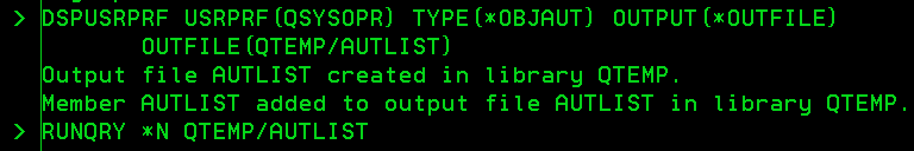
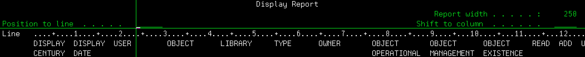

### 目的

特定ユーザー(例: QSYSOPR)の個別ユーザー権限が付与されたオブジェクト(\*LIB, \*FILE, \*OBJ, etc...)の一覧表示。 
<!-- truncate -->


### コマンド

```
DSPUSRPRF USRPRF(QSYSOPR) TYPE(*OBJAUT)

```

必要に応じてOUTPUTパラメーターを指定する。後々Excelで加工する場合は、OUTFILEにしておくと良い。

```
DSPUSRPRF USRPRF(QSYSOPR) TYPE(*OBJAUT) OUTPUT(*OUTFILE) OUTFILE(QTEMP/AUTLIST)

```

上記OUTFILEのIBM i 上での確認は下記のコマンドで可能。

```
RUNQRY *N QTEMP/AUTLIST

```

[](./dspusrprf_objaut_cmd.gif) 下図のようにカラム整形して出力してくれる。 [](./dspusrprf_objaut_outfile.gif)

### 活用例

資源移行元と移行先でQ付きユーザーの個別権限が付与されいるオブジェクトリストの比較・突合時。

### 活用背景

資源の移行時、Q付きユーザープロファイルをオミットして復元する際、移行元オブジェクトにQ付きユーザーの個別権限の欠落が生じる。欠落した対象オブジェクトの特定の為。
