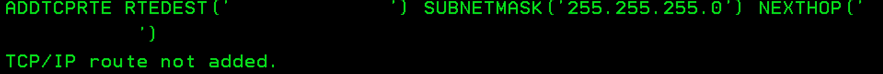
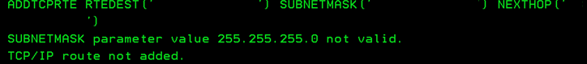

### 事象

ADDTCPRTEコマンドを実行後、"TCP/IP route not added."エラーメッセージが出力され、パラメーターに指定したRouteの登録が出来ない。(実行環境: v6r1)

```
ADDTCPRTE RTEDEST('192.0.2.3') SUBNETMASK('255.255.255.0') NEXTHOP('192.0.2.1')
```

[](./addtcprte_subnet_mask_error_cmdline.gif) 
<!-- truncate -->


### 原因

RTEDESTに正しいサブネットワークアドレスが指定されていない、もしくはSUBNETMASKに適切なサブネットマスクが指定されていない為。 [](./addtcprte_subnet_mask_error_detail.gif) 上図はコマンドエントリ画面上でF10押下時のメッセージ。(詳細表示)

### 対処

仮に192.0.2.0/24に対してStatic Routeを設定したい場合、正しいコマンドは下記の通り。（192.0.2.3 → 192.0.2.0)

```
ADDTCPRTE RTEDEST('192.0.2.0') SUBNETMASK('255.255.255.0') NEXTHOP('192.0.2.1')
```

### 雑感

初歩的なミス。手順書の再鑑時は気をつけること。。 因みに、本記事のようにIPv4のアドレスの例を記載する場合はRFC5735の記述に則ること。 [tools.ietf.org/rfc/rfc5735.txt](http://tools.ietf.org/rfc/rfc5735.txt)

> 192.0.2.0/24 - This block is assigned as "TEST-NET-1" for use in documentation and example code. It is often used in conjunction with domain names example.com or example.net in vendor and protocol documentation. As described in \[RFC5737\], addresses within this block do not legitimately appear on the public Internet and can be used without any coordination with IANA or an Internet registry. See \[RFC1166\]. ＜中略＞ 198.51.100.0/24 - This block is assigned as "TEST-NET-2" for use in documentation and example code. It is often used in conjunction with domain names example.com or example.net in vendor and protocol documentation. As described in \[RFC5737\], addresses within this block do not legitimately appear on the public Internet and can be used without any coordination with IANA or an Internet registry. ＜中略＞ 203.0.113.0/24 - This block is assigned as "TEST-NET-3" for use in documentation and example code. It is often used in conjunction with domain names example.com or example.net in vendor and protocol documentation. As described in \[RFC5737\], addresses within this block do not legitimately appear on the public Internet and can be used without any coordination with IANA or an Internet registry.
