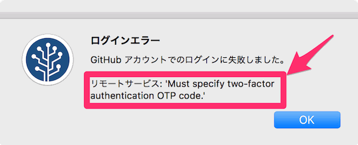
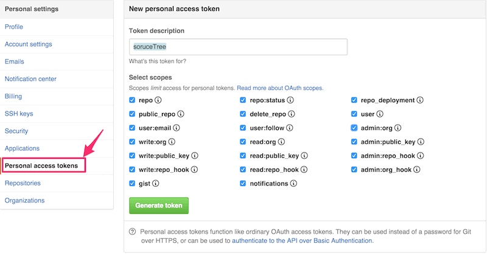

### 事象

GUIでリポジトリを操作できるSourceTreeを用いてGitHubへログインを試みたところ下記のエラーが発生。  
<!-- truncate -->

### 原因

Mac版SourceTreeがGitHubの二段階認証によるログインに対応していない為。

### 対応

GitHub設定画面からPersonal access tokenを作成し、当該token文字列をSourceTreeのGitHubアカウントパスワード入力欄へペーストする。  尚、access tokenのScopesは後からでも編集可能。
