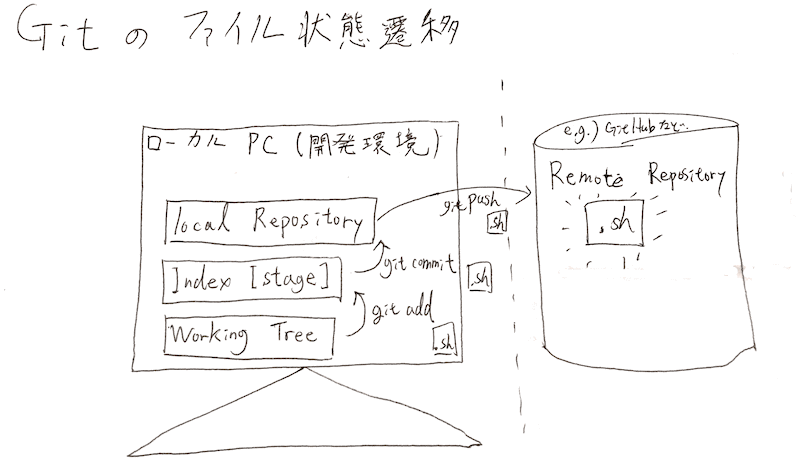

本記事は基本的なGitコマンドを基にサンプルシェルの更新の過程でローカルブランチの作成手法を紹介する。 対象サブコマンド: init, status, add, commit, log, show, branch, checkout, tag. ※尚、各項目のコマンド説明文にgit開発元のReferenceリンクを併記している。

### 前提

以下の内容は本記事には含まず、既知・設定済みとして扱う。

- バージョン管理, Gitの概要
- Gitクライアントのインストール
- Gitクライアントの設定(user.name, user.email等)


<!-- truncate -->


### 実行環境

OS: CentOS v7.1 Git version: 1.8.3.1

### git init - ローカルリポジトリの作成

開発用ディレクトリ (≒gitではワーキングツリー\[working tree\])を作成し本記事ではhello\_app)、そこにローカルリポジトリをgit initコマンドで作成する。 [Git - git-init Documentation](https://git-scm.com/docs/git-init)

```
[vagrant@localhost vagrant]$ mkdir hello_app
[vagrant@localhost vagrant]$ cd hello_app/
[vagrant@localhost hello_app]$ git init
Initialized empty Git repository in /vagrant/hello_app/.git/

```

当該リポジトリの管理情報は.git (隠しディレクトリ)に保管される。

```
[vagrant@localhost hello_app]$ ls -F .git
HEAD  branches/  config  description  hooks/  info/  objects/  refs/

```

続いて、ワーキングツリー直下にhello\_git.shファイルを下記の通り作成する。

```
#!/bin/bash
echo "Hello, Git!"

```

### git status - ワーキングツリーのステイタス表示

[Git - git-status Documentation](https://git-scm.com/docs/git-status)

```
[vagrant@localhost hello_app]$ git status
# On branch master
#
# Initial commit
#
# Untracked files:
#   (use "git add ..." to include in what will be committed)
#
#    hello_git.sh
nothing added to commit but untracked files present (use "git add" to track)

```

Untracked files欄にhello\_git.shが追加されていることを確認できる。

### git add - ファイルをインデックスエリアに追加

[Git - git-add Documentation](https://git-scm.com/docs/git-add) 現状はhello\_git.shはコミット対象となるインデックスエリアに登録されてないため、addサブコマンドでインデックスへ登録、再度statusサブコマンドを確認する。

```
[vagrant@localhost hello_app]$ git add hello_git.sh
[vagrant@localhost hello_app]$ git status
# On branch master
#
# Initial commit
#
# Changes to be committed:
#   (use "git rm --cached ..." to unstage)
#
#    new file:   hello_git.sh
#

```

### git commit - ローカルリポジトリに変更を登録

[Git - git-commit Documentation](https://git-scm.com/docs/git-commit)

```
[vagrant@localhost hello_app]$ git commit -m "Initial commit."
[master (root-commit) 4e51083] Initial commit.
 1 file changed, 3 insertions(+)
 create mode 100755 hello_git.sh

```

\-mオプションは任意のコメントを付与できる。実際の開発であれば変更内容等の記載するが、その内容・形式についてPMや標準化部署から指定がある場合もある。 以下はコミットまでのファイル状態の遷移を図示したもの。 [](./git_local_remote_file.gif)

### git log - これまでのコミットログを表示

[Git - git-log Documentation](https://git-scm.com/docs/git-log)

```
[vagrant@localhost hello_app]$ git log
commit 4e5108357d5ffe4ef3e66eb7377281529d862739
Author: yukun.info 
Date:   Tue Jan 12 07:00:33 2016 +0000
    Initial commit.
[vagrant@localhost hello_app]$

```

因みにcommit: 右に記載されいている41桁の文字列はコミットIDと言いグローバルでユニークなハッシュ値を持つ。コミットIDを引数にgit showコマンドを実行すると、コミットID内容の詳細を確認できる。 [Git - git-show Documentation](https://git-scm.com/docs/git-show)

```
[vagrant@localhost hello_app]$ git show 4e5108357d5ffe4ef3e66eb7377281529d862739
commit 4e5108357d5ffe4ef3e66eb7377281529d862739
Author: yukun.info 
Date:   Tue Jan 12 07:00:33 2016 +0000
    Initial commit.
diff --git a/hello_git.sh b/hello_git.sh
new file mode 100755
index 0000000..2418d10
--- /dev/null
+++ b/hello_git.sh
@@ -0,0 +1,3 @@
+#!/bin/bash
+
+echo "Hello, Git!"

```

### hello\_git.shの修正 (その1)

下記の通り修正し、再度コミットを実施する。

```
#!/bin/bash
echo -n "May I have your name please? "
read name
echo "Hello $name! Welcome to Git!"

```

\[vagrant@localhost hello\_app\]$ git commit -a -m "Add: read name." \[master ac1e9d9\] Add: read name. 1 file changed, 3 insertions(+), 1 deletion(-)

```
-aオプションを使用するとgit addサブコマンドの省略が可能。※ 1 deletion (-)は.DS_Storeファイルを削除した為。（当方環境では当該ディレクトリをホストOSのMacと共有しており、ファイルブラウズ時に生成された物)
下記の通り、git logにて2回分のコミットを確認できる。
[vagrant@localhost hello_app]$ git log
commit ac1e9d9f7c1b0534bd19544a1c0bb8c0ddc15550
Author: yukun.info 
Date:   Tue Jan 12 07:43:29 2016 +0000
    Add: read name.
commit 4e5108357d5ffe4ef3e66eb7377281529d862739
Author: yukun.info 
Date:   Tue Jan 12 07:00:33 2016 +0000
    Initial commit.

git branch - ブランチの作成
現時点の状態をv1.0として定義し、リポジトリをmasterブランチとv1ブランチへ分ける際は下記のコマンドを使用する。
Git - git-branch Documentation
[vagrant@localhost hello_app]$ git branch v1
[vagrant@localhost hello_app]$ git branch
* master
  v1

branchサブコマンドは何も引数が無い場合は、リポジトリのブランチを一覧表示する。*が付いているブランチは現在作業中のbranch となる。
git checkout - 作業ブランチの切り替え
Git - git-checkout Documentation
[vagrant@localhost hello_app]$ git checkout v1
Switched to branch 'v1'
[vagrant@localhost hello_app]$ git branch
  master
* v1

これ以降のコミットはv1ブランチ宛てに行われる。
下記のREADME.mdを作成の後、バージョン1.0としてコミットする。
[vagrant@localhost hello_app]$ vim README.md
[vagrant@localhost hello_app]$ cat README.md
Version 1.0
[vagrant@localhost hello_app]$ git add README.md
[vagrant@localhost hello_app]$ git status
# On branch v1
# Changes to be committed:
#   (use "git reset HEAD ..." to unstage)
#
#    new file:   README.md
#
[vagrant@localhost hello_app]$ git commit -m "Release: v1.0"
[v1 c1f1c7c] Release: v1.0
 1 file changed, 2 insertions(+)
 create mode 100644 README.md

git tag - タグの付与
Git - git-tag Documentation
直前のコミットに対してtagを付与しv1.0を付与し、その内容を確認する。
[vagrant@localhost hello_app]$ git tag v1.0
[vagrant@localhost hello_app]$ git tag
v1.0
[vagrant@localhost hello_app]$ git show v1.0
commit c1f1c7cb197f362897b9055aae906ec70575f8a4
Author: yukun.info 
Date:   Tue Jan 12 08:05:57 2016 +0000
    Release: v1.0
diff --git a/README.md b/README.md
new file mode 100644
index 0000000..d39bb0d
--- /dev/null
+++ b/README.md
@@ -0,0 +1,2 @@
+Version 1.0
+

v1.0についてはこちらを完成版扱いとしてmasterブランチで次期バージョンの編集を行う。
hello_git.shの修正 (その2)
下記の通り修正する。
#!/bin/bash
echo -n "May I have your name please? "
read name
echo "Hello $name! Welcome to Git!"
echo "Date & Time: `date`"

続いて、当該ファイルをコミットする。
[vagrant@localhost hello_app]$ git add hello_git.sh
[vagrant@localhost hello_app]$ git commit -m "Add: display date and time"
[master efa10d8] Add: display date and time
 1 file changed, 1 insertion(+)
[vagrant@localhost hello_app]$ git log
commit efa10d8f5ea2dd67ab15922a56e8bb7bbf50fb8b
Author: yukun.info 
Date:   Tue Jan 12 08:31:24 2016 +0000
    Add: display date and time
commit ac1e9d9f7c1b0534bd19544a1c0bb8c0ddc15550
Author: yukun.info 
Date:   Tue Jan 12 07:43:29 2016 +0000
    Add: read name.
commit 4e5108357d5ffe4ef3e66eb7377281529d862739
Author: yukun.info 
Date:   Tue Jan 12 07:00:33 2016 +0000
    Initial commit.

当該結果にはv1ブランチが含まれていないことを確認できる。
[vagrant@localhost hello_app]$ git checkout v1
Switched to branch 'v1'
[vagrant@localhost hello_app]$ git log
commit c1f1c7cb197f362897b9055aae906ec70575f8a4
Author: yukun.info 
Date:   Tue Jan 12 08:05:57 2016 +0000
    Release: v1.0
commit ac1e9d9f7c1b0534bd19544a1c0bb8c0ddc15550
Author: yukun.info 
Date:   Tue Jan 12 07:43:29 2016 +0000
    Add: read name.
commit 4e5108357d5ffe4ef3e66eb7377281529d862739
Author: yukun.info 
Date:   Tue Jan 12 07:00:33 2016 +0000
    Initial commit.

```
