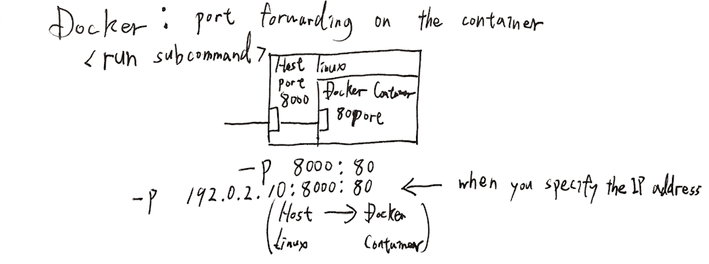
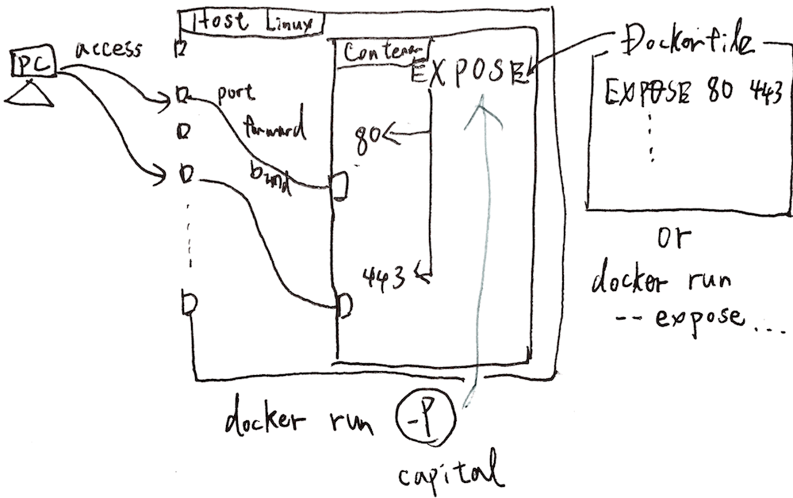

ホストLinux上でDockerコンテナを用いてWebサーバ等を提供する際、ホストLinux-Dockerコンテナ間でポートの紐付けが必要である。本記事は下記の3パターンのポートの紐付け方法を紹介する。尚、参考にした公式ガイドは記事末尾をご参照。 
<!-- truncate -->


1. docker run -pオプション
2. docker run -Pオプション (Dockerfileに[EXPOSE](https://docs.docker.com/engine/reference/builder/)指定)
3. docker run --expose

### docker run -pオプション

[](./docker_run_port_forward.gif) -pオプションで＜ホストport＞:＜コンテナport＞を紐付けることができる。

```
$ docker run -d -p 8080:80 --name web1 nginx
ae7fe48f7e2a325f748b95d4d64a6c72cd979f6b23c6b95f7709f97d013ab1f0
$ docker ps -l
CONTAINER ID        IMAGE               COMMAND                  CREATED             STATUS              PORTS                           NAMES
ae7fe48f7e2a        nginx               "nginx -g 'daemon off"   6 seconds ago       Up 6 seconds        443/tcp, 0.0.0.0:8080->80/tcp   web1
$ curl http://localhost:8080

＜後略＞
$

```

### docker run -Pオプション (大文字)

[](./docker_run_expose_port.gif) 予めDockerfileにEXPOSE文を用いてコンテナが開示するポートを指定してDockerイメージを構築後に、-P (大文字)オプションを使用すると、dockerエンジン側でコンテナ側のEXPOSE指定ポートにホスト側のポートをランダムに割り振り、紐付ける。 下記の例で使用している公式nginxのコンテナはDockerfile上でEXPOSE 80 443を指定している。 参考サイト) [https://hub.docker.com/\_/nginx/](https://hub.docker.com/_/nginx/)

```
$ docker run -d -P --name web2 nginx
8210e114cca486636c9a7a6efa62a64cbdf7a3d08da3c26d6768dde35deda82e
$ docker ps -l
CONTAINER ID        IMAGE               COMMAND                  CREATED             STATUS              PORTS                                           NAMES
8210e114cca4        nginx               "nginx -g 'daemon off"   23 seconds ago      Up 22 seconds       0.0.0.0:32779->80/tcp, 0.0.0.0:32778->443/tcp   web2
$ curl http://localhost:32779

＜後略＞
$

```

因みにバインディングされているポートは[docker inspectコマンドの引数を活用](https://docs.docker.com/engine/reference/commandline/inspect/)することで確認可能。

```
$ docker inspect --format='{{range $p, $conf := .NetworkSettings.Ports}} {{$p}} -> {{(index $conf 0).HostPort}} {{end}}' web2
 443/tcp -> 32778  80/tcp -> 32779

```

ただ、このコマンド長すぎるので、オプション無しで出力→目視確認の方が現実的。

### docker run --expose

上述ではDockerfile上でEXPOSEするポートをしていたが、docker run --exposeオプションでexposeするポートを指定する事も可能。ただ、このオプション使用シーンは余り思い浮かばないが。基本上記2パターンで十分な気もする。

### コンテナを再起動した場合

尚、docker stop / docker start で一度runしたコンテナを再起動した場合、コンテナポートフォワーディング設定は自動的に引き継がれ、再設定される。その際、-Pオプションで指定されるホスト側のポートは再度ランダムで設定される。

```
$ docker run -dP --name web01 nginx:latest
5ec9fb59bf49d804179a62f167cac5095179e43ca91abf72636b5e1a95620a66
$ docker ps
CONTAINER ID        IMAGE               COMMAND                  CREATED             STATUS              PORTS                                           NAMES
5ec9fb59bf49        nginx:latest        "nginx -g 'daemon off"   19 seconds ago      Up 18 seconds       0.0.0.0:32775->80/tcp, 0.0.0.0:32774->443/tcp   web01
$ docker stop web01
web01
$ docker ps -l
CONTAINER ID        IMAGE               COMMAND                  CREATED              STATUS                      PORTS               NAMES
5ec9fb59bf49        nginx:latest        "nginx -g 'daemon off"   About a minute ago   Exited (0) 11 seconds ago                       web01
$ docker start web01
web01
$ docker ps
CONTAINER ID        IMAGE               COMMAND                  CREATED              STATUS              PORTS                                           NAMES
5ec9fb59bf49        nginx:latest        "nginx -g 'daemon off"   About a minute ago   Up 6 seconds        0.0.0.0:32777->80/tcp, 0.0.0.0:32776->443/tcp   web01

```

### 参考サイト

- [Dockerfile reference](https://docs.docker.com/engine/reference/builder/)
- [Network configuration](https://docs.docker.com/engine/userguide/networking/)
