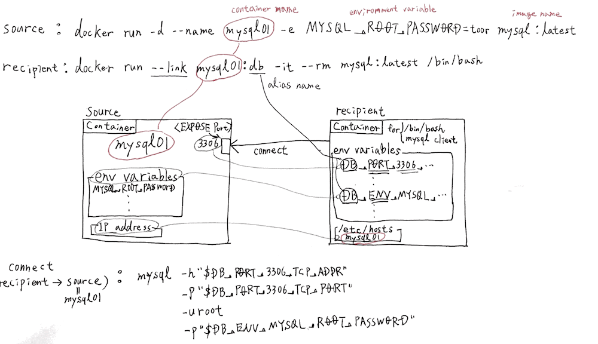

例えば、Webアプリケーションを作成する際のDocker構成の一例としてデータベース(DB)機能のみのコンテナを起動し、WebアプリコンテナからDBコンテナにアクセスする際の方法として、ホストネットワークIPへバインディングせずに、docker runサブコマンドのlinkオプションを活用する方法がある。本記事は公式mysqlサーバコンテナを作成しlinkオプションで起動したコンテナからサーバへ接続する手法を紹介する。尚、参考にした公式ドキュメントリンクは記事末尾を参照すること。また、使用docker engine versionは1.9.1。 
<!-- truncate -->


### linkオプションの機能

仮にリンクされる側のコンテナ(DBサーバ等)をsource、リンクする側のコンテナ(Webアプリ、クライアント等)をrecipientと置いた時、linkオプションがrecipientコンテナに提供する機能は下記の通り。

1. sourceコンテナのIPアドレス、EXPOSEしているポート、プロトコルをrecipientコンテナの環境変数に登録
2. sourceコンテナの環境変数をrecipientコンテナの環境変数に登録
3. sourceコンテナのIPアドレスをrecipientコンテナの/etc/hostsへ登録

DockerコンテナのIPアドレスはdocker run時にランダムに割り振られ、他のコンテナから仮想ブリッジ経由で当該IPにアクセスする際は、上記の様なlink機能が必要となる。 以下にmysqlコンテナを用いて、上記機能の確認結果を示す。 [](./docker_link_mysql.gif) 尚、公式mysqlコンテナのリンクは下記の通り。 [https://hub.docker.com/\_/mysql/](https://hub.docker.com/_/mysql/) DockerfileのEXPOSE指定は3306ポートとなる。

### mysqlサーバコンテナの作成

```
$ docker run -d --name mysql01 -e MYSQL_ROOT_PASSWORD=toor mysql:latest
afceca423dc989776dd067e5779b5560033b0f10e294055de63a8a9ec7e60704
$ docker ps -l
CONTAINER ID        IMAGE               COMMAND                  CREATED              STATUS              PORTS               NAMES
afceca423dc9        mysql:latest        "/entrypoint.sh mysql"   About a minute ago   Up About a minute   3306/tcp            mysql01

```

\-eオプションで指定している環境変数MYSQL\_ROOT\_PASSWORDはmysqlのrootパスワードとなる。ちなみに、toorはBlack hat(現kali)でデフォルトで設定されているパスワード。私はテスト用だと良く使用する。 続いて、mysql01コンテナ上のbashからコンテナのステータスを確認する。

```
$ docker exec -it mysql01 /bin/bash
root@afceca423dc9:/# ps -efl
F S UID        PID  PPID  C PRI  NI ADDR SZ WCHAN  STIME TTY          TIME CMD
4 S mysql        1     0  0  80   0 - 365656 poll_s 05:54 ?       00:00:00 mysqld
4 S root       105     0  0  80   0 - 5051 wait   05:58 ?        00:00:00 /bin/bash
0 R root       114   105  0  80   0 - 4371 - 05:58 ?        00:00:00 ps -efl
root@afceca423dc9:/# env
HOSTNAME=afceca423dc9
MYSQL_VERSION=5.7.10-1debian8
PATH=/usr/local/sbin:/usr/local/bin:/usr/sbin:/usr/bin:/sbin:/bin
PWD=/
SHLVL=1
HOME=/root
MYSQL_MAJOR=5.7
MYSQL_ROOT_PASSWORD=toor
_=/usr/bin/env
root@afceca423dc9:/# mysql -u root -ptoor
mysql: [Warning] Using a password on the command line interface can be insecure.
Welcome to the MySQL monitor.  Commands end with ; or \g.
Your MySQL connection id is 3
Server version: 5.7.10 MySQL Community Server (GPL)
Copyright (c) 2000, 2015, Oracle and/or its affiliates. All rights reserved.
Oracle is a registered trademark of Oracle Corporation and/or its
affiliates. Other names may be trademarks of their respective
owners.
Type 'help;' or '\h' for help. Type '\c' to clear the current input statement.
mysql> show databases;
+--------------------+
| Database           |
+--------------------+
| information_schema |
| mysql              |
| performance_schema |
| sys                |
+--------------------+
4 rows in set (0.03 sec)
mysql> quit
Bye
root@afceca423dc9:/# exit
exit
$ docker ps -l ← execでbashを起動したので、exit後もコンテナがUp状態であることを念のため確認。
CONTAINER ID        IMAGE               COMMAND                  CREATED             STATUS              PORTS               NAMES
afceca423dc9        mysql:latest        "/entrypoint.sh mysql"   5 minutes ago       Up 5 minutes        3306/tcp            mysql01

```

psコマンドにてコンテナ上でmysqldが稼働していること、envコマンドにてコンテナ上にMYSQL\_ROOT\_PASSWORDが登録されていること、mysqlコマンドにてmysqldへログインしsqlを打鍵できることを確認できる。

### mysqlクライアントコンテナの作成

```
$ docker run --link mysql01:db -it --rm mysql:latest /bin/bash

```

mysqlクライアントとしてのコンテナが必要である為、手っ取り早くmysqlコマンドが使える公式mysqlコンテナを活用。エイリアス名はdb。--rmオプションを付けることでコンテナ終了時、すなわち/bin/bash終了時にコンテナを削除する設定とする。

```
root@1f7e94bb29f4:/# env
HOSTNAME=1f7e94bb29f4
DB_NAME=/stoic_wescoff/db
TERM=xterm
MYSQL_VERSION=5.7.10-1debian8
DB_PORT=tcp://172.17.0.4:3306
DB_PORT_3306_TCP_PORT=3306
DB_PORT_3306_TCP_PROTO=tcp
DB_ENV_MYSQL_ROOT_PASSWORD=toor
PATH=/usr/local/sbin:/usr/local/bin:/usr/sbin:/usr/bin:/sbin:/bin
PWD=/
DB_PORT_3306_TCP_ADDR=172.17.0.4
HOME=/root
SHLVL=1
DB_PORT_3306_TCP=tcp://172.17.0.4:3306
MYSQL_MAJOR=5.7
DB_ENV_MYSQL_VERSION=5.7.10-1debian8
DB_ENV_MYSQL_MAJOR=5.7
_=/usr/bin/env

```

上記環境変数から分かるとおり、source側のコンテナ情報はDB\_PORT\_3306〜で登録され、source側の環境変数もDB\_ENV\_〜で登録されている。 参考) 公式ガイド: [Legacy container links](https://docs.docker.com/engine/userguide/networking/default_network/dockerlinks/)

```
_PORT__
The components in this prefix are:
the alias  specified in the --link parameter (for example, webdb)
the  number exposed
a  which is either TCP or UDP
```

hostsファイルにもコンテナ名(mysql01)、エイリアス名(db)、コンテナID(afceca423dc9)でホストエントリが登録されている。

```
root@ac2ccafabe6d:/# cat /etc/hosts
172.17.0.2	ac2ccafabe6d
127.0.0.1	localhost
::1	localhost ip6-localhost ip6-loopback
fe00::0	ip6-localnet
ff00::0	ip6-mcastprefix
ff02::1	ip6-allnodes
ff02::2	ip6-allrouters
172.17.0.4	db afceca423dc9 mysql01
root@ac2ccafabe6d:/# ping mysql01
PING db (172.17.0.4): 56 data bytes
64 bytes from 172.17.0.4: icmp_seq=0 ttl=64 time=0.073 ms
64 bytes from 172.17.0.4: icmp_seq=1 ttl=64 time=0.083 ms
64 bytes from 172.17.0.4: icmp_seq=2 ttl=64 time=0.084 ms
^C--- db ping statistics ---
3 packets transmitted, 3 packets received, 0% packet loss
round-trip min/avg/max/stddev = 0.073/0.080/0.084/0.000 ms
root@ac2ccafabe6d:/#

```

### mysqlサーバコンテナへの接続

```
root@1f7e94bb29f4:/# mysql -h"$DB_PORT_3306_TCP_ADDR" -P"$DB_PORT_3306_TCP_PORT" -uroot -p"$DB_ENV_MYSQL_ROOT_PASSWORD"
mysql: [Warning] Using a password on the command line interface can be insecure.
Welcome to the MySQL monitor.  Commands end with ; or \g.
Your MySQL connection id is 4
Server version: 5.7.10 MySQL Community Server (GPL)
Copyright (c) 2000, 2015, Oracle and/or its affiliates. All rights reserved.
Oracle is a registered trademark of Oracle Corporation and/or its
affiliates. Other names may be trademarks of their respective
owners.
Type 'help;' or '\h' for help. Type '\c' to clear the current input statement.
mysql> show databases
    -> ;
+--------------------+
| Database           |
+--------------------+
| information_schema |
| mysql              |
| performance_schema |
| sys                |
+--------------------+
4 rows in set (0.00 sec)
mysql> exit
Bye
root@1f7e94bb29f4:/# exit
exit
$

```

linkを用いたコンテナ構成で本番デプロイを行う際、環境変数に渡す情報と、コンテナの起動順序に考慮が必要となる。大量のコンテナを管理する場合にDocker ComposeやKubernetesが必要なる理由が良くわかる。

### recipientコンテナ上の/etc/hostsファイルの動的更新

仮にmysql01:dbコンテナのみをrestartした場合、再割り当てされたIPアドレス情報はrecipientコンテナの/etc/hostsファイルに即時反映される。但し、環境変数＜エイリアス名＞\_PORT\_3306\_TCP\_ADDRは当該プロセスが終了するまでは変更されない。

```
$ docker ps
CONTAINER ID        IMAGE               COMMAND                  CREATED              STATUS              PORTS               NAMES
7cd2a1a20986        mysql:latest        "/entrypoint.sh /bin/"   About a minute ago   Up About a minute   3306/tcp            berserk_wright
afceca423dc9        mysql:latest        "/entrypoint.sh mysql"   3 hours ago          Up 3 hours          3306/tcp            mysql01
[vagrant@localhost ~]$ docker restart mysql01
mysql01

```

再度、berserk\_wright上でhostsを確認すると、mysql01のIPが172.17.0.4から172.17.0.3に変更されているが、DB\_PORT\_3306\_TCP\_ADDRは変更されていない。

```
root@7cd2a1a20986:/# cat /etc/hosts
172.17.0.2	7cd2a1a20986
127.0.0.1	localhost
::1	localhost ip6-localhost ip6-loopback
fe00::0	ip6-localnet
ff00::0	ip6-mcastprefix
ff02::1	ip6-allnodes
ff02::2	ip6-allrouters
172.17.0.3	db afceca423dc9 mysql01
root@7cd2a1a20986:/# env
HOSTNAME=7cd2a1a20986
DB_NAME=/berserk_wright/db
TERM=xterm
MYSQL_VERSION=5.7.10-1debian8
DB_PORT=tcp://172.17.0.4:3306
DB_PORT_3306_TCP_PORT=3306
DB_PORT_3306_TCP_PROTO=tcp
DB_ENV_MYSQL_ROOT_PASSWORD=toor
PATH=/usr/local/sbin:/usr/local/bin:/usr/sbin:/usr/bin:/sbin:/bin
PWD=/
DB_PORT_3306_TCP_ADDR=172.17.0.4
HOME=/root
SHLVL=1
DB_PORT_3306_TCP=tcp://172.17.0.4:3306
MYSQL_MAJOR=5.7
DB_ENV_MYSQL_VERSION=5.7.10-1debian8
DB_ENV_MYSQL_MAJOR=5.7
_=/usr/bin/env
root@7cd2a1a20986:/# ping mysql01
PING db (172.17.0.3): 56 data bytes
64 bytes from 172.17.0.3: icmp_seq=0 ttl=64 time=0.085 ms
64 bytes from 172.17.0.3: icmp_seq=1 ttl=64 time=0.083 ms
64 bytes from 172.17.0.3: icmp_seq=2 ttl=64 time=0.082 ms
^C--- db ping statistics ---
3 packets transmitted, 3 packets received, 0% packet loss
round-trip min/avg/max/stddev = 0.082/0.083/0.085/0.000 ms
root@7cd2a1a20986:/#

```

そう考えると、コード中で使用するsourceのIPアドレス指定は環境変数よりもhostsに記載のコンテナ名、エイリアス名の方が、コンテナの動的なIP変更にも耐えられる設計となり良いかと思う。

### 参考サイト

- [Legacy container links](https://docs.docker.com/engine/userguide/networking/default_network/dockerlinks/)
- [https://hub.docker.com/\_/mysql/](https://hub.docker.com/_/mysql/)
- [docker command reference - run](https://docs.docker.com/engine/reference/commandline/run/)
