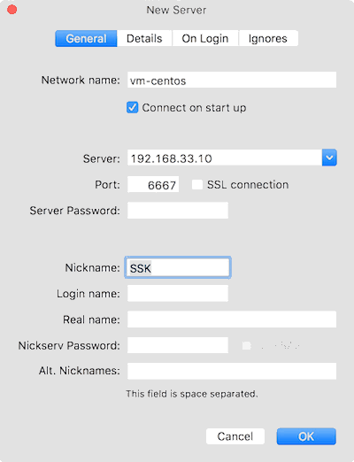
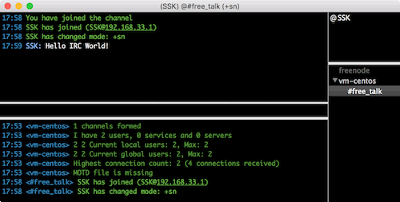

本記事はIRCサーバーの一つである[ngircd](http://ngircd.barton.de/)をCentOS v7へインストール及びIRCクライアントからの接続確認する手順を記載している。尚、/etc/ngircd.confの詳細な設定方法については本記事では取り上げていない。 
<!-- truncate -->


### ngircdパッケージのインストール

以下の通りyumコマンドでのインストールが可能。

```
# yum install epel-release
# yum install ngircd

```

### ngircdの設定

サンプル設定ファイル等は下記公式に記載がある。 [Documentation | ngIRCd: Next Generation IRC Daemon](http://ngircd.barton.de/documentation.php.en) ここでは必要最低限の設定のみを実施する。

```
# vim /etc/ngircd.conf
------------<中略>-------------
# Comma separated list of IP addresses on which the server should
# listen. Default values are:
# "0.0.0.0" or (if compiled with IPv6 support) "::,0.0.0.0"
# so the server listens on all IP addresses of the system by default.
;Listen = 127.0.0.1

```

上記の通りにListenの左に";"を打鍵しコメントアウトする。

### ngircdの自動起動設定

```
# systemctl enable ngircd.service
Created symlink from /etc/systemd/system/multi-user.target.wants/ngircd.service to /usr/lib/systemd/system/ngircd.service.
# systemctl start ngircd.service

```

### ngircdデーモンの起動確認

```
$ ps -aux  | grep ngircd
ngircd    3520  0.0  0.6  72388  3264 ?        Ss   08:47   0:00 /usr/sbin/ngircd -n
$ netstat -lnpt
(No info could be read for "-p": geteuid()=1000 but you should be root.)
Active Internet connections (only servers)
Proto Recv-Q Send-Q Local Address           Foreign Address         State       PID/Program name
tcp        0      0 0.0.0.0:6667            0.0.0.0:*               LISTEN      -
tcp        0      0 0.0.0.0:22              0.0.0.0:*               LISTEN      -
tcp        0      0 127.0.0.1:25            0.0.0.0:*               LISTEN      -
tcp6       0      0 :::6667                 :::*                    LISTEN      -
tcp6       0      0 :::22                   :::*                    LISTEN      -
tcp6       0      0 ::1:25                  :::*                    LISTEN      -
$
↑確かに、ngircdプロセスが起動し6667ポートでListenしていることを確認できた。

```

### ngircdへのログイン確認

これで上記のサーバに対してIRCクライアントからログイン可能となる。ここでは、IRCの代表的なクライアントである[LimeChat](http://limechat.net/)を用いる。仮にngircdサーバのIPアドレスが192.168.33.10である場合、LimeChatを起動→メニューのServer→Add server...→下図↓ [](./limechat_add_server_config.gif) その後、画面右下のサーバリストから登録したサーバ名（ここでは"vm-centos"を右クリック→Connectでログインできることを確認できる。 試しにメッセージを送信したい場合、先ずは、

```
/join #任意のチャンネル名

```

で任意のチャンネルに入室後に、画面右下のチャンネル名を選択しメッセージを送信する。 [](./limechat_hello_world.gif)

### ngircdの自動起動設定の解除とサービスの停止

サービスを停止・自動起動設定を解除したい場合は下記のコマンドを打鍵する。

```
# systemctl disable ngircd.service
Removed symlink /etc/systemd/system/multi-user.target.wants/ngircd.service.
# systemctl stop ngircd.service

```

### 記事背景

PythonでIRCクライアントボットを作成しており、その動作確認用でIRCサーバを立てた。netでIRC周りを調べてみると、記事投稿時点はngircdの最終更新は2015/11となっており、現在も開発は続けられているが、チャットログの保管に他のツールが必要のようで、使い込もうとすると色々手間が掛かりそうな印象を受けた。反対に前評判が良いのは[ZCN](http://wiki.znc.in/ZNC)なので、時間があればこちらを調べてみる。 _※本記事は31分で書かれている。@academyhills_
