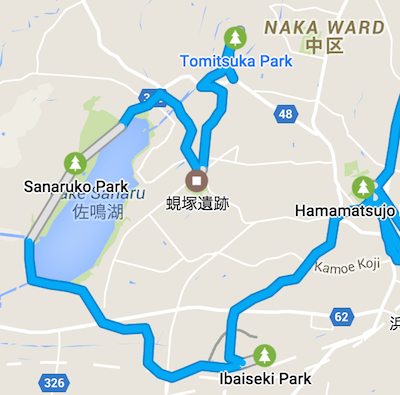
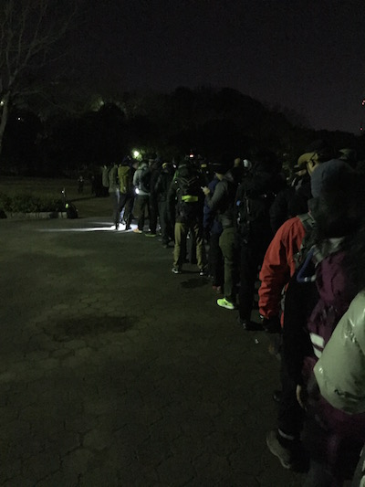
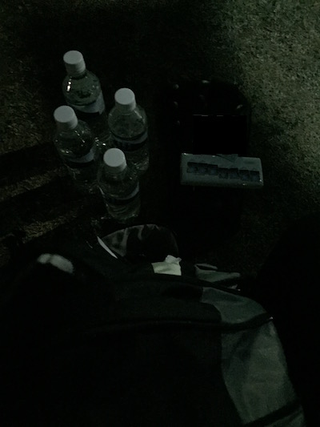
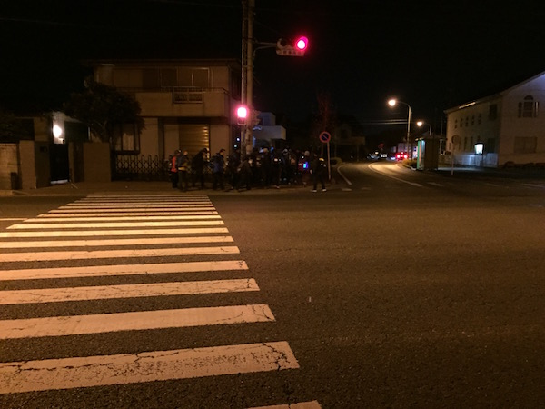
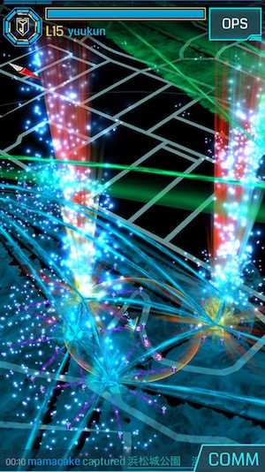
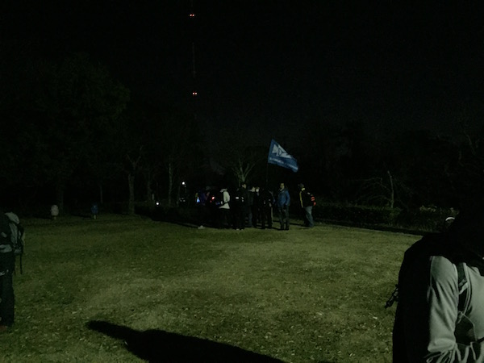
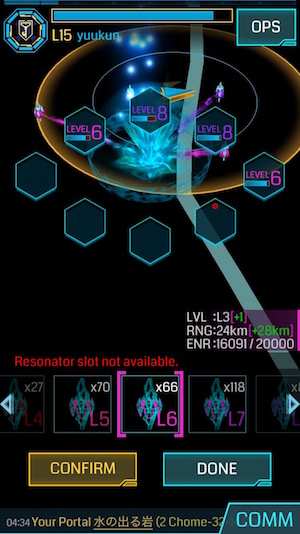
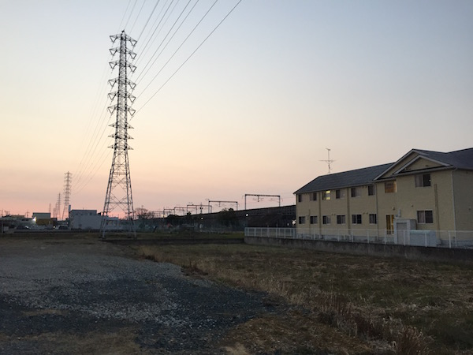
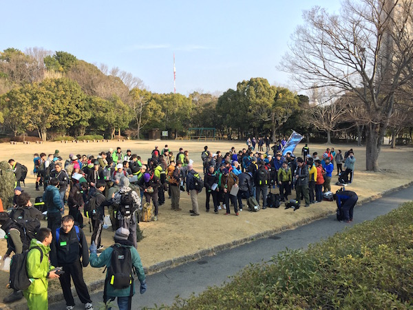
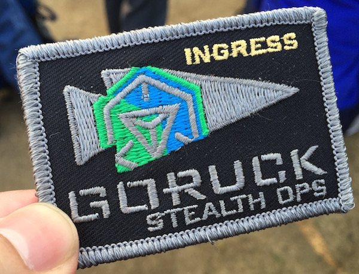

The purpose of this article is to introduce my experience at the Ingress X GORUCK Stealth in Hamamatsu on Feb 26 (overnight), 2016. 
<!-- truncate -->

### What's the Ingress X GORUCK Stealth?

This event is for strength and mental training, like a boot camp, in which the participant carries 8kg 20 LB on his or her back and march a total of about 21km around the Hamamatsu area (while the temperature is around 1.3 ℃) overnight with some additional missions about Ingress.  If you would like to know more details, please refer to the official home page as follows: GORUCK GORUCK x Ingress

### The purpose of GORUCK Stealth

I quote the sentence from the official page:

> During Stealth Ops, you will learn to apply the 4 steps of leadership:
> 
> 1. Understand the problem
> 2. Visualize a solution
> 3. Over-Communicate
> 4. Adapt to win

### Timetable and Review

#### 21:00 Roll call & Check at Hamamatsujo Park

 The instructor, called a "Cadre", did a roll call from the list at random. However, my agent name was not registered in it, even though I emailed the name to GORUCK and GORUCK replied to me with the confirmation. So I informed the Cadre of my agent name individually. After that, the attendees were checked with ID, headlight, money, weight, and water. Then, the instructor gave us an introduction and caution at the briefing. 

#### 22:00 Team Weight Training

Teamwork Training: pushups, Squat (and etc...) are conducted by synchronizing with all the attendees. When someone performed faster or slower, the Cadre asked us to exercise additionally. Of course, during this training, we carry the weight so it was harder than I expected.

#### 23:00 Team Building

We rebuilt the 4 teams for each faction. The team on the Resistance side consisted of about 14 members. Then we took a short rest to drink water and did stretching exercises.

#### 23:26 Time to March from Hamamatsujo Park

 The Cadre ordered the Resistance team to move onto Tomitsuka Park (富塚公園) and during this movement, we need to capture all the portals along the way to blue as the resistance color (blue). \* ENL faction went to the other destination. 

#### 24:12 Arrival at Tomitsuka Park

 We arrived at Tomitsuka Park and took a short rest and performed exercises.

#### 01:21 Start to march from Tomitsuka Park

Cadre ordered that we moved onto Shijimizuka Park (蜆塚公園) and following rules and competition:

##### Moving Rules

1. Don't talk. (The reason being, this is the Stealth Ops.)
2. When we encounter the bicycle, bike and ENL agents, we sit down and pose with our hands like the character 'L'.
3. When we're able to go, we make a gesture of waving our hands.

##### First Competition Rules

1. Make the control field in the destination before opposite agents.
2. Build an ambush on the enemy troops and if it finds the Cadre of the opposite faction and takes a picture, that faction wins.

#### 02:06 Arrival at Shijimizuka Park

We arrived at Shijimizuka Park and this competition was won by the ENL. The Cadre explained some points of leadership and reassigned the faction leader and team leader. After that, someone was too exhausted and he withdrew from our team. The Cadre added the rule while moving of "Reach". It means when the Cadre says "Reach", everyone has to reach their hand to the shoulder of the person in front of themselves. If we can't do it, the opposite faction will get the ten redeem codes of Ultra strike L8. And when troops are divided during moving, it's regarded that we faced the dead person and we need to convey the person.

#### 03:09 Start to march from Shijimizuka Park

Cadre ordered that we moved onto Sanaruko park (佐鳴湖公園).

#### 04:03 Arrival at Sanaruko park

We arrived at Sanaruko park and Cadre gave us the second competition like keeping the portal:

##### Second Competition Rules

1. Keep the ordered portal in our faction as Lvl 8 at the ordered time and get the screenshot of the scanner.
2. The portal is far from Sanaruko park so we need to move before the opposite team arrives.

In this time, we finished at 04:30 Winner: RES. 

#### 05:05 Third Competition

The Cadre gave us the third competition, which was to arrange the GORUCK emblem:

##### Third Competition Rule

1. Express the logo "Tip of spear" by arranging a group of people so as to form a character or spell out a message.
2. Strategy meeting: 3 mins
3. Time to create: 30 sec
4. Point: Filling the people without gaps.

Winner: ENL

#### 05:25 Start to march from Sanaruko Park

The Cadre ordered that we move onto Iba Relic Park (伊場遺跡). If we can reach it within 1 hour, we can get the thirty redeem codes of Ultra Strike Lvl8. \*The opposite (ENL) is the different destination. 

#### 06:35 Arrival at Iba Relic Park

We arrived at Iba Relic Park and got the codes.

#### 06:57 Start to march from Iba Relic Park

The Cadre gave us the fourth (final) competition.

##### Fourth (Final) Competition Rules

1. Create a control field like Tip of Spear logo in the Hamamatsujo park (浜松城公園) where the first point was.
2. Build an ambush of troops consisting of ten people.

#### 07:41 Arrival at Hamamatsujo Park

We arrived at Hamamatsujo park, but the ENL had created the CF already. Winner: ENL

#### 08:00 Closing Stealth Ops

 Closing and awarding emblem and taking souvenir picture. 

### Time to Urban Ops...

I'll post the review of Urban Ops later day. Please feel free to contact me or send the comment if you have any questions about this article. Thank you for your time. (This article was written in 1.5 hours @ home)
