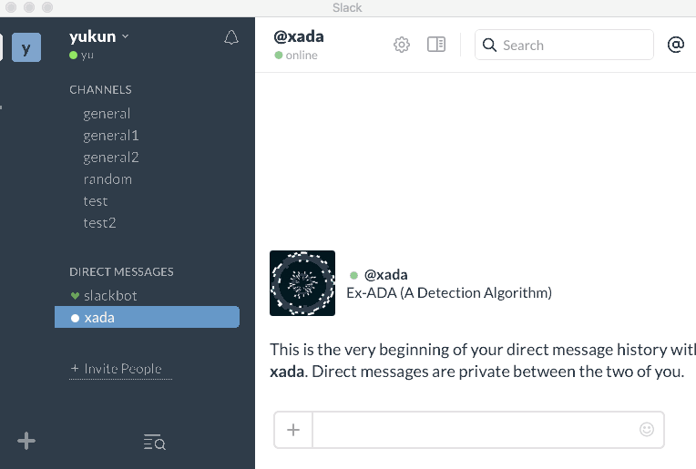
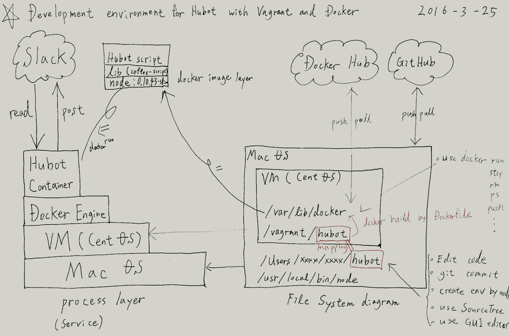

### 当記事の目的

[Hubot](https://hubot.github.com/)というチャットフレームワークを用いたSlack botの開発にDockerを用いる場合の環境構築方法の一例、及び考慮点を記載する。

### 背景理由

この度、初めてGitHub、Docker Hubを使用してBotの開発をした際に考慮事項が多かった為、その備忘録をつけておきたい為。 
<!-- truncate -->


### 作成したBotコード、Dockerイメージ

十数ステップのCoffeescriptコードと、Dockerイメージは下記リンクをご参照。GitHub側には使用方法も簡単に記載している。

- GitHub:
- Docker Hub: [https://hub.docker.com/r/yuukun/hubot-xada/](https://hub.docker.com/r/yuukun/hubot-xada/)

BotのデモGif動画は以下の通り。bot宛てに送出したメッセージが指定のチャンネルに転送されていることを確認できる。 [](./hubot_trans_msg_to_channel.gif)

### 開発環境の構成図

手書きでさっと走り描いたもので読み取り難いかと思うが、開発環境の全体構成を下図に示す。 [](./dev_env_hubot_vagrant_docker.gif) 左下に青字記載した通り、HubotフレームワークのインストールやHubotスクリプトの作成、及びGitリポジトリ操作はホストOS(ここではMac OS)側で実施する。対して、VM(ここではCentOS v7.1)はテスト環境(≒本番想定環境)として扱い、Docker Engineのみ導入する。Node.jsモジュールや依存ライブラリーはScriptと合わせてDockerイメージに入れる為。 ホストOSとVMは赤字記載のHubotディレクトリを共有ディレクトリとしてマッピングする事で、コード修正→Docker イメージ作成→スクリプト実行(Dockerコンテナ実行)のシームレスなサイクルを実現する。 以下に環境構築から開発〜テスト及びGitHub／Docker Hubへのリソース登録までの流れを紹介する。 ※本記事でのテストとは単なる動作確認とし、テストコードやテストツールについては取り扱わない。

### ホストOS側の環境構築〜開発

#### Node.jsのインストール

[Hubot](https://hubot.github.com/)はNode.js環境下で稼働するので、Node.jsをインストールする。Mac上でインストールする方法は複数あり、[Homebrew](http://brew.sh/index_ja.html)を使用してのインストールは下記コマンドを用いる。

```
$ brew install node

```

他の方法として、[公式サイト](https://nodejs.org/en/)が配布しているNode.jsの.pkgファイルをダウンロード・インストールする手法がある。私は当時Homebrewでのインストール手法を知らなかったので、.pkgでインストールしたが、これからインストールする方はHomebrewを使用することをお勧めする。.pkgと異なりuninstallが容易な為。また、nodebrewというパッケージを使用すると導入するNode.jsの複数バージョンを指定して導入・管理する事ができる。 Node.jsがインストールされているかは、下記のコマンドで確認する。

```
$ node -v
v5.8.0

```

#### VagrantによるVMの構築

テスト環境(Docker Engine環境)となるVMをVagrantを用いて構築する。構築手法は下記記事をご参照。

- [Vagrantで構築したCentOSにDocker Engineをインストール](/blog/install-docker-vagrant-centos)
- [Vagrant: 仮想マシンのホスト-ゲスト間フォルダ共有でエラーが出る場合の解決法](/blog/vagrant-failed-mount-folders)

#### Gitリポジトリの作成

リモートサイトにGitHubを使用する場合は、リポジトリをGitHubで作成した後、ホストOS上の作業ディレクトリでgit cloneを実行する。

```
git clone 

```

この作業ディレクトリとVM上のディレクトリを共有ディレクトリとしてマッピングしておく。Vagrantfileのデフォルト設定であれば、ホストOS側のVagrantfile保管先ディレクトリがVM上の/vagrantディレクトにマッピングされる。

#### Hubot環境の作成

ホストOS側から下記のジェネレーターコマンドで構築していく。詳細は[公式ドキュメント](https://hubot.github.com/docs/)をご参照。

```
$ mkdir hubot
$ cd hubot
$ yo hubot
                     _____________________________
                    /                             \
   //\              |      Extracting input for    |
  ////\    _____    |   self-replication process   |
 //////\  /_____\   \                             /
 ======= |[^_/\_]|   /----------------------------
  |   | _|___@@__|__
  +===+/  ///     \_\
   | |_\ /// HUBOT/\\
   |___/\//      /  \\
         \      /   +---+
          \____/    |   |
           | //|    +===+
            \//      |xx|
? Owner XX XXXXXX 
? Bot name xada
? Description Ex-ADA
? Bot adapter (campfire) slack
? Bot adapter slack
   create bin/hubot
   create bin/hubot.cmd
   create Procfile
   create README.md
   create external-scripts.json
   create hubot-scripts.json
   create .gitignore
   create package.json
   create scripts/example.coffee
   create .editorconfig
                     _____________________________
 _____              /                             \
 \    \             |   Self-replication process   |
 |    |    _____    |          complete...         |
 |__\\|   /_____\   \     Good luck with that.    /
   |//+  |[^_/\_]|   /----------------------------
  |   | _|___@@__|__
  +===+/  ///     \_\
   | |_\ /// HUBOT/\\
   |___/\//      /  \\
         \      /   +---+
          \____/    |   |
           | //|    +===+
            \//      |xx|
＜後略＞

```

デフォルトの状態だと使用しない外部スクリプトやパッケージがあるので、external-scripts.jsonやpackage.jsonを必要に応じて修正する。

#### botスクリプト(Coffeescript)の作成

今回作成したスクリプトは下記の通り。

これをhubotのscriptsディレクト以下に保管する。

#### Dcokerfileの作成

Dockerfileは以下のものを作業ディレクトリ直下に保管する。

#### .gitignore／.dockerignoreの修正

環境変数ファイルやprivate情報(トークン、パスワード)はGitHubやDocker Hubへのアップロードを防止する為に、.gitignore、.dockerignoreへ追加する。 本スクリプトは環境変数にSlack API トークン等のprivateな情報や各種設定を持たせ、コンテナ起動時にコンテナへ変数を渡す仕様とし設定値のハードコードを避けイメージの可搬性を保持している。環境変数の数が増加するにつれて、docker runコマンドの-eオプションが長くなるので、--env-fileオプションが指定する外部ファイルに環境変数を保管する手法が良い。

### VM上でのテスト

以下の作業はVM上で行う。

#### Dockerイメージのビルド

docker buildコマンドを用いて作成する。 例）

```
docker build -t yuukun/hubot-xada:latest ./

```

上記コマンドは、カレントディレクトリ上に保管されているDockerfileに対してbuildし、作成したイメージをyuukun/hubot-xada、タグをlatestとする。

#### Dockerコンテナのテスト実行

テスト中は何度もdocker runコマンドを実行するので不要なコンテナを増やさない為にも、--rmオプションでコンテナ終了時に削除する設定とする。また、--env-fileオプションで指定されているenvfile.txtは上述で言及した環境変数を記述している。 例）

```
docker run --rm -it --name xada --env-file envfile.txt yuukun/hubot-xada:latest

```

現状のDockerfileの構成ではコードを修正する度にdocker buildが必要であり、時間が掛かる。その為、開発中はhubot/scriptsフォルダをDockerコンテナのhubot/scriptsフォルダにマウント(-vオプション)する事で、docker build不要でスクリプトの実行確認ができる。

### Docker Hubへのイメージ登録

VM上から下記のコマンドで登録する。 例）

```
[vagrant@localhost hubot-xada]$ docker login
Username (yuukun):
Password:
WARNING: login credentials saved in /home/vagrant/.docker/config.json
Login Succeeded
[vagrant@localhost hubot-xada]$ docker push yuukun/hubot-xada
The push refers to a repository [docker.io/yuukun/hubot-xada]
8793b6168a64: Pushed
3d08d6867394: Pushed
5f70bf18a086: Pushed
8226255b60d4: Pushed
cfd8f70ebb69: Pushed
917c0fc99b35: Pushed
latest: digest: sha256:bcfee36ff10940b54955a6bcb5b9843bd5f7de7da516e8b6dc9dfb1217a87a85 size: 8299

```

### GitHubへのソース登録

ホストOS上でgitやSourceTree、GitHub Desktop等のお好みのツールでgit status, git add, git commit, git log, git push origin master等のコマンドを実行しリモートリポジトリへソースを登録する。

### Hubotのコンテナ化のメリット

Dockerfileによるイメージ構築の再現性、イメージの可搬性等各所で言及されいるメリットはこのBotコンテナも享受できる。個人的な感想としては、本番系でコンテナを稼働させる際のデーモン化オプション"-d"が便利。仮にコンテナ化しない場合はOSに合わせたサービス用のスクリプトを記載する必要がある為。
