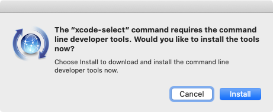

### エラー事象

Mac OS X EI Capitan (v10.11.4)上で[pyenvコマンドを用いてPython v3.5.1環境のインストール時](/blog/mac-install-pyenv-python-conf-pycharm)に下記のエラーが発生し、Pythonのビルドに失敗する。 
<!-- truncate -->


```
$ pyenv install 3.5.1
Downloading Python-3.5.1.tgz...
-> https://www.python.org/ftp/python/3.5.1/Python-3.5.1.tgz
Installing Python-3.5.1...
BUILD FAILED (OS X 10.11.4 using python-build 20160130)
Inspect or clean up the working tree at /var/folders/b5/cl371z9s20bdmwtprsx2nn6h0000gn/T/python-build.20160327162619.8068
Results logged to /var/folders/b5/cl371z9s20bdmwtprsx2nn6h0000gn/T/python-build.20160327162619.8068.log
Last 10 log lines:
  File "/private/var/folders/b5/cl371z9s20bdmwtprsx2nn6h0000gn/T/python-build.20160327162619.8068/Python-3.5.1/Lib/ensurepip/__main__.py", line 4, in 
    ensurepip._main()
  File "/private/var/folders/b5/cl371z9s20bdmwtprsx2nn6h0000gn/T/python-build.20160327162619.8068/Python-3.5.1/Lib/ensurepip/__init__.py", line 209, in _main
    default_pip=args.default_pip,
  File "/private/var/folders/b5/cl371z9s20bdmwtprsx2nn6h0000gn/T/python-build.20160327162619.8068/Python-3.5.1/Lib/ensurepip/__init__.py", line 116, in bootstrap
    _run_pip(args + [p[0] for p in _PROJECTS], additional_paths)
  File "/private/var/folders/b5/cl371z9s20bdmwtprsx2nn6h0000gn/T/python-build.20160327162619.8068/Python-3.5.1/Lib/ensurepip/__init__.py", line 40, in _run_pip
    import pip
zipimport.ZipImportError: can't decompress data; zlib not available
make: *** [install] Error 1

```

追記(2019-02-24)：Mac OS X 10.14.3環境でも同様のエラーが発生。

```
$ pyenv install 3.7.1
python-build: use openssl from homebrew
python-build: use readline from homebrew
Downloading Python-3.7.1.tar.xz...
-> https://www.python.org/ftp/python/3.7.1/Python-3.7.1.tar.xz
Installing Python-3.7.1...
python-build: use readline from homebrew

BUILD FAILED (OS X 10.14.3 using python-build 20180424)

Inspect or clean up the working tree at /var/folders/b5/cl371z9s20bdmwtprsx2nn6h0000gn/T/python-build.20190222215427.16905
Results logged to /var/folders/b5/cl371z9s20bdmwtprsx2nn6h0000gn/T/python-build.20190222215427.16905.log

Last 10 log lines:
  File "/private/var/folders/b5/cl371z9s20bdmwtprsx2nn6h0000gn/T/python-build.20190222215427.16905/Python-3.7.1/Lib/ensurepip/__main__.py", line 5, in 
    sys.exit(ensurepip._main())
  File "/private/var/folders/b5/cl371z9s20bdmwtprsx2nn6h0000gn/T/python-build.20190222215427.16905/Python-3.7.1/Lib/ensurepip/__init__.py", line 204, in _main
    default_pip=args.default_pip,
  File "/private/var/folders/b5/cl371z9s20bdmwtprsx2nn6h0000gn/T/python-build.20190222215427.16905/Python-3.7.1/Lib/ensurepip/__init__.py", line 117, in _bootstrap
    return _run_pip(args + [p[0] for p in _PROJECTS], additional_paths)
  File "/private/var/folders/b5/cl371z9s20bdmwtprsx2nn6h0000gn/T/python-build.20190222215427.16905/Python-3.7.1/Lib/ensurepip/__init__.py", line 27, in _run_pip
    import pip._internal
zipimport.ZipImportError: can't decompress data; zlib not available
make: *** [install] Error 1

```

追記(2019-12-24)：Mac OS X 10.15.2 (Catalina) 環境でも同様のエラーが発生。

```
% pyenv install 3.7.3
python-build: use openssl@1.1 from homebrew
python-build: use readline from homebrew
Downloading Python-3.7.3.tar.xz...
-> https://www.python.org/ftp/python/3.7.3/Python-3.7.3.tar.xz
Installing Python-3.7.3...
python-build: use readline from homebrew

BUILD FAILED (OS X 10.15.2 using python-build 20180424)

Inspect or clean up the working tree at /var/folders/b5/cl371z9s20bdmwtprsx2nn6h0000gn/T/python-build.20191224212158.20583
Results logged to /var/folders/b5/cl371z9s20bdmwtprsx2nn6h0000gn/T/python-build.20191224212158.20583.log

Last 10 log lines:
  File "/private/var/folders/b5/cl371z9s20bdmwtprsx2nn6h0000gn/T/python-build.20191224212158.20583/Python-3.7.3/Lib/ensurepip/__main__.py", line 5, in 
    sys.exit(ensurepip._main())
  File "/private/var/folders/b5/cl371z9s20bdmwtprsx2nn6h0000gn/T/python-build.20191224212158.20583/Python-3.7.3/Lib/ensurepip/__init__.py", line 204, in _main
    default_pip=args.default_pip,
  File "/private/var/folders/b5/cl371z9s20bdmwtprsx2nn6h0000gn/T/python-build.20191224212158.20583/Python-3.7.3/Lib/ensurepip/__init__.py", line 117, in _bootstrap
    return _run_pip(args + [p[0] for p in _PROJECTS], additional_paths)
  File "/private/var/folders/b5/cl371z9s20bdmwtprsx2nn6h0000gn/T/python-build.20191224212158.20583/Python-3.7.3/Lib/ensurepip/__init__.py", line 27, in _run_pip
    import pip._internal
zipimport.ZipImportError: can't decompress data; zlib not available
make: *** [install] Error 1

```

尚、下記の様にzlibをインストールしても事象は解消しない。

```
$ brew install zlib
==> Downloading https://homebrew.bintray.com/bottles/zlib-1.2.11.mojave.bottle.tar.gz
######################################################################## 100.0%
==> Pouring zlib-1.2.11.mojave.bottle.tar.gz
==> Caveats
zlib is keg-only, which means it was not symlinked into /usr/local,
because macOS already provides this software and installing another version in
parallel can cause all kinds of trouble.

For compilers to find zlib you may need to set:
  export LDFLAGS="-L/usr/local/opt/zlib/lib"
  export CPPFLAGS="-I/usr/local/opt/zlib/include"

For pkg-config to find zlib you may need to set:
  export PKG_CONFIG_PATH="/usr/local/opt/zlib/lib/pkgconfig"

==> Summary
🍺  /usr/local/Cellar/zlib/1.2.11: 12 files, 373KB

```

### 解決法

#### 追記(2019-02-24)：その一

```
$ sudo installer -pkg /Library/Developer/CommandLineTools/Packages/macOS_SDK_headers_for_macOS_10.14.pkg -target /
Password:
installer: Package name is macOS_SDK_headers_for_macOS_10.14
installer: Installing at base path /
installer: The install was successful.

```

その後に改めてインストール確認。

```
$ pyenv install 3.7.1
python-build: use openssl from homebrew
python-build: use readline from homebrew
Downloading Python-3.7.1.tar.xz...
-> https://www.python.org/ftp/python/3.7.1/Python-3.7.1.tar.xz
Installing Python-3.7.1...
python-build: use readline from homebrew
Installed Python-3.7.1 to /usr/local/var/pyenv/versions/3.7.1

```

#### その二

その一で解決しない場合は下記の公式ドキュメント(GitHub)上の対処法を参照。

[Common build problems · yyuu/pyenv Wiki](https://github.com/yyuu/pyenv/wiki/Common-build-problems#build-failed-error-the-python-zlib-extension-was-not-compiled-missing-the-zlib) XCode command line toolsのインストール後に再度pyenv installで対応、Python v3.5.1のインストールの正常完了を確認できた。

```
$ xcode-select --install
xcode-select: note: install requested for command line developer tools

```

[](./xcode_command_line_tools.png)

```
$ pyenv install 3.5.1
Downloading Python-3.5.1.tgz...
-> https://www.python.org/ftp/python/3.5.1/Python-3.5.1.tgz
Installing Python-3.5.1...
Installed Python-3.5.1 to /usr/local/var/pyenv/versions/3.5.1
$ pyenv versions
* system (set by /usr/local/var/pyenv/version)
  3.5.1

```
