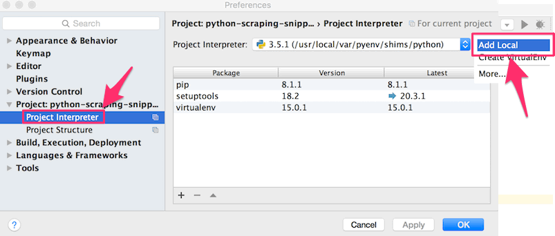

### 当記事の目的

Pythonインタプリタのバージョン管理ツールであるpyenvをHomebrewを用いてインストールし、Python v3.5.1を標準インタプリタとして使用、及び[PyCharm](https://www.jetbrains.com/pycharm/) IDEでのパス設定までの手順を記載。 
<!-- truncate -->


### 背景理由

Mac OS標準のPythonのバージョンが2.7系で、3.X.X系の実行環境を導入したかった為。

### 設定手順

当記事の公開時点での公式ドキュメント記載の方法で進める。 [yyuu/pyenv: Simple Python version management](https://github.com/yyuu/pyenv#homebrew-on-mac-os-x)

#### 前提

[Homebrew](http://brew.sh/index_ja.html)がインストールされていること。

#### pyenvのインストール

```
$ brew update
$ brew install pyenv

```

#### pyenvのPATH設定

上述のインストールログ内にも出力されているが、PYENV\_ROOTとeval "$(pyenv init -)"を設定する。当該ログを喪失した場合は、brew info pyenvコマンドで再度確認が可能である。

```
$ brew info pyenv
＜中略＞
==> Caveats
To use Homebrew's directories rather than ~/.pyenv add to your profile:
  export PYENV_ROOT=/usr/local/var/pyenv
To enable shims and autocompletion add to your profile:
  if which pyenv > /dev/null; then eval "$(pyenv init -)"; fi

```

本記事での追記先は.bash\_profileとする。

```
$ vim .bash_profile
export PYENV_ROOT=/usr/local/var/pyenv
if which pyenv > /dev/null; then eval "$(pyenv init -)"; fi
↑ 2行を追記

```

.bash\_profileにMacのプリインストールPythonに関わるPATHが設定されていれば、それをコメントアウトする。

```
#export PATH="/Library/Frameworks/Python.framework/Versions/2.7/bin:${PATH}"
↑行頭に'#'を追加。

```

最後にShellを再起動するか$ source .bash\_profileを実行してPATH設定を更新する。

#### pyenv経由でのPython 3.x.x系のインストール

```
$ pyenv install -l
＜前略＞
3.5.1
＜後略＞
$ pyenv install 3.5.1
Downloading Python-3.5.1.tgz...
-> https://www.python.org/ftp/python/3.5.1/Python-3.5.1.tgz
Installing Python-3.5.1...
Installed Python-3.5.1 to /usr/local/var/pyenv/versions/3.5.1

```

※参考）zlib not availableエラーでPythonのビルドが失敗した場合の対処法は下記の通り。 [pyenv: 対処法→Python環境のBUILD FAILED – “zipimport.ZipImportError: can’t decompress data; zlib not available”](/blog/python-pyenv-build-failed-zlib-not-available-mac)

#### 使用インタプリタをPython 3.x.x系に変更

pyenv globalコマンドを使用して変更する。

```
$ pyenv versions
* system (set by /usr/local/var/pyenv/version)
  3.5.1
$ pyenv global 3.5.1
$ pyenv versions
  system
* 3.5.1 (set by /usr/local/var/pyenv/version)

```

下記コマンドにてインタプリタのバージョン及びパスの確認を行う。

```
$ python -V
Python 3.5.1
$ python3 -V
Python 3.5.1
$ pip -V
pip 8.1.1 from /usr/local/var/pyenv/versions/3.5.1/lib/python3.5/site-packages (python 3.5)
$ pip3 -V
pip 8.1.1 from /usr/local/var/pyenv/versions/3.5.1/lib/python3.5/site-packages (python 3.5)
$ which python
/usr/local/var/pyenv/shims/python
$ which python3
/usr/local/var/pyenv/shims/python3
$ which pip
/usr/local/var/pyenv/shims/pip
$ which pip3
/usr/local/var/pyenv/shims/pip3

```

#### pipのアップデート

上記の通りpipはデフォルトでインストールされいてるが最新バージョンではない場合がある為、下記のコマンドでアップグレードする。

```
$ pip install --upgrade pip

```

#### PyCharm IDEの設定

$ which pythonで出力されたパスを設定する。 [](./pycharm_python_interpreter_setting.gif)

### (未解決) git clone と virtualenvの併用

[virtualenv](https://virtualenv.pypa.io/en/latest/index.html)を用いてPyCharmプロジェクト毎にPythonの仮想環境を構築するとプロジェクト毎に使用ライブラリを設定できてベター。しかし、GitHubのリポジトリのClone後に仮想環境を使用するとdirectory not emptyエラーで構築できず、逆に仮想環境作成後にgit cloneすると、これもnot emptyエラーとなる。 この解決法についてはざっと調べた限り見つけられなかったので、一旦棚上げとして、virtualenv無しでの開発環境としてコーディングを進めてみる。最終的にはDockerイメージとしてアプリをパッケージかする予定なので、現時点では特に支障はないが、時間のあるときにもう一度調べて解決したい。
