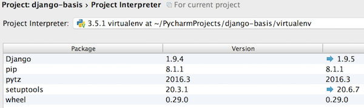

### 目的

Pythonの統合開発環境であるPyCharmを用いたPythonアプリの開発において使用インタープリターをvirtualenv環境とする設定をする。 ※尚、以下の手順はMac環境上に[PyCharm](https://www.jetbrains.com/pycharm/)がインストールされている前提で進める。 
<!-- truncate -->


### virtualenvとは？

Pythonの隔離環境を構築できるツールで、Pythonのパッケージマネージャであるpipでインストールできる。PyCharmのプロジェクト毎に使用パッケージをvirtualenvで隔離することで、プロジェクト毎に別Versionのパッケージを使用することができ、システム標準のパッケージを汚さず、本番想定のPython環境を構築できるメリットがある。 公式ドキュメント：[Virtualenv — virtualenv latest documentation](https://virtualenv.pypa.io/en/latest/)

### Python環境の確認

Pythonを未インストールの場合はインストールしておく。 参考ページ：[Mac OSにpyenvを使用してPython環境をインストール・設定](/blog/mac-install-pyenv-python-conf-pycharm)

```
$ which python
/usr/local/var/pyenv/shims/python
$ python -V
Python 3.5.1

```

### virtualenvのインストール

virtualenvが未インストールの場合は$ pip install virtualenvでインストールする。

```
$ which pip
/usr/local/var/pyenv/shims/pip
$ which virtualenv
/usr/local/var/pyenv/shims/virtualenv

```

### Python仮想環境(virtualenv)の構築

```
$ mkdir ~/PycharmProjects/django-basis
$ cd ~/PycharmProjects/django-basis
$ virtualenv --python="`which python`" virtualenv

```

### virtualenvのactivate

virtualenvを構築しただけではこの仮想環境は有効にならない為、下記コマンドでactivateする必要がある。

```
$ source virtualenv/bin/activate
(virtualenv)$

```

activate以降に追加したパッケージはシステムのPythonではなく、上述で構築したvirtualenv環境にインストールされる。

### virtualenvへパッケージをインストール

例としてWebアプリケーションフレームワークであるDjango v1.9をインストールする。

```
(virtualenv)$ pip install 'django>=1.9'

```

上記プロンプト上でactivateした仮想環境を無効化(抜け出す)場合はdeactivateコマンドを用いる。

```
(virtualenv) $ deactivate
$

```

### PyCharmのインタープリターをvirtualenvに設定

PyCharmのPreference画面からProject Interpreterに移動し、右端の「．．．」マークのプルダウンメニューから「Add Local」を選択する。実行環境パスはこの場合下記の通りとなる。

```
~/PyCharmProjects/django-basis/virtualenv/bin/python3 
```

設定後に下図の通りインタープリターのパスがvirtualenvに設定されていることを確認する。 [](./pycharm_project_interpreter.png) 最後にApply、OKボタンで変更を確定して設定が完了となる。

### 参考サイト

- [Python VirtualEnv - ArchWiki](https://wiki.archlinux.jp/index.php/Python/%E4%BB%AE%E6%83%B3%E7%92%B0%E5%A2%83)
