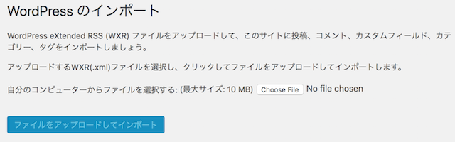

他サイトのWordPressの記事データを移行する方法として、メニュー→ツール→インポートから、WordPress eXtended RSS (WXR) ファイル(.xml)をアップロード手法があるが、デフォルト設定ではアップロードできるファイルの最大サイズを超えるWXRファイルを使用出来ない。アップロードファイルの最大サイズを変更するには、対象のWordPressサーバ上の/etc/php.iniファイルの以下のディレクティブを変更する。


<!-- truncate -->


下記の例は10Mのファイルまでアップロードを許容する設定。確認環境はCentOS 7.x系、PHP 7.2.5。

### php.ini設定例

```
; Maximum allowed size for uploaded files.
; http://php.net/upload-max-filesize
upload_max_filesize = 10M

; Maximum size of POST data that PHP will accept.
; Its value may be 0 to disable the limit. It is ignored if POST data reading
; is disabled through enable_post_data_reading.
; http://php.net/post-max-size
post_max_size = 10M
```

その後、下記のコマンドで設定内容を反映する。


```bash
systemctl restart php-fpm
```


### 各ディレクティブの仕様

各ディレクティブの仕様は下記の公式サイトをご参照。

[PHP: Description of core php.ini directives - Manual](http://php.net/manual/en/ini.core.php)

下記の引用の通り、両ディレクティブの大小関係は「post\_max\_size ＞ upload\_max\_filesize」となる。postデータはupload対象のファイル以外にもヘッダ等メタデータが付与されるので、自明ではある。

> post\_max\_size integer Sets max size of post data allowed. This setting also affects file upload. To upload large files, this value must be larger than upload\_max\_filesize. Generally speaking, memory\_limit should be larger than post\_max\_size.

その為、厳密に言うと、上述の設定例でuploadできるファイルサイズは10MB未満となる。しかし、WordPress側のビューは両ディレクティブの値が同値の場合は下図の通り10MBで表示する。

[](./wordpress_import_size.png)
