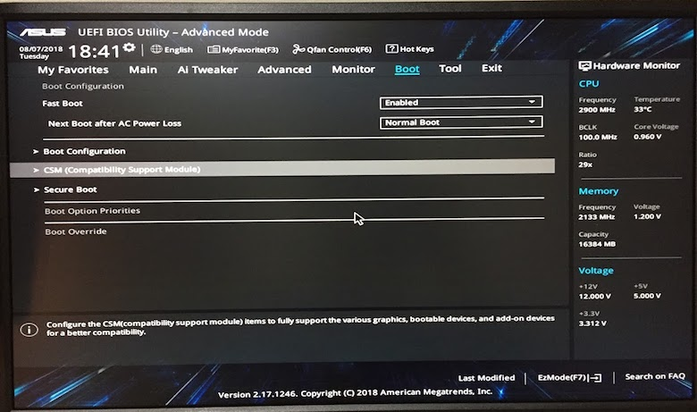
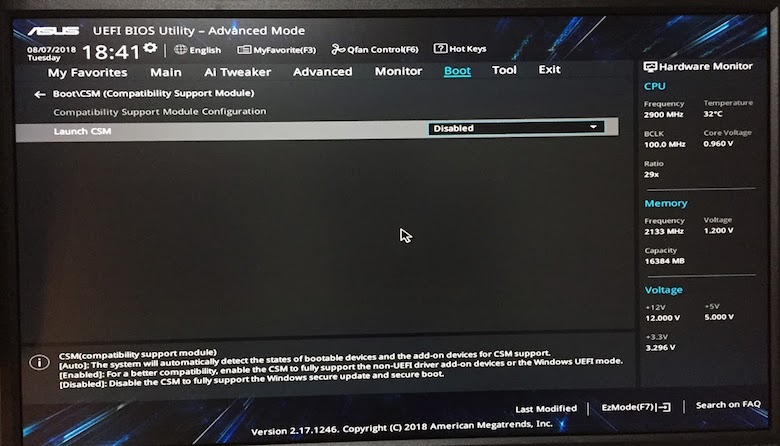
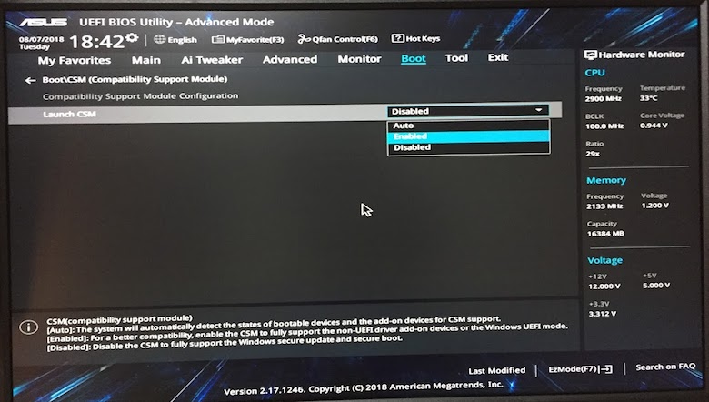
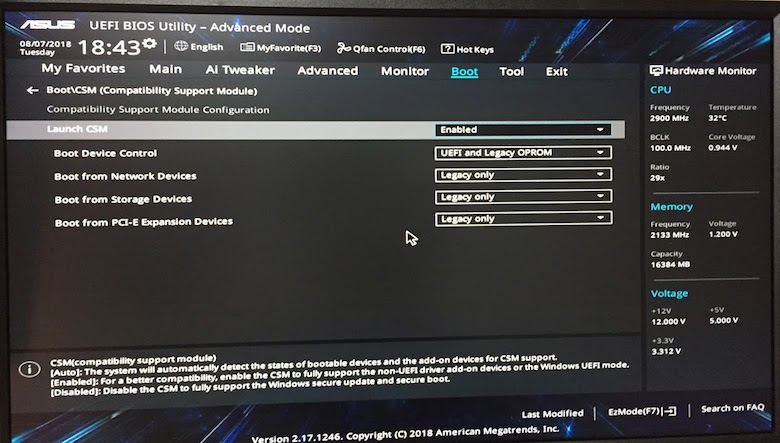
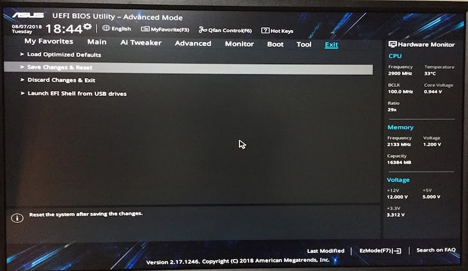
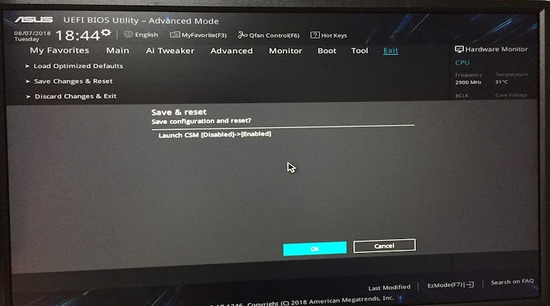
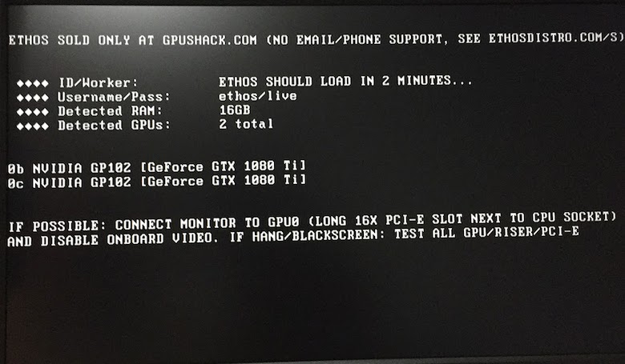

先日、知人からASUS B250 Mining Expertマザーボード([公式Link](https://www.asus.com/jp/Motherboards/B250-MINING-EXPERT/) ／ [Amazon](https://amzn.to/2OtxvIH))を譲って貰ったので、セットアップで躓いた点を記録に残しておく。

今回はこのマザーボードを用いてethOSイメージをUSBメモリから起動を試みたところ、初期のBIOS設定ではOSは起動せず、BIOSメニュー画面に遷移する為、USBブートする為のBIOS設定を以下に記載する。

<!-- truncate -->

### BIOS設定

BIOS設定画面へ遷移後にAdvanced Modeに変更後、下記画像遷移の通り操作を進める。

先ずは、Bootタブ→CSMにカーソルを合わせてEnterを押下。 

Launch CSMにカーソルを合わせてEnterを押下。 

Enabledにカーソルを合わせてEnterを押下。 

そうすると下図の画面構成となる。 

ExitタブのSave Changes & Resetにカーソルを合わせてEnterを押下。 

確認のポップアップ画面が表示されるのでOKでEnter。 

その後、マシンに再起動が掛かる。USBメモリを挿入済みであれば無操作で下図の画面まで遷移する。既にUSBブート済みであり、ここから数分経つとethOSの初期画面に遷移する。 
