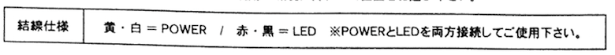
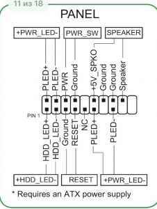
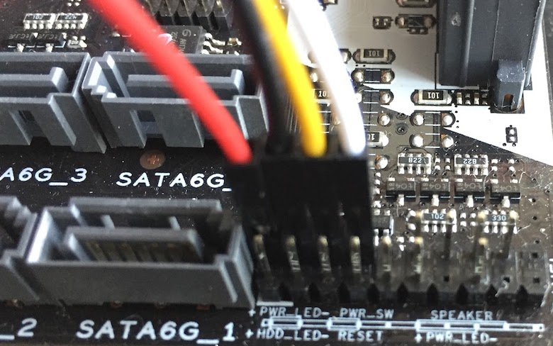

PM-MINING-F2リグ([公式link](https://www.aiuto-jp.co.jp/information/entry_558.php)／[Amazon](https://amzn.to/2MuItQG))に付属の電源スイッチ・LEDケーブルをB250 Mining Expertマザーボードに結線するPINの位置を記載。

<!-- truncate -->

### PM-MINING-F2の結線仕様

 引用元：PM-MINING-F2組立説明書

### B250 Mining ExpertのSystem panel connector仕様

 引用元：公式Motherboard Pin Definition (PDF, 1-11)

上記の仕様を踏まえると結線は下図の通りとなる。

(+ - を間違えないように。当方は横着して間違えたので備忘を兼ねて本記事を記載。。)
